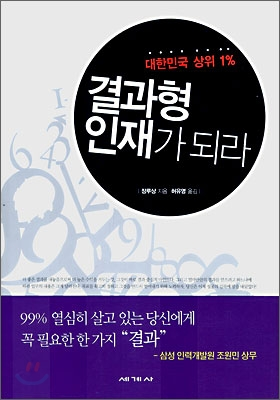
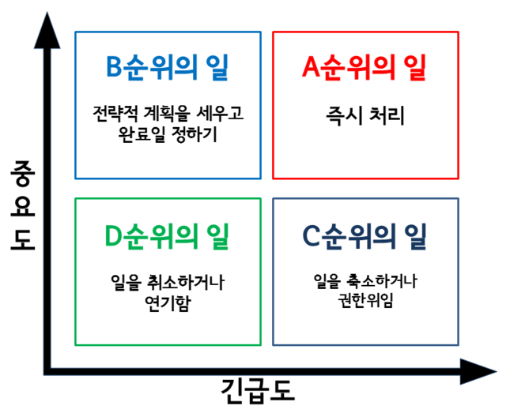

# 성공의 열쇠는 무엇인가?

###### _결과형 인재가 되라를 읽고..._


​																																		**작 성 일 : 19. 12. 24.**

​																																		**수 정 일 : 19. 12. 30.**

​																																		**작 성 자 : 김 한 석**




>   누구나 성공하고 싶다. 하지만 성공한 사람은 적다. 그렇다면 성공하지 못 한 사람들은 노력을 안 한 것일까? 또, 성공한 사람은 어떻게 성공했을까?  대단한 기대를 가지고 이 책을 펴봤을지도 모르겠다. 하지만, 이 책 **장루샹의 결과형 인재가 되라**에서는 대단하고 특별한 방법을 소개하지는 않았다. 책에서 소개하고 있는 방법은 누구나 다 알고있는, 지극히 평범하고 고리타분한 것일지도 모른다. 하지만 진리는 그리 멀리있지 않다는 것을 상기시켜준다. 이 책을 간단하게 요약해 보자면,
>
> - **_생각이 전략을 결정한다._**
> - **_프로 의식을 가져라._**
> - **_생각이 곧 행동으로 나타나고, 행동이 곧 결과로 이어지며, 결과에 의해 인생이 결정된다._**
>
> 로 할 수 있을 것이다.

## 1. 임무 완수보다 결과가 중요하다

### 1.1 임무 != 결과

#### 1.1.1 임무는 결과가 아니다

```
								    임무 완수 != 결과
```

- 임무란 결과가 아니며, 오히려 **결과를 가로막는 가장 큰 장애물**이다.

- 임무란 단순히 과제를 수행하는 것이 아니라, **결과로서 증명**해야한다.
  - 임무를 수행하기 위해서만 한다면, 여러가지 핑계만 얻게 될 수 있다.
  - 하지만 결과를 얻기 위한다면, **결과를 얻기위한 여러가지 방법을 생각**해낼 수 있다.

#### 1.1.2 노력에 따라 결과는 달라진다

- 노력을 했음에도 그에 상응하는 결과가 나타지 않을 수도 있다.
- 임무를 열심히 수행하는데 중점을 두지말고 **결과를 얻기 위해서 노력**하자.


### 1.2 프로의 데드라인, 결과

- **데드라인을 파악하라.**
  - 문제가 요구하는 **본질을 파악**하자.
- 결과는 **데드라인**이다.


### 1.3 결과에 책임을 져라

#### 1.3.1 스스로에게 책임지자

- 성공은 사실 '특출한 자질'이 필요하지 않고, 뛰어날 필요도 없다.

- 성공을 희망하는 사람이 반드시 갖추어야 할 덕목은 **'스스로에 대한 진정한 책임감'**이다.

#### 1.3.2 약속 엄수, 결과 추구, 불굴의 집념

- 성공을 원한다면 **명확한 목표**를 세우자.
- 결과를 추구하고, 결과를 얻기 전까지 **결코 포기하지 말고 노력**하자.

#### 1.3.3 시련은 우리를 강하게 만든다

- **발전하기 위해서는 반드시 책임을 감수하는 과정을 겪어야 한다.**
- 책임을 져야 할 상황이 왔다면 절대로 도망치지 말고 기꺼이 받아들이자.


### 1.4 결과를 자기 손으로 통제하라

#### 1.4.1 속전속결로는 작은 그릇밖에 채울 수 없다

- 하루하루 꾸준히 결과를 쌓아가면 언젠가는 성공할 수 있다.
- 큰 그릇을 채우려면 결과들을 쌓아가는 **외로움의 시간과 싸워 이겨야**만 한다.

- **결과는 곧 인생의 가치이며, 오로지 자신만이 통제 가능**하다.

#### 1.4.2 하늘은 스스로 돕는자를 돕는다

- 사람들은 자기 힘으로 노력하는 사람을 도우려한다.

#### 1.4.3 목표를 향하여

- 결과를 내기 위해 **끝까지 포기하지 않는 사람은 큰 그릇이 될 수 있는 희망**이 있다.

- **쉽게 포기하는 사람은 조그만 어려움이 닥쳐도 금방 포기**하게 된다.

- 조그마한 어려움에도 쉽게 포기하지 않고 나아간다면 할 수 있는 일은 많아진다.

-----


## 2. 생각이 행동을 결정한다

### 2.1 결과 중심적 마인드

#### 2.1.1 시장의 변화에 마인드를 맞추자

- 이미 이루어 놓은 **결과에 안주하고 시장의 변화를 따라가지 못하면 힘들어질 수 밖에 없다**.
  - 예) 제록스의 프린터, 노키아의 휴대폰, 스위스의 쿼츠쇼크
- 만족스로운 **'경제적 수익'**을 얻고자 한다면 우선 행동을 유발할 수 있는 **'사업 마인드'**를 가지자.

#### 2.1.2 가치 창출의 마인드

- **가치 중심적 마인드**는 **결과 중심적 마인드**라 할 수 있다.
  - **많은 대가 원함** => **많은 가치 제공**
- **결과 중심적 마인드** : 즉시 행동으로 옮길 수 있는 **원동력과 자기 계발의 기회**를 얻었음을 의미한다.
- **기회는 무엇**일까?
  - 대외적 : 제품의 **품질**이나 **서비스 만족도**를 높이는 일
  - 대내적 : 회사에 **결과를 제공**하고 회사로 하여금 자신을 **고용할 가치**가 있다고 느끼게 함
- **가치를 창출할 수 있는 원인에 주목**하고, 회사를 위해 **더 많은 가치를 창출할 수 있을지에 관심을 집중**시키자.


### 2.2 '반드시' 만이 있을 뿐이다

- '만약'은 없고, '반드시'만 있을 뿐이다.
- 처음부터 **과감히 행동하고 반드시 목표를 실현**해야 한다.
- 결과 앞에서는 **'반드시 실현해내고야 말겠다'**는 결심이 필요하다.


### 2.3 결과 중심적 마인드의 3요소

#### 2.3.1 실행(행동적 사고)

- 행동적 사고란 **행동한 후에 목표를 생각**하는 것이다.

- 행동적 사고에 따라 문제를 해결한다면, 가장 적합한 방식보다는 당장 효과 체감할 수 있는 방법을 선택한다.

#### 2.3.2 협동

- 자신의 능력에만 의존하지 않고 다른 사람과의 협조를 통해 결과를 얻자.
- 자신의 능력을 넘는 목표라도 **함께 하면 기적을 만들어 낼 수 있다**.

#### 2.3.3 의지

- 꺾이지 않는 강인한 의지를 가지고 용감히, 한눈 팔지 않고 **성공을 향해 직진**하자.
- 원하는 결과를 얻는 과정에서 크고 작은 어려움과 실패를 겪게 되더라도, **신념을 잃지 않고 용감히** 맞서자.

-----


## 3. 행동이 결과를 결정한다.

### 3.1 결과는 행동할 때 창출된다

- 행동한다고 반드시 결과를 얻는 것은 아니지만, **결과를 얻기 위해서는 행동**해야 한다.
- **결과는 생각이 아닌 행동에서 창출**된다.
- **생각이 행동을 낳고 행동이 결과를 결정**한다.


### 3.2 0.1은 0보다 크다

- **예상에 못 미치는 결과라도 결과를 얻지 못하는 것보다는 낫다.**
- 완벽한 결과는 오랜 노력 끝에 이루어지는 것이므로, 완벽하지 못한 결과라도 기꺼이 수용해야 한다.


### 3.3 한 가지 일에 몰두하라

- 일정 기간 동안 오로지 **한 가지 일에만 몰두하는 열정이 필요**하다.
- 그 일을 위해서라면 다른 사람이 보기에는 매우 가치있는 것일지라도 모두 포기할 수 있어야 한다.
- 처음부터 모든 문제를 한꺼번에 해결하려고 하면 한 가지도 제대로 하지 못한다.


### 3.4 자신에게 너무 많은 변명을 허용치 말라

- **실패를 정당화할 핑계거리를 스스로 찾는 순간부터 나태해지고 스스로를 포기**하게 된다.
- 성공할 수 없는 이유를 찾는 순간, 삶의 희망은 물거품처럼 사라진다.
- **결과의 원칙**
  - 결과가 있어야만 살아남을 수 있고, 변명을 먹고서는 결코 살아남을 수 없다.
- 핑계를 대지 말고 **결과만을 놓고 행동 방향을 정하는 습관**을 길러야 한다.

-----


## 4. 중간 관리자를 강하게 만드는 방법

### 4.1 중간 관리자가 승부를 좌우한다

- 중간 관리자의 **가장 첫 번째 일은 위치를 정확하게 잡는 것**이다.
- 나태해지지 않고 긴장하여 성장하자.


### 4.2 기본 원칙에 충실하라

- 다시 언급하지만, **꿈을 꾸었다면 실현시키기 위해 행동**하자.
- 결과를 보여주는 것을 인식하지 못하면, 엄청난 능력을 가졌더라도 실질적인 가치 창출이 불가능하다.


### 4.3 '최고'는 없다 다만, '더 나은 것'이 있을 뿐이다

- **기대를 초월**하자.
- 상대가 기대하는 비율이 100이라면 120, 150의 성과를 달성을 위해 노력하자.

-----


## 5. 책임질 줄 알아야 결과를 얻을 수 있다

### 5.1 책임을 회피하지 말라

- 책임을 관리하는 첫 번째 법칙은 책임을 미루지 말자.
- **책임 소재를 분명히 하라.**
- 책임 소재에 변동이 생겼다면 상대방으로 하여금 책임이 넘어갔음을 확실히 알려야 한다.


### 5.2 업무 실행의 원칙을 가르쳐라

- 자신의 시간을 늘리는 기본적인 방법은 다른 직원들이 **내 시간을 점령하지 못하도록 하는 것**이다.

- 직원 **스스로 문제를 처리하는 능력을 함양**하도록 하는 것으로 문제 해결 가능하다.

  - **순서를 명확히 하자.**
    - 순서에 따라 자신의 일을 검토할 수 있기 때문에 일**의 추진 결과와 책임을 통제**할 수 있다.
  - **방향과 원칙을 제시하고 구체적인 방법은 직원 스스로 생각**하게 하자.
  - 구체적인 방법을 제시하지말고, **보편적으로 적용할 수 있는 근거(핵심)를 알려주자**.
  
  

### 5.3 시간을 관리하라

- 시간 관리의 출발은 일 처리의 우선 순위를 판단하는 것인데 **'중요도'**와 **'완급도'**가 판단의 기준이 된다.

  

  - 중요한 일과 급한 일을 구분하는 **기준은 중요한 목표를 달성하는데 도움이 되는지의 여부**이다.

  

- **시간 관리를 하는 방법**

  1. 모든 일을 끝까지 해내겠다는 생각을 버려라.
  2. 책상 위에 놓인 일들이 가장 중요한 일이 아닐지도 모른다.
  3. 매일 저녁에 내일 해야 할 일을 정리해서 메모하고, 중요도에 따라 처리 순서를 정하자.
  4. 내일은 가장 중요한 일부터 하고, 다른 일에는 신경쓰지 말자.
  5. 저녁까지 다 하지 못해도 괜찮다. 중요한 일은 이미 끝났기 때문이다.
  
  

### 5.4 책임을 주고받는 방법

- 자신의 **책임이 무엇인지 상사와 이야기**해야 한다.
  - 책임의 범위를 결정하는 것은 문제가 발생했을 때 누가 책임을 지는가 하는 문제이다.
- **부하 직원과는 책임의 의미에 대해 이야기**해야 한다.


### 5.5 감독과 검사를 게을리 하지 말라

- 부하 직원에게 얼마만큼의 재량권을 허용하는지가 아니라, **내가 얼마나 감독할 수 있는지가 중요**하다.

- 감독 가능한 방법이 많을수록 부하 직원에게 많은 재량권을 내어줄 수 있다.

-----


## 6. 실패를 성공으로 전환하라

### 6.1 실패를 끌어 안아라

- 자신의 **발전에 걸림돌이 되는 것은 실패가 아니라, 실패에 대한 스스로의 반응**이다.
- 성공하고 싶다면 실패를 사랑하고 그 속에서 용기를 얻어야 한다.


### 6.2 '포스트 잇' 법칙을 믿어라

- **'포스트 잇' 법칙 ?**
  - "왼쪽 눈에 실패가 보일 때 오른쪽 눈에는 성공이 보인다"
  - **실패를 보는 다른 시각이 필요**하다.
- 심리학에서는 **'자기 암시 효과'**라고도 한다.
  
  - 적극적이고 긍정적인 태도로 운명의 도전에 담담히 맞서서 모든 일에 최선을 다하자.
  
  

### 6.3 실패를 반갑게 맞아들여라

- 실패를 반갑게 맞이하는 방법은 **실패가 성공의 길에 만나는 길동무로 생각**하는 것이다.
- 그 시련을 즐기고 더 큰 시련을 두려워하지 않는다면, 나중에 **같은 시련이 찾아와도 극복 가능**하다.
- 한번도 **실패해본 적이 없다면 반드시 위기에 대해 생각**해야 한다.


### 6.4 단지 성공이 잠시 멈췄을 뿐이다

- 진정한 실패란 없으며 단지 성공이 잠시 멈추었을 뿐이다.
- **성공한 경험을 통해 강해지는 것이 아니라 실패의 교훈 속에서 성장**한다.
- 시장의 규칙을 반드시 지키자.
- **절대로 포기하지 말아라.**

-----


## 7. 진정한 목표를 실행하라

### 7.1 '똑똑'하기보다 '성실'하자

- 목표가 확고한 사람들은 성실하게 일해야만 성공할 수 있다는 굳은 믿음을 가지고 있다.
- **책임감이 투철한 사람들은 평생 진지하고 성실한 자세로 일에 임한다**.


### 7.2 '집중'과 '반복'의 효과를 믿어라

- 능력을 키우고 싶다면 **목표를 설정한 후 집중해서 그것을 끊임없이 반복**하자.
- 작은 노력은 결과를 얻기 힘들지만, 그것이 모이면 엄청난 결과를 얻을 수 있다.


### 7.3 '성패'보다는 '결심'을 중시하라

- **결심이 먼저이고 성패는 나중이다.**
- 지금 눈앞에 있는 일이 내일도 기다려준다고 생각하지 말자.


### 7.4 '완벽'보다는 '속도'를 추구하라

- **목표 실행에 착수했다면 가장 먼저 추구해야 할 것은 속도**이다.
- 후발자보다는 선구자가 되어라.


### 7.5 '이유'보다는 '결과'에 집중하라

- 결과가 우선이고 이유는 그 다음이다.
- 목표를 실행하는 궁극적인 목적은 기대한 결과를 얻는 것이다.
- **임무를 제대로 수행했는지를 판단하는 기준은 이유가 아닌 결과**이다.


### 7.6 단칼에 승부하라

- **목표를 실행하고 난 후에 가장 중요한 것은 결과**이다.
- 결과 앞에서는 어떤 이유도 무의미해진다.
- 책임의 소재와 정도 역시 행동한 결과에 따라 결정되는 것이다.
- 실패의 이유가 아무리 많아도 또 얼마나 그럴 듯하다 해도, **책임과 권리는 마땅히 '결과'에 상응**해야 한다.
- 그러므로, **결과에 몰두하자!**

-----


##                                                                                                                                                                                                                                                                                                 8. 마무리하며

  이 책은 특별함이 곧 뛰어난 것이 아니고, 누구나 알고 있는 평범한 것이 인생을 특별할 수 있게, 성공을 만들어가는 **7가지 원칙**을 독자들의 흥미를 유발할 수 있도록 이야기를 풀어나가듯이 설명하고 있다.

주요 7가지 원칙으로는, 

 **첫 번째로 임무를 완수하는 것보다 결과가 중요하다.** 임무를 단순히 수행하는 것은 결과가 아니며, 그 결과를 얻기 위해서는 책임감을 가지고 노력해야 한다. 

 **두 번째로 생각이 행동을 결정한다.** 결과에 안주하지 말고 스스로를 채찍질하며, 자만심과 오만을 하지말고 협동심과 의지력을 가지고 목표를 실현하도록 노력하도록 하자. 

 **세 번째로 행동이 결과를 결정한다.** 실패를 두려워하지말고 결과만을 생각하며 행동하되, 결과가 미약하거나 실패하더라도 핑계거리를 만들지 말고 열정을 가지고 행동하도록 하자. 안 하는 것보다는 조금이라도 하는 것이 낫다. 

 **네 번째로 중간 관리자를 강하게 만들기.** 중간관리자가 자신의 위치를 정확히 파악할 수 있도록 하며, 긴장감을 가지고 조직의 구성원들이 일을 처리하도록 이끌수 있도록 해야한다. 

 **다섯 번째로 책임질 줄 알아야 결과를 얻을 수 있다.** 각각의 구성원들의 책임 소재를 분명히 하고 그에 따른 결과에 대해 책임을 회피하지 말아야한다. 

 **여섯 번째로 실패를 성공으로 전환하라.** 실패를 하더라도 절대 포기하지 말고, 실패의 원인을 분석하여 다음에 같은 일이 발생했을 때 성공의 밑거름으로 써야한다. 

 **마지막으로 진정한 목표를 실행하라.** 목표를 결심하고, 목표 달성을 위해 집중하고 반복하자. 성실함은 누구도 이길수 없다. 또한, 목표를 정했다면, 빠르게 행동하자. 사회는 기다려주지 않는다.

 이상 7가지를 간단하게 돌아보았다. 이 책을 한 마디로 정리하자면 **'평범한 것이 곧 진리다'**로 할 수 있다.

 사실 앞서 말했듯이 특별히 대단한 성공의 이유는 존재하지 않는다. 하지만, 이 책은 누구나 아는 사실을 독자들로 하여금 자신의 인생을 돌아보고 자기 반성의 시간을 갖게 한다. 또한, 위 원칙들을 되뇌이는 것이 **'성공의 비결'**이라 하겠다.

