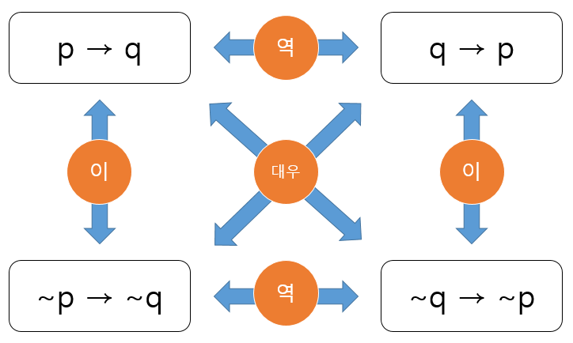

# 로지컬 씽킹?

###### _비주얼 로지컬 씽킹을 읽고..._

-----

## 1. 로지컬 씽킹은 업무 상식이다

### 1.1 로지컬 씽킹은 논리적으로 판단하는 것이다

- 객관적으로 사물을 **파악**해서 구조를 **이해**하고 정확한 **판단**을 내려서 바람직한 **결과**를 얻기 위한 활동

### 1.2 기본은 피라미드 구조와 MECE이다

- 논리적으로 생각하기 위해서는 **대상을 분석**하고, **생각해야 할 항목을 분명**하게 할 필요가 있다.
  - 즉, **피라미드 구조**로 만드는 것이 로지컬 씽킹의 기본이다.

- **MECE를 의식**함으로써 생각 요소의 누락을 방지해야 정답에 도달할 가능성이 높아진다.

#### 1.2.1 피라미드 구조는 논리력을 높인다

- 처음에는 불완전한 형태여도 종이에 피라미드 구조를 그려보자.
- 누락이나 중복을 발견하여 **하나로 정리 가능한 상위 개념이나 다른 구조가 보이는 일도 기대 가능**하다.

#### 1.2.2 누락 없이, 중복 없이 생각하는 것이 MECE이다

- **MECE** (Mutually Exclusive Collectively Exhaustive) : 겹치지 않으면서 빠지는 것도 없는 상태

- **누락이 존재**하면 중요한 것을 놓쳐서 **잘못된 결론**에 이를 확률이 높다.
  - 즉, 한 요소가 크게 누락된다면 어떤 문제를 해결하기 위한 해결책을 도출하기 매우 힘들다.
- 항목에 **중복이 존재**할 경우는 같은 것을 여러 번 생각해야 하므로 **효율이 저하**된다.

### 1.3 사고 속도를 올리자

- 로지컬 씽킹에서는 어려운 문제를 **'분해'**로 생각의 시작점과 단서를 찾아서 바로 생각 가능하다.

- **적극적으로 MECE나 피라미드 구조를 활용**하면 불필요한 시간을 줄일 수 있다.
- 사고 속도가 빨라지면 **단축된 시간**으로 더 많은 것을 생각할 수 있고, **업무 성과**로 이어진다.

### 1.4 비즈니스에 바로 적용 가능하다

- 안정되게 프로젝트를 운영하고 성공시키기 위해서는 **전체를 논리적으로 파악**할 필요가 있다.

- 로지컬 씽킹은 **직장인으로서 생활하는데 필수적인 OS**라고 할 수 있다.

### 1.5 '생각한다.' 라는 결론을 내는 것이다

- '생각한다' 는 것은 **입수한 정보에서 어떠한 결론을 도출**하는 것이다.
- 정보와 결론 사이에 논리를 구축해야 한다.
- 인터넷이 보급되면서 누구나 다양한 정보를 얻을 수 있게 되면서 **생각의 중요성**은 더욱 커지고 있다.

-----

## 2. 피라미드 구조로 논리력을 높이자

### 2.1 사물을 분해하면 구체성이 높아진다

- 분해함으로써 정답을 도출하는 데 필요한 요소가 명확해져 요소들의 구조가 보인다.
- 사물을 **분해하여 구체성을 높이되 깊게 해야 요점을 놓치는 일이 줄어든다.**

### 2.2 황금분할이 중요하다

- 황금분할은 **무엇을 중요하게 생각하고 문제를 어떻게 파악**하고 있는지를 나타낸다.

- 즉, **사고의 방향성을 결정**짓는 중요한 첫걸음이다.

### 2.3 수준이 같은 키워드를 나열하자

- 인접하는 항목은 **비슷한 추상도와 중요도로 나열**하자.
- 그래야 **중요한 요소를 빠뜨릴 위험이 줄고, 항목 간의 논의에 의미가 생긴다**.

### 2.4 한 칸에 넣을 항목은 명확하게 정의하자

- 명확하게 정의되지 않은 항목이 한 칸에 들어 있다면 논리적으로 생각하지 못했다는 것이다.

### 2.5 '풍경'형 구조는 잘못된 것이다

- '풍경'형 즉, 항목과 서브항목이 1:1의 관계를 가지는 구조는 올바르지 않다.
- 1:1이 되어있다고 꺠달으면 **그 시점에서 멈추고 논리를 확인**해야 한다.

### 2.6 피라미드 구조는 사칙연산의 집합이다

- 상위 항목을 서브 항목으로 **인수분해하기 때문에 사칙연산으로 표현** 가능하다.
- 올바른 피라미드는 수학적으로 각각의 항목 단위에 대해서 **정합성**이 있다.
- **사칙연산을 의식하면 자신의 분해 습관을 고치고 다양하게 생각 가능해진다.**

### 2.7 삼단논법은 강력한 논리 패턴이다

#### 2.7.1 전제와 사실의 관계성과 정확성을 확인해야 한다

- 삼단논법은 논리 구성이 단순해서 강한 설득력으로 주장 가능하다.
- 하지만, **전제가 무너지면 논리가 무너지기 때문에 주의**해야 한다.

#### 2.7.2 전제가 다르면 논의가 어긋난다

- 논리의 토대가 상대방과 공유되어 있지 않으면 삼단논법에 큰 함정이 생겨 결론이 달라진다.
- 그러므로 **논리의 토대가 무엇이며, 그것이 공유되어 있는지를 확인**해야 한다.

#### 2.7.3 역, 이, 대우로 논리를 확인하자

- 역, 이, 대우로 논리가 무엇인지 생각해봄으로써 **논리의 오류**를 피할 수 있다.

### 2.8 논리의 블랙박스화를 피하자

- **블랙박스화** : 내부 구조나 작동 원리를 해명하지 못하는 상태가 되는 것
- 대충 납득하지 말고 **논리의 연결이 정확한지를 먼저 확인**하자.

### 2.9 귀납법은 설득력이 높은 사고법이다

- 귀납법은 **복수의 사실에서 논리를 쌓아올리는 방법에 근거**한 강력한 사고법이다.
- 사실만으로는 말하기 힘든 **무리한 결론을 이끌어내는지 확인**해야 한다.

#### 2.9.1 귀납법은 반대 사례에 약하다

- 도출된 결론에 맞지 않는 반대 사례가 하나라도 있으면 그 논리는 무너진다.
- 즉, **일반화의 오류**에 빠지지 않도록 예외를 주의해야 한다.

#### 2.9.2  논의 대상이 아닌 것도 생각하자

- 올바른 결론에 이르기 위해서 **시야를 확장하고 다각화하는 것도 중요**하다.

#### 2.9.3 샘플링할 때 치우치지 말자

- 샘플로 추출하는 집단이 특수한지, 아닌지 **늘 한 발짝 물러서서 확인하는 것이 중요**하다.

