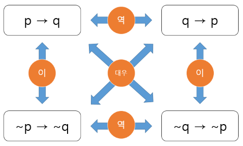

# 결정에 시간을 낭비하지 마라!

###### _비주얼 로지컬 씽킹을 읽고..._

>  로지컬 씽킹이란 무엇일까?
>
> 로지컬 씽킹은 논리적인 과정으로 사물을 판단하는 방법이다. 이를 익히면 문제를 분명하게 알아내고, 이에 대한 해결책을 효과적이고 효율적으로 도출 할 수 있다.  이 책 **비주얼 로지컬 씽킹**에서는 로지컬 씽킹의 기본을 소개하고 있으며 69가지의 '생각하는 힌트'를 제공하고 있다. 로지컬 씽킹의 기본이면서 중요하게 생각해야할 것은 **'피라미드 구조'**와 **'MECE'**이다. 이를 간단하게 요약해 보자면,
>
> - **_문제를 분석하고, 생각해야 할 항목을 분명하게 하자._**
> - **_누락 없이 중복 없이 생각하자._**
> - **_문제 설정부터 문제 해결책의 발견, 그 마지막 작업은 '행동'이다._**
>
> 로 할 수 있다.

-----

## 1. 로지컬 씽킹은 업무 상식이다

### 1.1 로지컬 씽킹은 논리적으로 판단하는 것이다

- 객관적으로 사물을 **파악**해서 구조를 **이해**하고 정확한 **판단**을 내려서 바람직한 **결과**를 얻기 위한 활동

### 1.2 기본은 피라미드 구조와 MECE이다

- 논리적으로 생각하기 위해서는 **대상을 분석**하고, **생각해야 할 항목을 분명**하게 할 필요가 있다.
  - 즉, **피라미드 구조**로 만드는 것이 로지컬 씽킹의 기본이다.

- **MECE를 의식**함으로써 생각 요소의 누락을 방지해야 정답에 도달할 가능성이 높아진다.

#### 1.2.1 피라미드 구조는 논리력을 높인다

- 처음에는 불완전한 형태여도 종이에 피라미드 구조를 그려보자.
- 누락이나 중복을 발견하여 **하나로 정리 가능한 상위 개념이나 다른 구조가 보이는 일도 기대 가능**하다.

#### 1.2.2 누락 없이, 중복 없이 생각하는 것이 MECE이다

- **MECE** (Mutually Exclusive Collectively Exhaustive) : 겹치지 않으면서 빠지는 것도 없는 상태

- **누락이 존재**하면 중요한 것을 놓쳐서 **잘못된 결론**에 이를 확률이 높다.
  - 즉, 한 요소가 크게 누락된다면 어떤 문제를 해결하기 위한 해결책을 도출하기 매우 힘들다.
- 항목에 **중복이 존재**할 경우는 같은 것을 여러 번 생각해야 하므로 **효율이 저하**된다.

### 1.3 사고 속도를 올리자

- 로지컬 씽킹에서는 어려운 문제를 **'분해'**로 생각의 시작점과 단서를 찾아서 바로 생각 가능하다.

- **적극적으로 MECE나 피라미드 구조를 활용**하면 불필요한 시간을 줄일 수 있다.
- 사고 속도가 빨라지면 **단축된 시간**으로 더 많은 것을 생각할 수 있고, **업무 성과**로 이어진다.

### 1.4 비즈니스에 바로 적용 가능하다

- 안정되게 프로젝트를 운영하고 성공시키기 위해서는 **전체를 논리적으로 파악**할 필요가 있다.

- 로지컬 씽킹은 **직장인으로서 생활하는데 필수적인 OS**라고 할 수 있다.

### 1.5 '생각한다.' 라는 결론을 내는 것이다

- '생각한다' 는 것은 **입수한 정보에서 어떠한 결론을 도출**하는 것이다.
- 정보와 결론 사이에 논리를 구축해야 한다.
- 인터넷이 보급되면서 누구나 다양한 정보를 얻을 수 있게 되면서 **생각의 중요성**은 더욱 커지고 있다.

-----

## 2. 피라미드 구조로 논리력을 높이자

### 2.1 사물을 분해하면 구체성이 높아진다

- 분해함으로써 정답을 도출하는 데 필요한 요소가 명확해져 요소들의 구조가 보인다.
- 사물을 **분해하여 구체성을 높이되 깊게 해야 요점을 놓치는 일이 줄어든다.**

### 2.2 황금분할이 중요하다

- 황금분할은 **무엇을 중요하게 생각하고 문제를 어떻게 파악**하고 있는지를 나타낸다.

- 즉, **사고의 방향성을 결정**짓는 중요한 첫걸음이다.

### 2.3 수준이 같은 키워드를 나열하자

- 인접하는 항목은 **비슷한 추상도와 중요도로 나열**하자.
- 그래야 **중요한 요소를 빠뜨릴 위험이 줄고, 항목 간의 논의에 의미가 생긴다**.

### 2.4 한 칸에 넣을 항목은 명확하게 정의하자

- 명확하게 정의되지 않은 항목이 한 칸에 들어 있다면 논리적으로 생각하지 못했다는 것이다.

### 2.5 '풍경'형 구조는 잘못된 것이다

- '풍경'형 즉, 항목과 서브항목이 1:1의 관계를 가지는 구조는 올바르지 않다.
- 1:1이 되어있다고 꺠달으면 **그 시점에서 멈추고 논리를 확인**해야 한다.

### 2.6 피라미드 구조는 사칙연산의 집합이다

- 상위 항목을 서브 항목으로 **인수분해하기 때문에 사칙연산으로 표현** 가능하다.
- 올바른 피라미드는 수학적으로 각각의 항목 단위에 대해서 **정합성**이 있다.
- **사칙연산을 의식하면 자신의 분해 습관을 고치고 다양하게 생각 가능해진다.**

### 2.7 삼단논법은 강력한 논리 패턴이다

#### 2.7.1 전제와 사실의 관계성과 정확성을 확인해야 한다

- 삼단논법은 논리 구성이 단순해서 강한 설득력으로 주장 가능하다.
- 하지만, **전제가 무너지면 논리가 무너지기 때문에 주의**해야 한다.

#### 2.7.2 전제가 다르면 논의가 어긋난다

- 논리의 토대가 상대방과 공유되어 있지 않으면 삼단논법에 큰 함정이 생겨 결론이 달라진다.
- 그러므로 **논리의 토대가 무엇이며, 그것이 공유되어 있는지를 확인**해야 한다.

#### 2.7.3 역, 이, 대우로 논리를 확인하자

- 역, 이, 대우로 논리가 무엇인지 생각해봄으로써 **논리의 오류**를 피할 수 있다.

### 2.8 논리의 블랙박스화를 피하자

- **블랙박스화** : 내부 구조나 작동 원리를 해명하지 못하는 상태가 되는 것
- 대충 납득하지 말고 **논리의 연결이 정확한지를 먼저 확인**하자.

### 2.9 귀납법은 설득력이 높은 사고법이다

- 귀납법은 **복수의 사실에서 논리를 쌓아올리는 방법에 근거**한 강력한 사고법이다.
- 사실만으로는 말하기 힘든 **무리한 결론을 이끌어내는지 확인**해야 한다.

#### 2.9.1 귀납법은 반대 사례에 약하다

- 도출된 결론에 맞지 않는 반대 사례가 하나라도 있으면 그 논리는 무너진다.
- 즉, **일반화의 오류**에 빠지지 않도록 예외를 주의해야 한다.

#### 2.9.2  논의 대상이 아닌 것도 생각하자

- 올바른 결론에 이르기 위해서 **시야를 확장하고 다각화하는 것도 중요**하다.

#### 2.9.3 샘플링할 때 치우치지 말자

- 사실을 기반으로 논리를 구축해도 **치우침이나 의문점이 있으면 신빙성이 저하**된다.

- 샘플로 추출하는 집단이 특수한지, 아닌지 **늘 한 발짝 물러서서 확인하는 것이 중요**하다.

-----

## 3. 누락 없이, 중복 없이 생각하자

### 3.1 우선 '큰 그림'부터 시작하자

- 사물을 생각할 때는 그 **사물에 영향을 미치는 범위 전체를 크게 파악**하자.
- 앞을 내다보고 **넓고 깊게 생각하면 문제 대응 능력이 향상**된다.

#### 3.1.1 생각하는 범위에 따라 답이 달라진다

- 사물을 작게 생각하면, **사고가 표면적이고 근시안적이 되어 일부분만 보게된다**.
- 사물을 크게 파악하면 더욱 본질적인 답을 도출할 수 있다. 

#### 3.1.2 누락 없이 생각해서 적중시키자

- 누락이 발생하면 **이기적이고 엉뚱한 논리의 함정**에 빠질 가능성이 있다.
- **'전후, 좌우, 상하'로 넓게 생각하면 정확하고 깊은 판단**을 할 수 있다.

### 3.2 면적 그래프로 MECE를 시각화하자

- 큰 사각형이 전체를 나타내고, 안의 사각형이 구조를 나타낸다
- **중요한 요소를 두 개(X, Y)로 추릴 수 있다**.
- MECE가 아니면 면적 그래프를 만들 수 없다.

### 3.3 시간과 공간을 축으로 놓고 발상하자

- **시간과 공간을 두 축으로 놓고 전체상을 이해하면 효과적**이다.

### 3.4 중복을 없애서 효율을 높이자

- **누락이 오류**를 야기한다면, **중복은 비효율**을 초래한다.

- 같은 것을 다른 부류에서 계속 반복하고 있지 않은지 **한 발짝 물러서서 생각**해야 한다.

### 3.5 모를 때는 그루핑부터 시작하자

- 처음부터 사물을 MECE로 분해하기란 어렵다.
- 먼저 생각나는 요소를 걸러내서 **그루핑을 하면 구조를 파악**할 수 있다..

-----

## 4. 로지컬 씽킹으로 문제를 해결하자

### 4.1 문제는 이상과 현실의 괴리에서 나온다

- 해결책은 이 괴리를 메우는 것이라고 할 수 있다.
- 물론 **이상과 현실을 올바르게 이해해야 해결책을 도출**할 수 있다.

### 4.2 'What'을 생각한 다음 'How'를 생각하자

- **무엇을 해야 하는지, 무엇을 실현해야 하는지 등의 시점을 먼저 파악**하자.
- 순서가 잘못될 경우, 문제를 올바르게 설정할 수 없다.

### 4.3 문제 설정은 '4P'를 활용하자

- **목적(Purpose)** : 무엇을 위한 것인지
- **입장(Position)** : 누구의 문제인지
- **공간(Perspectives)** : 사고의 확산이 충분한지
- **시간(Period)** : 어느 시점에서의 문제인지

### 4.4 입장에 따라 문제가 바뀐다

- 입장에 따라 문제는 사물의 본질을 파악하지 못할 확률이 높다.
- 즉, **역지사지의 마음으로 생각한다면 더욱 객관적**으로 다가갈 수 있다.

### 4.5 '가설'을 세우면 작업량이 줄어든다

- 가설의 장점을 세움으로써 명확하게 밝혀야 할 대상을 알 수 있다.
- 수집된 정보와 분석 결과를 활용할 수 있다.
- 정보가 충분하지 않더라도 **불필요한 작업이 생략되어 빠르고 정확한 답을 도출**할 수 있다.

### 4.6 '80/20 법칙'을 적극 활용하자

- 주요 논점만으로 답을 도출할 수 있다.
- 모든 논점에 답을 낼 필요는 없다.
- **대충 맞는다고 생각되는 답을 알맞은 형태로 정의하고 빠르게 행동하는 것이 더 의미**있다.

### 4.7 가설은 새로운 발견으로 진화한다

- **새로운 사실에 의해 가설이 진화되고, 새로운 가설에 의해 분석의 방향성이 생긴다.**
- 처음 가설에 집착하지 말고, 가설에 맞지 않는 발견이 있더라도 무시해선 안된다.

### 4.8 Why를 다섯 번 반복하자

- **단편적인 생각으로는 문제해결이 불가능**하다.

- 다섯 개의 다른 시각에서 **다면적으로 문제를 접근**해 보자

### 4.9 360도로 사고해보자

- 문제의 **다양한 성질을 이해하는 것은 해결책을 도출하기 위한 필수 조건**이다.
- 복잡한 것을 이해하기위해서는 복잡성을 받아들이고 **사고의 유연성**을 가져야한다.

### 4.10 끊임없이 의심하자

- **'Why so?', 'So what?', 'True?'의 질문을 반복해서 논리를 탄탄하게** 하자.
- 세 가지 질문을 반복하면 논리가 탄탄해지면서 답의 정밀도가 높아진다.

-----

## 5. 사고의 질을 높이자

### 5.1 정보량과 사고량은 반비례한다

- 단서가 되는 정보가 전혀 없는 상황에서 생각하기란 힘들다.
- **정보량이 많으면 오히려 사고량이 떨어진다.**

### 5.2 모든 것을 건전하게 의심하자

- 모든 것을 **건전하게 의심**함으로써 사고 수준이 한층 더 높아져 돌파구가 생긴다.
- 이를 **크리티컬 씽킹**이라고 한다.

### 5.3 현상이 아니라 시스템을 생각하자

- 원인과 결과는 반드시 시공간으로 근접해있지 않다.
- **연결을 파악**해야 다양한 구조(시스템)를 파악할 수 있다.

### 5.4 셀프 토론을 즐기자

- 다양한 사람의 입장을 빌려서 셀프 토론을 해보면 **자신의 논리를 다른 시점에서 파악** 가능하다.

### 5.5 말보다 그래프로 생각하자

- 그래프로 표현하는 것은 **생각을 수식으로 바꾸는 것**을 의미한다.
- 그래프는 **인과관계나 역동성을 이해**하는데 좋고, **수치화되므로 정량적인 분석**이 가능하다.

### 5.6 거짓 관계를 찾아내자

- **상관관계만을 보고 결론을 내리고 인과관계의 존재를 결정 짓는 것은 위험**하다.
- 상관관계의 이면에 **숨은 다른 인자를 의심**해보자.

### 5.7 키워드에 의존하지 말자

- 키워드를 많이 사용하면 잘 **모르는 것을 아는 것처럼 착각하는 실수**를 할 수 있다.
- **애매한 표현이 나왔을 때는 그대로 방치하지 말고 논리적으로 분해**해야 한다.

### 5.8 일반 해답 말고 '개별 해답'을 찾자

- 일반 해답은 진정한 문제 해결로 이어지는 경우가 많지 않다.
- **진정한 답이란 그 상황에만 적용할 수 있는 개별 해답**이어야 한다.

### 5.9 무엇을 위해서 생각하는지 잊지 말자

- **작업에 몰두한 나머지 생각하던 것이 본래 목적을 잃는 경우가 존재**한다.
- 무엇을 위해서 무엇을 하는지를 늘 **의식**하자.

-----

## 6. 로지컬 커뮤니케이션으로 설득하자

### 6.1 결론부터 먼저 말하자

- **결론을 먼저** 말하고 그 **후에 근거**를 말하는 순서로 소통하면 **자신의 생각을 보다 쉽게 전달**할 수 있다.
- 자신이 말하고자 하는 바가 확실하게 **전할 수 있는 구조로 되어 있는지 의식**해보자.

### 6.2 요점을 세 가지로 정리해서 말하자

- 발언해야할 때 **'요점은 세가지'라고 선언**하면, 듣는 이가 전체상을 이해할 수 있기 때문에 안심한다.
- 그 자리에서 말하는 **논점을 간추리고 정리하는 것 자체가 로지컬 씽킹**으로 이어진다.

### 6.3 설득력이 강해지는 CRF 법칙이 있다

- **Conclusion(결론), Reason(이유), Facts(근거)**의 순서로 사물을 설명하는 방법이다.
- **피라미드 구조가 C - R - F 의 세 단계로 이루어지기 때문에 큰 설득력**이 있다.

### 6.4 사실, 인식, 의견은 명확히 나누자

- 근거가 되는 **사실을 확실하게 파악하면 인식과 의견을 서로 맞출 수 있다**.

### 6.5 훌륭한 정보의 필수 3요소를 알자

- **1차 정보** : 생생한 정보
- **정량 정보** : 수치적으로 표현한 정보
- **중립 정보** : 자신이 아닌 타인이 평가하는 정보

### 6.6 한 페이지당 메시지는 하나여야 한다

- 파워포인트를 사용한다면 슬라이드 **한 장당 메시지 하나 or 도표 하나**여야 한다.
- **소통의 효과**는 프레젠테이션이나 슬라이드의 **완성도에 따라 크게 좌우**된다.

### 6.7 스토리가 사람의 마음을 흔든다(스토리텔링)

- 사실이 다양한 요소와 뒤섞여 공감이 생긴다.
- 피라미드 구조를 스토리로 적어서 **듣는 사람의 공감**을 얻는다.

-----

## 7. 일상에서 로지컬 씽킹을 훈련하자

### 7.1 일상 사건을 분해해보자

- 일상생활에서 **자연스럽게 눈에 들어오는 것들을 분해하면서 정량화**하는 것부터 시작하자.
- 가게의 수익이나, 광고의 타깃과 이익과 비용의 관계 등을 생각해보자.

### 7.2 본질적인 문제에 도전하자

- 답이 보이지 않는 **본질적인 문제에 도전**하는 것도 도움이 된다.
- 본질적인 문제는 임시방편으로 해결할 수 없으므로 **다양한 시도를 하면서 깊이 생각**할 수 있다.

### 7.3 사물을 숫자로 보자

- 중요한 숫자 감각은 **절대치**이다.
- 비율에만 의지해서는 의미없는 생각이나 논의에 빠질 우려가 있다.

### 7.4 '멋대로 부양책 훈련'을 해보자

- 우수한 사람에게만 의지하지 말고 생각하자.

- 주관적으로 마치 **내 일처럼 생각하는 습관은 로지컬 씽킹의 토대**가 된다.

### 7.5 머릿속 서랍을 늘리자

- 지금까지 **자신이 사용해온 문제 설정이나 해결 패턴을 적극적으로 활용**해야 한다.
- 현상은 달라도 그 속에 있는 **구조가 같으면 비슷한 문제 설정이나 해결이 가능**하다.

### 7.6 미래의 시나리오를 만들자

- 무엇이 어떻게 변화하는지를 자기 나름대로 내다보는 일은 의미가 있다.
- 미래가 시나리오대로 되지 않아도 시나리오를 가지고 있는 만큼 **궤도를 수정**할 수 있다.

### 7.7 이미지로 그려보며 사고하자

- 자신이 생각하는 것을 **시각화하는 것은 깊이 사고하는데 큰 위력을 발휘**한다.
- **화이트 보드가 화면이 크고, 수정이 용이하므로 전체상을 명백**하게 한다.

### 7.8 어정쩡한 상태도 참아보자

- 바로 생각하는 것보다 시간을 두면 생각이 숙성되어 새로운 발상이 나올 수 있다.
- 어정쩡한 상태는 답답하겠지만 **바로 답에 뛰어드는 충동을 참는 일도 필요**하다.

### 7.9 한두 단계 위의 입장에서 생각하자

- 시선을 한두 단계 높여서 '큰 그림'으로 생각한다.
- **시선을 높이면 영향력도 강해진다**.

### 7.10 목표 설정이 SMART해야 한다

- **S(Specfic)** : '해야 할 일이 구체적인가?'
- **M(Measurable)** : '목표를 정량적으로 측정 가능한가?'
- **A(Agreed upon)** : '납득하고 있는가?'
- **R(Realistic)** : '현실적인가?'
- **T(Timely)** : '지금이 적절한 타이밍이고, 목표 달성의 기일이 정해져 있는가?'
- 문제 설정부터 해결책까지 **마지막 작업은 '행동'**이다.

-----

## 8. 마무리하며

  오늘날 비즈니스 세계에서는 로지컬 씽킹이 '글로벌 스탠더드'라고 불릴만큼 업무를 진행하는데 필수적인 기술이라고 해도 과언이 아니다. 하지만 아무리 필수적인 기술이라고 해도 실천하지 않으면 의미가 없다. 활용할 수 있도록 단련해야한다. 이 책 **비주얼 로지컬 씽킹**은 로지컬 씽킹을 소개하면서 어떻게 활용하며 단련 방법들에 대한 힌트를 제공하고 있다.

  **첫 번째 장에서는** 문제를 분석하고, 생각해야 할 항목을 분명하게 하는 **'피라미드 구조'**와 **'MECE'**를 적극적으로 적용하여 결론을 도출하는 것이 **로지컬 씽킹**이라고 소개하고 있다.

  **두 번째 장에서는** '피라미드 구조'로 만들 때 수준이 같은 항목으로 분해하고, **삼단논법**을 이용하여 **논리의 오류**에 빠지지 않도록 조심해야 한다고 '로지컬 씽킹'에서 **'피라미드 구조'를 만들 때의 힌트**를 조언하고 있다.

  **세 번째 장에서는** 사물에 영향을 미치는 범위 전체를 크게 파악하여 **누락과 중복 없이(MECE)** 생각하고 한 발짝 떨어져서 **'큰 그림'**을 볼 수 있도록 해야 한다고 조언하고 있다.

  **네 번째 장에서는** 이상과 현실을 올바르게 이해해야 해결책을 도출할 수 있고, **역지사지**의 시각을 가지고 **끊임없이 의심**한다면 더욱 객관적인 해결책을 제시할 수 있다고 **로지컬 씽킹으로 문제를 해결하는 과정**을 소개한다.

  **다섯 번째 장에서는** 위와 같은 과정들을 통해 결론을 도출했음에도 **한번 더 의심**하고 본래의 목적을 잃지는 않았는지 살펴봐야하는 **주의사항**들을 소개한다.

  **여섯 번쨰 장에서는** 도출된 결론으로 상대방을 효과적으로 **설득하는 방법**들을 소개하고 있다.

  **일곱 번째 장에서는** 일상에서의 **로지컬 씽킹의 훈련 방법**을 소개하고 있다.