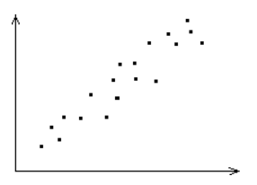
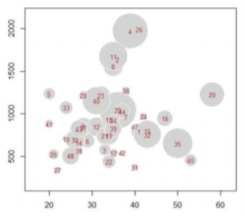

# 데이터가 보인다

## 1. 데이터 분석의 개요

### 1.1 데이터 분석의 개념

#### 1.1.1 데이터 분석의 다양한 형태

- **협업필터링(Collaborative Filtering)** 
  - 고객의 상품 구입 이력을 수치화한 **상관계수**를 이용하는 방법
  - 상관계수를 비교해서 서로 높은 상관이 인정되는 경우 상품을 제안하는 것
- **RFM 분석**
  - **Recency(최근)** : 해당 객이 마지막으로 구입한 날
  - **Frequency(빈도)** : 해당 고객이 일정 기간 내 구입한 횟수
  - **Monetary(규모)** : 해당 고객이 일정 기간 내 구입한 금액의 합계
- **자동 발주 시스템(AOS, Automatic Ordering System)** 
  - 재고량이 발주량을 하회하면 미리 설정된 수량을 발주하여 항상 적절한 양의 재고를 확보하는 시스템
  - **표준편차**와 **정규분포**가 사용됨

#### 1.1.2 사이트 운영과 데이터 분석

- 전자상거래 사이트의 운영에서 가장 중요한 수치는 **접속 횟수**
- **접속 횟수는 통상 시간대나 요일 등에 의해 크게 변동**
- 시간에 따라 긴박하게 변화하는 수치의 예측에는 **이동평균법**과 **지수평활법**이 사용됨

### 1.2 데이터 분석 시스템의 구성 요소

- **데이터 웨어하우스(DW, Data Warehouse)** : 분석 대상이 되는 데이터를 축적해두는 요소
  - **센트럴 웨어하우스(Central Warehouse)** : 데이터 웨어하우스 본체가 되는 데이터베이스
  - **데이터 스테이징 영역(DSA, Data Staging Area)** : 센트럴 웨어하우스에 저장하기 전의 임시 저장소
  - **데이터 마트(Data Mart)** : 센트럴 웨어하우스의 데이터 일부를 재구성한 소규모 데이터베이스
- **비즈니스 인텔리전스(BI, Business Intelligence)** : 데이터 웨어하우스에 축적된 데이터를 분석하는 요소
  - **플래닝 툴(Planning Tool)** 
    - **계획(Plan)** 단계에서 **계획의 근거를 검증**하기 위한 데이터 분석 툴
    - 다차원 데이터베이스에서 몇 가지 조건별로 시뮬레이션 결과를 작성 및 비교
  - **리포팅 툴(Reporting Tool)**
    - **실행(Do)** 단계에서 **문제의 조짐을 발견**하기 위한 데이터 분석 툴
    - 정형 리포트나 모니터링 화면 생성 기능에 의해 수치의 경향이나 움직임을 감시
  - **OLAP 툴**
    - **검증(Check)** 단계에서 **문제의 요소를 검증**하기 위한 데이터 분석 툴
    - 다차원 데이터베이스에서 데이터 슬라이싱, 드릴다운 & 드릴업, 드릴스루 등을 수행
  - **데이터 마이닝 툴(Data Mining Tool)**
    - **대처(Act)** 단계에서 **문제해결의 힌트**를 얻기 위한 데이터 분석 툴
    - 데이터 마이닝 알고리즘을 사용해 대량의 데이터로부터 미지의 관계, 경향을 도출하는 과정 자동화

---

## 2. 데이터 분석의 기초 지식

### 2.1 데이터 분석에 사용되는 다양한 평균

#### 2.1.1 기하평균

- **복수개의 수치의 곱을 수치의 개수로 제곱근을 취해서 산출되는 평균값**

$$
기하평균 = \sqrt[n]{x_1 \times x_2 \times x_3 ... x_n}
$$

- 기하평균에 의한 데이터 분석은 **CAGR(Compound Average Growth Rate)**

#### 2.1.2 조화평균

- **복수개의 수치의 역수를 산술평균한 것을 다시 역수를 취해서 산출되는 평균값**

$$
조화평균 = \frac{n}{\frac{1}{x_1} + \frac{1}{x_2} + \frac{1}{x_3} + ... + \frac{1}{x_n}}
$$

- 평균작업효율 등 생산성의 평균을 산출할 떄 사용

#### 2.1.3 가중평균

- **각각의 수치에 가중치를 부여한 값의 합을 가중치의 합으로 나누어 산출된 평균값**

$$
가중평균 = \frac{w_1 \times x_1 + w_2 \times x_2 + w_3 \times x_3 +... + w_n \times x_n}{w_1 + w_2 + w_3 + ... + w_n}
$$

- 가중평균은 모든 가중치가 동일하다면 산술평균과 같음

### 2.2 데이터 분석에 사용되는 분포 및 편차

#### 2.2.1 도수분포와 히스토그램

- **도수분포** : 복수의 데이터를 같은 간격으로 된 몇 개의 구간별로 나누었을 때 각 구간에 포함된 데이터 개수
- **히스토그램** : 도수분포를 막대그래프로 나타내 것
  - 데이터의 분포 상황을 시각적으로 확인
  - 이상치를 시각적으로 검출할 수 있음

#### 2.2.2 분산과 표준편차

- **분산** : 데이터가 표준데이터에서 얼마나 흩어져있는지를 나타냄
- **표준편차** : 분산을 제곱한 값으로, 데이터의 격차를 비교하여 평균값에서의 폭을 측정

#### 2.2.3 정규분포와 표준정규분포

- **정규분포** : 발생확률이 높은 평균값을 중심으로 해서 좌우 대칭으로 확률이 낮아져가는 확률분포
- **표준정규분포** : 정규분포 중에서 평균이 0, 표준편차가 1인 분포
  - 복수의 데이터에 대해 평균값으로의 격차 정도를 비교 가능
  - 특정 값이 나타날 확률을 간단히 계산 가능

## 3. 상관관계와 회귀분석

### 3.1 산포도와 버블차트

- **산포도** : x축과 y축으로 생긴 사분면에 **데이터 위치를 점으로 표시한 그래프**

  

- **버블차트** : 산포도에 데이터의 **속성값을 크기로 나타내서 버블로 표시된 산포도**

  

### 3.2 상관계수

- **상관계수** : 변화하는 데이터의 속성값 2가지에 대해 상관관계의 경향과 강도를 나타내는 지표
  $$
  r(상관계수) = \frac {\sum((x_i-\bar x) \times (y_i - \bar y))} {\sqrt {\sum(x_i - \bar x)^2 \times \sum(y_i - \bar y)^2}}
  $$

  - 정상관 : 상관계수가 0보다 클 경우(r > 0)
  - 부상관 : 상관계수가 0보다 작을 경우(r < 0)
  - 완전무상관 : 상관계수가 0일 경우(r = 0)

### 3.3 회귀분석

- **회귀분석** : 원인이 되는 값과 결과가 되는 값의 관련성을 통계적으로 조사하는 방법

  - 회귀분석은 예측모델인 **기울기**와 **절편**이 사용
    $$
    y = ax +b\\
    a = \frac{\sum((x_i-\bar x) \times (y_i - \bar y))}{\sum(x_i-\bar x)^2}\\
    b = \bar y -a\bar x
    $$

- 가격탄력성 분석 : 제품의 가격이 변동함에 따라 수요가 변화하는 정도
    $$
    가격탄력성 = \frac{수요의 변화율}{가격의 변화율}
    $$

### 3.4 결정계수

- **결정계수** : 데이터의 특정 값이 또 다른 한 값에 주는 영향의 강도를 측정하는 지표

$$
결정계수 = r(상관계수)^2
$$

- 결정계수의 값은 0 ~ 1 사이에 있으며, 상관관계가 높을수록 1에 가까워짐
  - 0에 가까울 수록 회귀모형은 유용성이 낮고, 반대이면 유용성이 높음