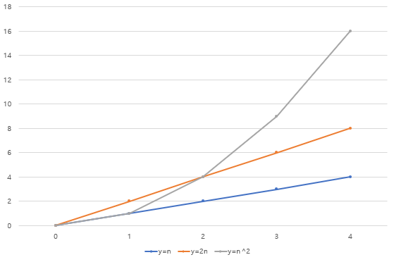
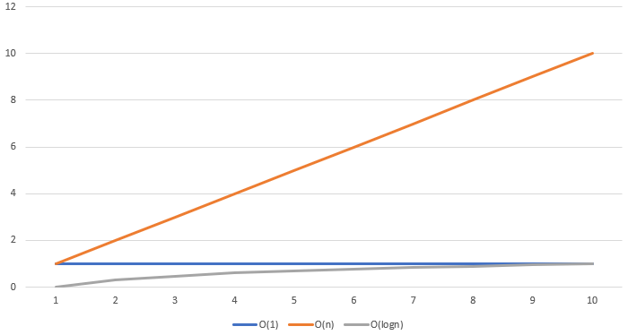

# 시스템 성능 구조

## 1. 성능 기초 개념

### 1.1 알고리즘

#### 1.1.1 알고리즘이란 ?

- 어떠한 문제를 해결하기 위한 일련의 절차나 방법을 공식화한 형태로 표현한 것
- 계산을 실행하기 위한 단게적 절차를 의미

#### 1.1.2 알고리즘을 배우는 방법

- 장점과 단점을 파악
  - 알고리즘에는 장점과 단점이 늘 공존하는데, 인식하지 못해서 발생하는 문제 존재
- 그림을 그려서 생각
  - 성능은 그림을 그려 가면서 이해하는것이 중요
  - 가능한 한 스스로 그림을 그려 가면서 다른 사람에게 설명해볼 것

### 1.2 알고리즘과 성능

#### 1.2.1 성능 영향 정도

> - 100만 개 데이터에서 특정 데이터를 검색하는 경우(하나의 데이터를 보는데 1ms)
>  1. 확률적으로 반 정도를 보면 데이터를 찾을 수 있으므로 50만 x 1ms = 500초 소요
>  2. 이진 탐색 알고리즘의 경우 1회째 50만, 2회째 25만으로 반씩 줄어들어 20회 째에 조사 대상이 한 개가 되어 20ms가 소요

- 자잘한 오버헤드(overhead) 무시 가능
  - 전체적인 관점에서 자잘한 처리는 무시해도 좋을 정도(40ms나 60ms는 무시)
- 중요한 것은 데이터 양이 증가할 때 어떤 형태로 시간이 늘어나는가임
  - 데이터가 적을 때 성능이 좋아도 수천~수만 건일때 성능이 급격히 저하되는 알고리즘이 존재하기 때문

#### 1.2.2 알고리즘 평가 지표



- 2n의 2는 큰 영향을 주지 못한다는 것이 앞서 자잘한 오버헤드는 무시 가능함을 보여줌

- **계산량이란?**
- y=n이나 y=2n에서는 'O(n)'이라고 표기하며 '오더 엔'이라 읽음
  - 트리 구조 같은 이진 탐색에서는 'O(logn)'인데 수가 커져도 늘어나는 시간은 적음
  - 


### 1.3 응답과 처리량

- **응답(Response)** : 요청에 얼마나 빠르게 반응 가능한지
  - 응답 중심 시스템
    - 응답이 빠르면 보통 처리량도 올라가기때문에 만능처럼 보임
    - CPU clock이나 디스크 I/O 속도에 한계가 있으므로 물리적으로 불가능
- **처리량(Throughput)** : 처리 가능한 양이 많은지
  - 처리량 중심 시스템
    - 동시에 대량 처리를 하는 시스템
- 성능을 고려할 때는 응답 중심인지 처리량 중심인지를 항상 인지

### 1.4 성능의 중요 기술

#### 1.4.1 캐시(Cache)

- 캐시는 컴퓨터에서 성능 향상을 목적으로 사용
- 성능 목적이기 때문에 배치 위치보단 빠른 속도가 중요
- 데이터 갱신 방법에 따라 **라이트 백(Write Back)**과 **라이트 스루(Write Through)**로 나뉨
  - **라이트 백**
    - 데이터 갱신 시 정식 데이터는 갱신 X, 캐시 데이터만 갱신 후 정식 데이터를 갱신하는 방법
    - 장점
      - 정식 데이터의 위치는 멀리 떨어져 있어 처리 속도가 느리지만, 라이트백은 정식 데이터 기록을 기다리지 않으므로 속도가 빠름
    - 단점
      - 캐시 데이터가 망가지면 정식 데이터가 오래된 데이터를 보유할 경우에 불일치 문제 발생, 정식 데이터도 항상 최신 상태로 유지하려면 라이트 스루 방식 사용
  - **라이트 스루**
    - 정식 데이터도 반드시 갱신해야 하는 경우
    - 시간이 걸리지만 데이터를 확실하게 갱신 가능한 방법
    - 장점
      - 캐시에 데이터 존재 시 읽기 처리가 빠르고, 쓰기 처리도 보장
    - 단점
      - 정식 데이터에 기록하기까지 시간이 걸리기 때문에 응답 지체 가능

#### 1.4.2 락(Lock)과 성능

> 어느 구조에서 특정 위치에 동시에 데이터를 입력하려 한다면 구조는 망가진다. 이와 같은 사태를 방지하기 위해서는 갱신 중에는 다른 프로그램의 갱신 처리를 기다려야한다.

- 락은 병렬로 처리할 때 필요한 메커니즘
- 특정 처리가 진행되고 있는 상태를 보호하기 위한 구조이자, 다른 처리가 끼어들지 못하도록 하는 것
- 락 대기는 하나의 처리만 실행될 때는 발생하지 않기에 개발 시에는 인지하지 못하는 경우가 다수 존재
- **락 대기를 해결할 방법**
  - 기본적인 해결책은 락이 된 처리를 빨리 끝내는 것
    - DB 테이블에 락을 건 상태에서 SQL을 발행한 경우 해당 SQL을 빠르게 끝내면 됨
  - 락을 분할하는 방법
    - DB 테이블에 락을 거는 것이 아니라, 레코드에 대해 락을 걸어서 SQL 발행 시 병렬 실행 가능
    - 이처럼 락 단위를 작게 해서 대기 시간 감소 가능

---

## 2. 성능 분석의 기본

### 2.1 측정

- 측정이 되지 않으면 성능에 대해 언급이 불가능

- 성능 문제 대처나 성능 튜닝은 바른 측정이 수반되어야 가능

### 2.2 필요한 성능 정보

#### 2.2.1 '샌드위치' 원칙

- 성능 측정의 기본으로 시간적인 전후 관계와 장소적인 전후 관계 모두 고려
- 어느 정도 시간의 성능 문제인지, 어떤 부분에서 느려지는 문제인지 이것을 사전에 파악하고 있다면, 사용해야 할 측정 툴과 대상 범위를 좁히기 가능
- 부하가 걸리는 툴도 존재하기 때문에 범위를 좁게 한다고 좋은 것만은 아님

#### 2.2.2 성능 정보 종류와 분석 비법

- **요약 형식**

  - 일정 시간 단위로 정보의 합계나 평균을 보여주는 방식
  - 초기 단계 정보 파악용으로는 편리
  - 값이 평균화되기 때문에 기간 내 변동은 파악하기 어려움

  **분석법**

  - 과거 시점의 대략적인 상태를 조사하기에 유리하지만 원인 조사가 어려움
  - 대략적인 상태(현상)로부터 원인을 추측해야 함

- **이벤트 기록 형식**
  
  - 개별 처리(이벤트)를 순차적으로 기록하는 방식
  - 이벤트 기록 형식의 툴 대부분은 성능 데이터가 방대해지는 단점 존재
  - 부하가 커서 상용 환경에 적용하기는 어려움
  - 어느 정도 문제를 파악한 후 상세한 내용을 조사하기 위한 툴
  
  **분석법**
  
  - 성능 파악 시에 '도착과 출발'을 항상 의식
  - 도착과 출발의 경우 같은 장비에서 측정하는 것이 중요(장비 간 시간이 미묘하게 차이나는 경우 존재)
  
- **스냅 샷**
  
  - 순간의 상태를 기록하는 방식
  - 정기적으로 촬영을 하게 되면 성능 문제를 해결하는데 도움
  - 원인 판명 시에 유용
  
  **분석법**
  
  - 원인을 조사하기에 적합하며 정보를 프로세스, 스레드,  처리 단위로 취득
  - 확인할 정보가 많지만, 문제 시간을 파악 가능하다면 해당 시간대 처리만 조사하면 되기에 원인 파악 용이

### 2.3 대기 행렬 이론

#### 2.3.1 대기 행렬 이론의 용어

- `접근 대기 시간` : 행렬을 기다리고 있는 시간
- `서비스 시간` : 서비스에 걸리는 시간
- `응답 시간` : `접근 대기 시간` + `서비스 시간`
- 대기 행렬 식은 **'M/M/1'**과 같이 표기
  - 처음 M은 요청 도달 시점의 특징, 포아송 분포
  - 다음 M은 서비스 타임의 특징, 지수 분포
  - 마지막 1은 처리병렬도를 가리킴, 1이면 단일 처리

#### 2.3.2 대기 행렬의 평균 대기 시간 계산

- 처리 능력을 초과하지 않더라도 일시적으로 대기 행렬이 발생가능하므로 평균 대기 시간 계산 가능

$$
평균\space사용률\space p\space=\space(처리\space시간\times처리\space건수)/단위\space시간 \\ 대기\space시간 = p/(1-p) \\ 응답\space시간 = 대기\space시간 + 처리\space시간
$$

- 사용률이 100%에 가까울수록 대기 시간이 급격하게 늘어나는 특성 존재
- 처리가 병렬화될수록 최고 대기 시간이 낮아짐
- 단일 처리에서는 상황에 따라 변동이 크지만, 서버처럼 병렬로 처리 가능한 장비는 비교적 안정적 운영 가능

#### 2.3.3 사용률

- **스파이크 ?** 
  - CPU 사용률이 갑자기 커지는 현상
  - 스파이크가 전혀 없는 시스템은 존재하지 않기에 가끔 발생하는 것은 허용해도 무방
  - 단, 성능에 영향을 주지 않는다는 사실을 중요 시스템에서 확인
  - 스파이크를 한 번 확인 후에도 정기적으로 새로운 스파이크가 증가하지 않았는지 관리

- 병렬 처리 정도가 낮으면 사용률이 급격하게 올라가거나 대기 행렬 발생 빈도가 높아짐
- 배치 처리는 처리 시간이 길어지더라도 대기 행렬은 길어지지 않지만, 대기 행렬이 짧더라도 성능에 문제 있는 경우 존재하므로 처리 시간이 긴지를 확인해서 판단

### 2.4 LINUX 명령

#### 2.4.1 sar

|                                  | <center>설 명</center>                                       |
| :------------------------------: | ------------------------------------------------------------ |
|        **성능 정보 종류**        | 요약 형식                                                    |
|          **측정 위치**           | OS 커널을 통해 취득 가능한 OS 정보를 보여줌<br>OS 레벨이기 때문에 애플리케이션에서 본 I/O와 다를 가능성 존재 |
|        **알 수 있는 것**         | CPU 사용률, 유휴(Idle) 상태, 읽기/쓰기 시의 I/O양, 메모리의 대략적인 상태 |
|        **알 수 없는 것**         | 프로세스 단위 상태, 순간적인 성능 문제, 원인이 되는 프로그램이나 프로세스,<br>하이퍼 스레드 등의 실제 CPU사용 상태 등 |
| **함께 보면 <br>좋은 성능 정보** | top 명령으로 얻는 프로세스 단위의 스냅샷 정보와 각종 애플리케이션 성능 정보<br>DB 서버의 경우 DBMS 스냅샷 형식 정보 |
|             **기타**             | sar는 자동으로 기록되기에 대략적인 상황 파악을 위해 과거 내역을 확인 가능<br>sar 명령 자체가 부하가 높지는 않음<br>sar 명령은 정보 출력 항목 수가 적어서 정작 필요한 정보 취득이 어려운 경우 존재<br>이 때문에 전용 명령(vmstat or iostat) 등으로 더욱 자세한 정보 취득 |

#### 2.4.2 vmstat

|                                  | <center>설 명</center>                                       |
| :------------------------------: | ------------------------------------------------------------ |
|        **성능 정보 종류**        | 요약 형식                                                    |
|          **측정 위치**           | OS 커널을 통해 취득 가능한 OS 정보를 보여줌                  |
|        **알 수 있는 것**         | 실행 대기 중인 평균 프로세스 수, 어떤 이유로 대기(블록)된 평균 프로세스 수<br>CPU 사용률, Swap I/O, 보통 I/O, 컨텍스트 스위치 횟수 |
|        **알 수 없는 것**         | 프로세스 단위 상태, 순간적인 성능 문제, 원인이 되는 프로그램이나 프로세스,<br>CPU 코어 상태의 차이(일부 문제에서는 코어 단위로 상태가 달라지는 경우 존재) |
| **함께 보면 <br>좋은 성능 정보** | top 명령 등 프로세스 단위의 스냅샷 정보<br>DB 서버의 경우 DBMS 스냅샷 정보 |
|             **기타**             | 보통 단기간에 취득해도 문제가 없는 명령<br>CPU 사용률보다 실행 대기 중인 평균 프로세스 수(r열)나 블록된 프로세스 수(b열)<br>wa열은 주의가 필요<br>I/O 대기열은 b열을 활용, b열은 페이징에 의한 성능 저하시에도 수치 증가<br>r열의 적정 값은 CPU 코어 수의 두배나 네 배 이하<br>**첫번째줄은 OS 가동후 평균을 출력으로 주의 필요(두번째 줄부터 보자)** |

```bash
$ vmstat -t 5 5	# 시간까지 나오는 옵션으로 5초 간격으로 5회 출력
```

```
procs -----------memory---------- ---swap-- -----io---- --system-- -----cpu-----
 r  b   swpd   free   buff  cache   si   so    bi    bo   in   cs us sy id wa st
 0  0      0 1213512  52084 223120    0    0   693    72  173  318  2  3 94  1  0
 0  0      0 1213488  52084 223148    0    0     0     0   34   37  0  0 100  0  0
 0  0      0 1213488  52084 223148    0    0     0     2   34   35  0  0 100  0  0
 0  0      0 1213488  52084 223148    0    0     0     0   38   42  0  0 100  0  0
 0  0      0 1213488  52084 223148    0    0     0     2   32   35  0  0 100  0  0
```

#### 2.4.3 ps

|                                  | <center>설 명</center>                                       |
| :------------------------------: | ------------------------------------------------------------ |
|        **성능 정보 종류**        | 스냅샷 형식                                                  |
|          **측정 위치**           | OS 커널을 통해 프로세스 정보 취득                            |
|        **알 수 있는 것**         | 실행 시점에 어떤 프로세스가 상주하고 있는가, 실행 시점의 프로세스 상태,<br>프로세스 이름 또는 명령어, 프로세스 번호, 프로세스별 CPU 사용 누적 시간 |
|        **알 수 없는 것**         | 초기 설정 상태에는 메모리나 CPU 사용률 등의 대략적인 상태,<br>실행 중인 각 스레드 정보를 알 수 없음 |
| **함께 보면 <br>좋은 성능 정보** | sar이나 vmstat 등의 요약 형식 정보<br> ps 명령으로 프로세스를 찾운 후 프로세스의 스택이나 트레이스 등으로 상세 내용 조사 |
|             **기타**             | 부하가 비교적 높은 명령이기 때문에 짧은 주기로 반복 실행하기는 부적합, <br>약간 다른 관점에서 프로세스를 조사하고 싶을 때도 있으므로 <br>ps명령으로 프로세스 목록을 정기적으로 취득해 둘 것을 권장 |

```bash
$ ps -elf
```

```
F S UID        PID  PPID  C PRI  NI ADDR SZ WCHAN  STIME TTY          TIME CMD
4 S root         1     0  0  80   0 -  4881 poll_s 02:00 ?        00:00:00 /sbin/init
1 S root         2     0  0  80   0 -     0 kthrea 02:00 ?        00:00:00 [kthreadd]
1 S root         3     2  0 -40   - -     0 migrat 02:00 ?        00:00:00 [migration/0]
1 S root         4     2  0  80   0 -     0 ksofti 02:00 ?        00:00:00 [ksoftirqd/0]
```

#### 2.4.4 netstat

|                                  | <center>설 명</center>                                       |
| :------------------------------: | ------------------------------------------------------------ |
|        **성능 정보 종류**        | 요약 형식(성능 통계 정보) 및 스냅샷 형식(라우팅 정보 등)     |
|          **측정 위치**           | 드라이버 수준, <br>케이블을 직접 측정하는 것이 아니라 네트워크 문제를 반드시 검출 가능한 것은 아님 |
|        **알 수 있는 것**         | `-a` : 실행 시점의 소켓 정보(스냅샷 형식)<br>`-r` : 실행 시점의 라우팅 정보(스냅샷 형식)<br>`-i` : 인터페이스 단위의 통계 정보(요약 형식) |
|        **알 수 없는 것**         | 네트워크 통신의 문제 발생 여부                               |
| **함께 보면 <br>좋은 성능 정보** | 네트워크가 이상하다면 해당 통신을 사용하는 애플리케이션의 성능 로그나 패킷 캡처 |
|             **기타**             | 통신량이나 소켓 목록, 라우팅 정보 등을 확인하고 싶을때 사용<br>클라우드 환경이나 테스트, 검증 환경 등에서 필요에 따라 사용하면 편리 |

```bash
$ netstat -옵션
```

#### 2.4.5 iostat

|                                   | <center>설 명</center>                                       |
| :-------------------------------: | ------------------------------------------------------------ |
|        **성능 정보 종류**         | 요약 형식                                                    |
|           **측정 위치**           | 블록 장비 수준, OS 커널 내부로 OS 파일 시스템 수준의 동작은 기록 X |
|         **알 수 있는 것**         | 디스크 사용률, 사용률을 통해 OS 측면에서의 디스크 가동 상태  |
| **함께 보면 <br/>좋은 성능 정보** | 처음 1회째 ㅍ시는 가동 이후부터의 평균이므로 무시<br>하나의 I/O 응답 시간은 수 밀리초 정도가 적당 그 이상은 응답 시간 저하 의심 필요<br> |
|             **기타**              | iostat로 기록해야 하는 시스템은 I/O가 중요한 DB서버, 디스크 문제 빈도 높은 서버 |

#### 2.4.6 top

|                                   | <center>설 명</center>                                       |
| :-------------------------------: | ------------------------------------------------------------ |
|        **성능 정보 종류**         | 기본은 스냅샷 형식                                           |
|           **측정 위치**           | OS 수준                                                      |
|         **알 수 있는 것**         | 실시간으로 OS 전체 상태를 파악할 때 유용<br>수 초 단위로 OS 전체 상태를 표시하고 활동이 많은 상위 프로세스 정보 선별 표시 |
|         **알 수 없는 것**         | 실시간으로 표시할 때는 활동이 적은 프로세스 정보를 알 수 없음(ps 사용할 것) |
| **함께 보면 <br/>좋은 성능 정보** | 수상한 프로세스(프로그램)의 성능 정보                        |
|             **기타**              | top은 약간 부하가 높은 명령 만일을 위해 부하가 주는 영향도를 고려해 사용 |

#### 2.4.7 패킷 덤프(wireshark, tcpdump)

|                                   | <center>설 명</center>                                       |
| :-------------------------------: | ------------------------------------------------------------ |
|        **성능 정보 종류**         | 이벤트 기록 형식                                             |
|           **측정 위치**           | 드라이버 수준                                                |
|         **알 수 있는 것**         | 어떤 통신을 하고 있는지 상세하게 파악 가능<br>서버 두 대를 샌드위치로 해서 좀처럼 확인하기 어려운 네트워크 부분 성능 파악 가능 |
| **함께 보면 <br/>좋은 성능 정보** | 패킷을 조사하여 수상한 애플리케이션 발견 및 조사해야 함      |
|             **기타**              | 루트 사용자만 실행 가능한 툴<br>OS 상에서 패킷 덤프를 실행하면 성능에 큰 영향을 미침 |

#### 2.4.8 pstack

|                                   | <center>설 명</center>                                       |
| :-------------------------------: | ------------------------------------------------------------ |
|        **성능 정보 종류**         | 스냅샷 형식                                                  |
|           **측정 위치**           | OS가 보는 콜 스택 정보                                       |
|         **알 수 있는 것**         | 해당 프로그램 실행 순간에 어떤 처리를 실행하고 있는지        |
|         **알 수 없는 것**         | pstack은 스냅샷이기에 계속 같은 상태였다는 것을 단정 짓기 불가능 |
| **함께 보면 <br/>좋은 성능 정보** | 이벤트 기록 형식 툴과 함께 사용하면 상태 증명 가능           |
|             **기타**              | pstack은 부하가 낮고, 성능에는 거의 영향을 주지 않음         |

#### 2.4.9 시스템 콜(strace)

|                                   | <center>설 명</center>                                       |
| :-------------------------------: | ------------------------------------------------------------ |
|        **성능 정보 종류**         | 이벤트 기록 형식                                             |
|           **측정 위치**           | OS가 보는 프로세스의 시스템 콜 정보                          |
|         **알 수 있는 것**         | 어떤 시스템 콜에서 기다리고 있는지, OS의 어떤 함수에서 시간이 걸리는지 |
|         **알 수 없는 것**         | 애플리케이션 내부 어디쯤에서 시간이 걸리고 있는지            |
| **함께 보면 <br/>좋은 성능 정보** | 먼저 top 명령 등을 이용해서 어떤 프로세스가 의심스러운지 파악 후<br>대상 특정한 후, 필요에 따라 strace 실행(특히, OS가 수상한 경우)<br>정기적인 pstack 정보를 함께 취득하면 효과적 |
|             **기타**              | strace는 다른 조사 방법이 없을 때 사용<br>부하가 높기 때문에 테스트 환경에서 문제를 재현 후 적용 |

#### 2.4.10 프로파일러(Profiler)

|                                   | <center>설 명</center>                                       |
| :-------------------------------: | ------------------------------------------------------------ |
|        **성능 정보 종류**         | 요약 형식                                                    |
|           **측정 위치**           | OS가 본 특정 프로세스의 함수 처리 시간                       |
|         **알 수 있는 것**         | 어떤 함수가 몇 번 호출됐는지, 어떤 함수에서 시간이 걸리는지  |
|         **알 수 없는 것**         | 순간적으로 발생하는 문제의 원인                              |
| **함께 보면 <br/>좋은 성능 정보** | 가능하면 이벤트 기록 형식 정보도 함께 보자<br>이를 통해 처리 중인 OS나 I/O, 네트워크에 의해 대기 상태가 발생하는지 인지 가능 |
|             **기타**              | 개발 환경에 있는 프로그램 전체 중 어디에서 시간이 걸리고 있는지 조사할 때 유용<br>프로파일러는 OS 상에서 성능 정보를 취득하기 위한 툴이지만,<br>각종 언어에서도 성능 분석에 많이 사용되기 때문에 다양한 프로파일러 기능과 툴 존재 |

