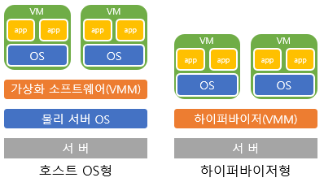

# 시스템 성능 구조

## 1. 성능 기초 개념

### 1.1 알고리즘

#### 1.1.1 알고리즘이란 ?

- 어떠한 문제를 해결하기 위한 일련의 절차나 방법을 공식화한 형태로 표현한 것
- 계산을 실행하기 위한 단게적 절차를 의미

#### 1.1.2 알고리즘을 배우는 방법

- 장점과 단점을 파악
  - 알고리즘에는 장점과 단점이 늘 공존하는데, 인식하지 못해서 발생하는 문제 존재
- 그림을 그려서 생각
  - 성능은 그림을 그려 가면서 이해하는것이 중요
  - 가능한 한 스스로 그림을 그려 가면서 다른 사람에게 설명해볼 것

### 1.2 알고리즘과 성능

#### 1.2.1 성능 영향 정도

> - 100만 개 데이터에서 특정 데이터를 검색하는 경우(하나의 데이터를 보는데 1ms)
>  1. 확률적으로 반 정도를 보면 데이터를 찾을 수 있으므로 50만 x 1ms = 500초 소요
>  2. 이진 탐색 알고리즘의 경우 1회째 50만, 2회째 25만으로 반씩 줄어들어 20회 째에 조사 대상이 한 개가 되어 20ms가 소요

- 자잘한 오버헤드(overhead) 무시 가능
  - 전체적인 관점에서 자잘한 처리는 무시해도 좋을 정도(40ms나 60ms는 무시)
- 중요한 것은 데이터 양이 증가할 때 어떤 형태로 시간이 늘어나는가임
  - 데이터가 적을 때 성능이 좋아도 수천~수만 건일때 성능이 급격히 저하되는 알고리즘이 존재하기 때문

#### 1.2.2 알고리즘 평가 지표


- 2n의 2는 큰 영향을 주지 못한다는 것이 앞서 자잘한 오버헤드는 무시 가능함을 보여줌

- **계산량이란?**
- y=n이나 y=2n에서는 'O(n)'이라고 표기하며 '오더 엔'이라 읽음
  - 트리 구조 같은 이진 탐색에서는 'O(logn)'인데 수가 커져도 늘어나는 시간은 적음
  - 


### 1.3 응답과 처리량

- **응답(Response)** : 요청에 얼마나 빠르게 반응 가능한지
  - 응답 중심 시스템
    - 응답이 빠르면 보통 처리량도 올라가기때문에 만능처럼 보임
    - CPU clock이나 디스크 I/O 속도에 한계가 있으므로 물리적으로 불가능
- **처리량(Throughput)** : 처리 가능한 양이 많은지
  - 처리량 중심 시스템
    - 동시에 대량 처리를 하는 시스템
- 성능을 고려할 때는 응답 중심인지 처리량 중심인지를 항상 인지

### 1.4 성능의 중요 기술

#### 1.4.1 캐시(Cache)

- 캐시는 컴퓨터에서 성능 향상을 목적으로 사용
- 성능 목적이기 때문에 배치 위치보단 빠른 속도가 중요
- 데이터 갱신 방법에 따라 **라이트 백(Write Back)**과 **라이트 스루(Write Through)**로 나뉨
  - **라이트 백**
    - 데이터 갱신 시 정식 데이터는 갱신 X, 캐시 데이터만 갱신 후 정식 데이터를 갱신하는 방법
    - 장점
      - 정식 데이터의 위치는 멀리 떨어져 있어 처리 속도가 느리지만, 라이트백은 정식 데이터 기록을 기다리지 않으므로 속도가 빠름
    - 단점
      - 캐시 데이터가 망가지면 정식 데이터가 오래된 데이터를 보유할 경우에 불일치 문제 발생, 정식 데이터도 항상 최신 상태로 유지하려면 라이트 스루 방식 사용
  - **라이트 스루**
    - 정식 데이터도 반드시 갱신해야 하는 경우
    - 시간이 걸리지만 데이터를 확실하게 갱신 가능한 방법
    - 장점
      - 캐시에 데이터 존재 시 읽기 처리가 빠르고, 쓰기 처리도 보장
    - 단점
      - 정식 데이터에 기록하기까지 시간이 걸리기 때문에 응답 지체 가능

#### 1.4.2 락(Lock)과 성능

> 어느 구조에서 특정 위치에 동시에 데이터를 입력하려 한다면 구조는 망가진다. 이와 같은 사태를 방지하기 위해서는 갱신 중에는 다른 프로그램의 갱신 처리를 기다려야한다.

- 락은 병렬로 처리할 때 필요한 메커니즘
- 특정 처리가 진행되고 있는 상태를 보호하기 위한 구조이자, 다른 처리가 끼어들지 못하도록 하는 것
- 락 대기는 하나의 처리만 실행될 때는 발생하지 않기에 개발 시에는 인지하지 못하는 경우가 다수 존재
- **락 대기를 해결할 방법**
  - 기본적인 해결책은 락이 된 처리를 빨리 끝내는 것
    - DB 테이블에 락을 건 상태에서 SQL을 발행한 경우 해당 SQL을 빠르게 끝내면 됨
  - 락을 분할하는 방법
    - DB 테이블에 락을 거는 것이 아니라, 레코드에 대해 락을 걸어서 SQL 발행 시 병렬 실행 가능
    - 이처럼 락 단위를 작게 해서 대기 시간 감소 가능

---

## 2. 성능 분석의 기본

### 2.1 측정

- 측정이 되지 않으면 성능에 대해 언급이 불가능

- 성능 문제 대처나 성능 튜닝은 바른 측정이 수반되어야 가능

### 2.2 필요한 성능 정보

#### 2.2.1 '샌드위치' 원칙

- 성능 측정의 기본으로 시간적인 전후 관계와 장소적인 전후 관계 모두 고려
- 어느 정도 시간의 성능 문제인지, 어떤 부분에서 느려지는 문제인지 이것을 사전에 파악하고 있다면, 사용해야 할 측정 툴과 대상 범위를 좁히기 가능
- 부하가 걸리는 툴도 존재하기 때문에 범위를 좁게 한다고 좋은 것만은 아님

#### 2.2.2 성능 정보 종류와 분석 비법

- **요약 형식**

  - 일정 시간 단위로 정보의 합계나 평균을 보여주는 방식
  - 초기 단계 정보 파악용으로는 편리
  - 값이 평균화되기 때문에 기간 내 변동은 파악하기 어려움

  **분석법**

  - 과거 시점의 대략적인 상태를 조사하기에 유리하지만 원인 조사가 어려움
  - 대략적인 상태(현상)로부터 원인을 추측해야 함

- **이벤트 기록 형식**
  
  - 개별 처리(이벤트)를 순차적으로 기록하는 방식
  - 이벤트 기록 형식의 툴 대부분은 성능 데이터가 방대해지는 단점 존재
  - 부하가 커서 상용 환경에 적용하기는 어려움
  - 어느 정도 문제를 파악한 후 상세한 내용을 조사하기 위한 툴
  
  **분석법**
  
  - 성능 파악 시에 '도착과 출발'을 항상 의식
  - 도착과 출발의 경우 같은 장비에서 측정하는 것이 중요(장비 간 시간이 미묘하게 차이나는 경우 존재)
  
- **스냅 샷**
  
  - 순간의 상태를 기록하는 방식
  - 정기적으로 촬영을 하게 되면 성능 문제를 해결하는데 도움
  - 원인 판명 시에 유용
  
  **분석법**
  
  - 원인을 조사하기에 적합하며 정보를 프로세스, 스레드,  처리 단위로 취득
  - 확인할 정보가 많지만, 문제 시간을 파악 가능하다면 해당 시간대 처리만 조사하면 되기에 원인 파악 용이

### 2.3 대기 행렬 이론

#### 2.3.1 대기 행렬 이론의 용어

- `접근 대기 시간` : 행렬을 기다리고 있는 시간
- `서비스 시간` : 서비스에 걸리는 시간
- `응답 시간` : `접근 대기 시간` + `서비스 시간`
- 대기 행렬 식은 **'M/M/1'**과 같이 표기
  - 처음 M은 요청 도달 시점의 특징, 포아송 분포
  - 다음 M은 서비스 타임의 특징, 지수 분포
  - 마지막 1은 처리병렬도를 가리킴, 1이면 단일 처리

#### 2.3.2 대기 행렬의 평균 대기 시간 계산

- 처리 능력을 초과하지 않더라도 일시적으로 대기 행렬이 발생가능하므로 평균 대기 시간 계산 가능

$$
평균\space사용률\space p\space=\space(처리\space시간\times처리\space건수)/단위\space시간 \\ 대기\space시간 = p/(1-p) \\ 응답\space시간 = 대기\space시간 + 처리\space시간
$$

- 사용률이 100%에 가까울수록 대기 시간이 급격하게 늘어나는 특성 존재
- 처리가 병렬화될수록 최고 대기 시간이 낮아짐
- 단일 처리에서는 상황에 따라 변동이 크지만, 서버처럼 병렬로 처리 가능한 장비는 비교적 안정적 운영 가능

#### 2.3.3 사용률

- **스파이크 ?** 
  - CPU 사용률이 갑자기 커지는 현상
  - 스파이크가 전혀 없는 시스템은 존재하지 않기에 가끔 발생하는 것은 허용해도 무방
  - 단, 성능에 영향을 주지 않는다는 사실을 중요 시스템에서 확인
  - 스파이크를 한 번 확인 후에도 정기적으로 새로운 스파이크가 증가하지 않았는지 관리

- 병렬 처리 정도가 낮으면 사용률이 급격하게 올라가거나 대기 행렬 발생 빈도가 높아짐
- 배치 처리는 처리 시간이 길어지더라도 대기 행렬은 길어지지 않지만, 대기 행렬이 짧더라도 성능에 문제 있는 경우 존재하므로 처리 시간이 긴지를 확인해서 판단

### 2.4 LINUX 명령

#### 2.4.1 sar

|                                  | <center>설 명</center>                                       |
| :------------------------------: | ------------------------------------------------------------ |
|        **성능 정보 종류**        | 요약 형식                                                    |
|          **측정 위치**           | OS 커널을 통해 취득 가능한 OS 정보를 보여줌<br>OS 레벨이기 때문에 애플리케이션에서 본 I/O와 다를 가능성 존재 |
|        **알 수 있는 것**         | CPU 사용률, 유휴(Idle) 상태, 읽기/쓰기 시의 I/O양, 메모리의 대략적인 상태 |
|        **알 수 없는 것**         | 프로세스 단위 상태, 순간적인 성능 문제, 원인이 되는 프로그램이나 프로세스,<br>하이퍼 스레드 등의 실제 CPU사용 상태 등 |
| **함께 보면 <br>좋은 성능 정보** | top 명령으로 얻는 프로세스 단위의 스냅샷 정보와 각종 애플리케이션 성능 정보<br>DB 서버의 경우 DBMS 스냅샷 형식 정보 |
|             **기타**             | sar는 자동으로 기록되기에 대략적인 상황 파악을 위해 과거 내역을 확인 가능<br>sar 명령 자체가 부하가 높지는 않음<br>sar 명령은 정보 출력 항목 수가 적어서 정작 필요한 정보 취득이 어려운 경우 존재<br>이 때문에 전용 명령(vmstat or iostat) 등으로 더욱 자세한 정보 취득 |

#### 2.4.2 vmstat

|                                  | <center>설 명</center>                                       |
| :------------------------------: | ------------------------------------------------------------ |
|        **성능 정보 종류**        | 요약 형식                                                    |
|          **측정 위치**           | OS 커널을 통해 취득 가능한 OS 정보를 보여줌                  |
|        **알 수 있는 것**         | 실행 대기 중인 평균 프로세스 수, 어떤 이유로 대기(블록)된 평균 프로세스 수<br>CPU 사용률, Swap I/O, 보통 I/O, 컨텍스트 스위치 횟수 |
|        **알 수 없는 것**         | 프로세스 단위 상태, 순간적인 성능 문제, 원인이 되는 프로그램이나 프로세스,<br>CPU 코어 상태의 차이(일부 문제에서는 코어 단위로 상태가 달라지는 경우 존재) |
| **함께 보면 <br>좋은 성능 정보** | top 명령 등 프로세스 단위의 스냅샷 정보<br>DB 서버의 경우 DBMS 스냅샷 정보 |
|             **기타**             | 보통 단기간에 취득해도 문제가 없는 명령<br>CPU 사용률보다 실행 대기 중인 평균 프로세스 수(r열)나 블록된 프로세스 수(b열)<br>wa열은 주의가 필요<br>I/O 대기열은 b열을 활용, b열은 페이징에 의한 성능 저하시에도 수치 증가<br>r열의 적정 값은 CPU 코어 수의 두배나 네 배 이하<br>**첫번째줄은 OS 가동후 평균을 출력으로 주의 필요(두번째 줄부터 보자)** |

```bash
$ vmstat -t 5 5	# 시간까지 나오는 옵션으로 5초 간격으로 5회 출력
```

```
procs -----------memory---------- ---swap-- -----io---- --system-- -----cpu-----
 r  b   swpd   free   buff  cache   si   so    bi    bo   in   cs us sy id wa st
 0  0      0 1213512  52084 223120    0    0   693    72  173  318  2  3 94  1  0
 0  0      0 1213488  52084 223148    0    0     0     0   34   37  0  0 100  0  0
 0  0      0 1213488  52084 223148    0    0     0     2   34   35  0  0 100  0  0
 0  0      0 1213488  52084 223148    0    0     0     0   38   42  0  0 100  0  0
 0  0      0 1213488  52084 223148    0    0     0     2   32   35  0  0 100  0  0
```

#### 2.4.3 ps

|                                  | <center>설 명</center>                                       |
| :------------------------------: | ------------------------------------------------------------ |
|        **성능 정보 종류**        | 스냅샷 형식                                                  |
|          **측정 위치**           | OS 커널을 통해 프로세스 정보 취득                            |
|        **알 수 있는 것**         | 실행 시점에 어떤 프로세스가 상주하고 있는가, 실행 시점의 프로세스 상태,<br>프로세스 이름 또는 명령어, 프로세스 번호, 프로세스별 CPU 사용 누적 시간 |
|        **알 수 없는 것**         | 초기 설정 상태에는 메모리나 CPU 사용률 등의 대략적인 상태,<br>실행 중인 각 스레드 정보를 알 수 없음 |
| **함께 보면 <br>좋은 성능 정보** | sar이나 vmstat 등의 요약 형식 정보<br> ps 명령으로 프로세스를 찾운 후 프로세스의 스택이나 트레이스 등으로 상세 내용 조사 |
|             **기타**             | 부하가 비교적 높은 명령이기 때문에 짧은 주기로 반복 실행하기는 부적합, <br>약간 다른 관점에서 프로세스를 조사하고 싶을 때도 있으므로 <br>ps명령으로 프로세스 목록을 정기적으로 취득해 둘 것을 권장 |

```bash
$ ps -elf
```

```
F S UID        PID  PPID  C PRI  NI ADDR SZ WCHAN  STIME TTY          TIME CMD
4 S root         1     0  0  80   0 -  4881 poll_s 02:00 ?        00:00:00 /sbin/init
1 S root         2     0  0  80   0 -     0 kthrea 02:00 ?        00:00:00 [kthreadd]
1 S root         3     2  0 -40   - -     0 migrat 02:00 ?        00:00:00 [migration/0]
1 S root         4     2  0  80   0 -     0 ksofti 02:00 ?        00:00:00 [ksoftirqd/0]
```

#### 2.4.4 netstat

|                                  | <center>설 명</center>                                       |
| :------------------------------: | ------------------------------------------------------------ |
|        **성능 정보 종류**        | 요약 형식(성능 통계 정보) 및 스냅샷 형식(라우팅 정보 등)     |
|          **측정 위치**           | 드라이버 수준, <br>케이블을 직접 측정하는 것이 아니라 네트워크 문제를 반드시 검출 가능한 것은 아님 |
|        **알 수 있는 것**         | `-a` : 실행 시점의 소켓 정보(스냅샷 형식)<br>`-r` : 실행 시점의 라우팅 정보(스냅샷 형식)<br>`-i` : 인터페이스 단위의 통계 정보(요약 형식) |
|        **알 수 없는 것**         | 네트워크 통신의 문제 발생 여부                               |
| **함께 보면 <br>좋은 성능 정보** | 네트워크가 이상하다면 해당 통신을 사용하는 애플리케이션의 성능 로그나 패킷 캡처 |
|             **기타**             | 통신량이나 소켓 목록, 라우팅 정보 등을 확인하고 싶을때 사용<br>클라우드 환경이나 테스트, 검증 환경 등에서 필요에 따라 사용하면 편리 |

```bash
$ netstat -옵션
```

#### 2.4.5 iostat

|                                   | <center>설 명</center>                                       |
| :-------------------------------: | ------------------------------------------------------------ |
|        **성능 정보 종류**         | 요약 형식                                                    |
|           **측정 위치**           | 블록 장비 수준, OS 커널 내부로 OS 파일 시스템 수준의 동작은 기록 X |
|         **알 수 있는 것**         | 디스크 사용률, 사용률을 통해 OS 측면에서의 디스크 가동 상태  |
| **함께 보면 <br/>좋은 성능 정보** | 처음 1회째 ㅍ시는 가동 이후부터의 평균이므로 무시<br>하나의 I/O 응답 시간은 수 밀리초 정도가 적당 그 이상은 응답 시간 저하 의심 필요<br> |
|             **기타**              | iostat로 기록해야 하는 시스템은 I/O가 중요한 DB서버, 디스크 문제 빈도 높은 서버 |

#### 2.4.6 top

|                                   | <center>설 명</center>                                       |
| :-------------------------------: | ------------------------------------------------------------ |
|        **성능 정보 종류**         | 기본은 스냅샷 형식                                           |
|           **측정 위치**           | OS 수준                                                      |
|         **알 수 있는 것**         | 실시간으로 OS 전체 상태를 파악할 때 유용<br>수 초 단위로 OS 전체 상태를 표시하고 활동이 많은 상위 프로세스 정보 선별 표시 |
|         **알 수 없는 것**         | 실시간으로 표시할 때는 활동이 적은 프로세스 정보를 알 수 없음(ps 사용할 것) |
| **함께 보면 <br/>좋은 성능 정보** | 수상한 프로세스(프로그램)의 성능 정보                        |
|             **기타**              | top은 약간 부하가 높은 명령 만일을 위해 부하가 주는 영향도를 고려해 사용 |

#### 2.4.7 패킷 덤프(wireshark, tcpdump)

|                                   | <center>설 명</center>                                       |
| :-------------------------------: | ------------------------------------------------------------ |
|        **성능 정보 종류**         | 이벤트 기록 형식                                             |
|           **측정 위치**           | 드라이버 수준                                                |
|         **알 수 있는 것**         | 어떤 통신을 하고 있는지 상세하게 파악 가능<br>서버 두 대를 샌드위치로 해서 좀처럼 확인하기 어려운 네트워크 부분 성능 파악 가능 |
| **함께 보면 <br/>좋은 성능 정보** | 패킷을 조사하여 수상한 애플리케이션 발견 및 조사해야 함      |
|             **기타**              | 루트 사용자만 실행 가능한 툴<br>OS 상에서 패킷 덤프를 실행하면 성능에 큰 영향을 끼침 |

#### 2.4.8 pstack

|                                   | <center>설 명</center>                                       |
| :-------------------------------: | ------------------------------------------------------------ |
|        **성능 정보 종류**         | 스냅샷 형식                                                  |
|           **측정 위치**           | OS가 보는 콜 스택 정보                                       |
|         **알 수 있는 것**         | 해당 프로그램 실행 순간에 어떤 처리를 실행하고 있는지        |
|         **알 수 없는 것**         | pstack은 스냅샷이기에 계속 같은 상태였다는 것을 단정 짓기 불가능 |
| **함께 보면 <br/>좋은 성능 정보** | 이벤트 기록 형식 툴과 함께 사용하면 상태 증명 가능           |
|             **기타**              | pstack은 부하가 낮고, 성능에는 거의 영향을 주지 않음         |

#### 2.4.9 시스템 콜(strace)

|                                   | <center>설 명</center>                                       |
| :-------------------------------: | ------------------------------------------------------------ |
|        **성능 정보 종류**         | 이벤트 기록 형식                                             |
|           **측정 위치**           | OS가 보는 프로세스의 시스템 콜 정보                          |
|         **알 수 있는 것**         | 어떤 시스템 콜에서 기다리고 있는지, OS의 어떤 함수에서 시간이 걸리는지 |
|         **알 수 없는 것**         | 애플리케이션 내부 어디쯤에서 시간이 걸리고 있는지            |
| **함께 보면 <br/>좋은 성능 정보** | 먼저 top 명령 등을 이용해서 어떤 프로세스가 의심스러운지 파악 후<br>대상 특정한 후, 필요에 따라 strace 실행(특히, OS가 수상한 경우)<br>정기적인 pstack 정보를 함께 취득하면 효과적 |
|             **기타**              | strace는 다른 조사 방법이 없을 때 사용<br>부하가 높기 때문에 테스트 환경에서 문제를 재현 후 적용 |

#### 2.4.10 프로파일러(Profiler)

|                                   | <center>설 명</center>                                       |
| :-------------------------------: | ------------------------------------------------------------ |
|        **성능 정보 종류**         | 요약 형식                                                    |
|           **측정 위치**           | OS가 본 특정 프로세스의 함수 처리 시간                       |
|         **알 수 있는 것**         | 어떤 함수가 몇 번 호출됐는지, 어떤 함수에서 시간이 걸리는지  |
|         **알 수 없는 것**         | 순간적으로 발생하는 문제의 원인                              |
| **함께 보면 <br/>좋은 성능 정보** | 가능하면 이벤트 기록 형식 정보도 함께 보자<br>이를 통해 처리 중인 OS나 I/O, 네트워크에 의해 대기 상태가 발생하는지 인지 가능 |
|             **기타**              | 개발 환경에 있는 프로그램 전체 중 어디에서 시간이 걸리고 있는지 조사할 때 유용<br>프로파일러는 OS 상에서 성능 정보를 취득하기 위한 툴이지만,<br>각종 언어에서도 성능 분석에 많이 사용되기 때문에 다양한 프로파일러 기능과 툴 존재 |

## 3. 시스템 성능 분석

### 3.1 웹/AP 서버와 자바/C 애플리케이션

#### 3.1.1 웹 서버의 접속 로그

- 언제, 어떤 요청이 왔는지를 알 수 있는 이벤트 형식 로그
- 시간이나 URL 정보뿐만 아니라, 응답에 어느 정도 시간이 걸렸는지 기록 가능
- 성능 분석 시에 부하의 상태를 확인할 때 유용
- 성능 문제를 분석할 때는 반드시 정확한 정보가 주어진다고 할 수 없음
- 도착 시간과 응답 시간 양쪽을 기록해 두면 , 웹 서버에 어떤 문제가 발생하는지 인지 가능

#### 3.1.2 애플리케이션/AP 서버 로그

- 자바나 C 언어는 예전부터 Log4J 등을 이용해서 **이벤트 기록 형식**으로 로그를 출력
- 웹 서버 접속 로그와 함께 사용하면 동기화 시점 분석 가능
- **요약 형식** 정보는 C 언어에서는 프로파일러 자바에서는 VisualVM 이용해서 확인
  - 단 성능에 크게 영향을 주기 때문에 테스트 환경에서 확인
- **스냅샷** 정보는 C 언어에서는 pstack 등의 OS 툴 사용, 자바는 스레드 덤프 사용
  - 스냅샷이기에 짧은 순간에 발생하는 문제를 분석하기에 적합
- 성능 정보 취득에 있어 자바와 C 언어의 차이점은 **GC 로그**
  - 성능 분석의 관점에서는 GC 로그를 출력할 것을 권장
  - **GC 로그를 제대로 활용하지 않으면 성능 문제를 해결하지 못하는 경우 다수 발생**

### 3.2 DB 서버의 성능 측정

#### 3.2.1 DBMS 성능 측정 이론

- DBMS의 경우 요약 정보를 분석하는 것이 중요하며, 여기에 추가로 세션이나 SQL을 확인

- DB 서버에서는 스레드가 다수 존재하지만, 각각을 연속적으로 확인할 필요 있음
  - DB 서버에서는 스레드 간에 일어나는 처리를 자주 확인할 필요가 있어서임
  - AP 서버에서는 각 스레드가 비교적 독립된 처리를 하지만, DB 서버는 데이터를 일괄 관리하기 때문에 스레드 간 처리나 리소스 경합이 발생
  - DBMS는 많은 서버로부터 요청을 받기 때문에, 상용 DBMS 대부분은 병렬 처리를 전제로 제작됨
  - 그러므로 DBMS 성능 분석 시에는 다수의 스레드가 존재한다는 것을 항상 인식

- 세부 조사는 SQL 단위 또는 세션 단위로 하고 SQL의 요약 정보는 SQL 트레이스를 통해 확인 가능

#### 3.2.2 성능 정보 마무리

- DBMS를 통해 취득 가능한 정보는 다양
- 중요한 것은 CPU 처리 시간 외의 대기 시간 조사와 `CPU 처리 시간 + 대기 시간 = SQL 시간`이라는 것

### 3.3 저장소 성능 분석 개념

#### 3.3.1 저장소 용어

|      용 어      | <center>설 명</center>                                       |
| :-------------: | ------------------------------------------------------------ |
|  **응답 시간**  | 요청 후 응답이 돌아오기까지의 시간                           |
|    **IOPS**     | 1초당 I/O 횟수로 Input Output Per Second의 약자로<br>I/O 크기가 IOPS는 반비례하므로 주의 |
|   **처리량**    | 특정 시간당 작업량                                           |
| **캐시 적중률** | 처리 횟수 대비 캐시가 얼마나 처리됐는지의 비율, 높을수록 좋음<br>라이트 백 형식의 경우 특별한 일이 없다면 쓰기 처리는 100% 캐시 적중률 |
|    **더티**     | 변경됐지만 아직 저장되지 않은 데이터<br>더티가 아닌 데이터는 제거해도 문제가 없으나 더티 데이터는 제거하면 안됨<br>캐시상에 더티 데이터가 대량으로 축적되면 I/O로 인한 문제 발생 |

#### 3.3.2 저장소 성능 개념 - IOPS 중시

- IOPS를 중시하는 방식에서는 I/O를 균일하게 분배하도록 설계하는 것이 중요
- 실제 성능 문제에서는 디스크 사용률과 큐 대기량을 먼저 확인
- iostat의 사용률이나 I/O 횟수가 절대적인 지표는 아니고 실제 사용 가능한 지표는 응답 저하
  - 대기 형렬 이론에 따르면 I/O 횟수가 한계에 다다르면 응답이 악화
  - 이런 현상에 기반해서 한계 도달 정도를 파악
- I/O에서 병목 현상이 발생해도 대기 행렬이 되지 않는 경우가 존재
  - 핑퐁으로 인해 성능이 저하되는 경우가 해당
  - 핑퐁은 각 회당 처리는 짧지만, 주고 받는 횟수가 많아서 전체 성능이 저하되는 현상

### 3.4 네트워크 성능 분석 개념

- 네트워크는 우편망과 같지만, 일정 크기의 짐만 보낼 수 있는 구조로, 큰 짐은 작게 나누어서 전송
- 중간에 배이하는 중계 장비(스위치, 라우터, 방화벽, 공유기 등)이 많아 1회당 처리 시간이 짧더라도 전체적으로 많은 횟수의 처리가 발생하여 시간이 소요
- 물리적인 거리(클라우드 환경, 데이터 센터)가 먼 경우에는 시간의 소요가 커짐

### 3.5 원인 조사

#### 3.5.1 원인 조사 시 주의해야 할 것

- 피해자에 주목
- 기반이 흔들리고 있는 것을 눈치 채지 못함
- 부하량 변동을 눈치채지 못함
- 필요한 정보를 누가 가지고 있는지 판단하기 어려움
- 인과 관계 파악 불가능

#### 3.5.2 명심해야 할 것

- 여러 사항을 고려해서 심사 숙고하여 판정
- 상대방이 받기 쉽도록 데이터를 정리하여 전송
- 다양한 데이터를 종합적으로 확인

## 4. 성능 튜닝

### 4.1 성능과 튜닝

#### 4.1.1 현실의 성능

- 계산량 측면에서는 몇 개의 데이터를 찾는 처리라면 전체 데이터를 찾는 것보다 인덱스 사용 시 성능이 좋음
- 데이터 전체가 크고 한 건을 찾을 때 전체 검색과 인덱스 비교가 각각 O(n)과 O(1)이 되므로 인덱스가 유리
- **인덱스는 데이터양이 늘어도 성능에는 거의 영향을 끼치지 않음**

#### 4.1.2 현장에서는 '전체적인 그림'을 봐라

> 실제 시스템 처리는 계산량으로 생각하면 M * N, N * N * 0 처럼 처리가 겹치는 경우가 존재. N을 즉시 처리 가능하다면 M * N은 M * 적은 수가 되서 M만 생각하면 됨. 여기에 M도 즉시 처리 가능하다면 적은 수 * 적은 수가 되므로 고속이라 할 수 있음.
>
> 하지만, N이 100배, M이 100배라고 하면 1만 배가 되고 맘. 예를 들어 테이블 A와 테이블 B를 결합하는 경우, M * N이 되는데, 이 때 인덱스가 존재하고 데이터가 1:1로 대응한다면, N(또는 M)이 1 이하가 되어 성능이 크게 향상됨

- 위의 경우처럼 계산량의 **'전체적인 그림'**을 사용해서 요점 파악 후 진행

### 4.2 성능 튜닝의 정석

#### 4.2.1 설정은 크지도 적지도 않게 적당히

- 실제 시스템에서는 **'블록'이나 '페이지'라는 덩어리 개념이 중요**
  - **블록 또는 페이지** : 1바이트나 2바이트가 아닌 수천 바이트를 하나의 덩어리로 보는 개념
- 메모리 내에서도 OS는 페이지라는 단위로 처리하며, 저장소는 블록이라는 단위로 처리
- 트리 구조도 페이지나 블록이라는 단위로 구현하는 경우가 다수 존재
- **덩어리 개념은 관리가 쉬움(덩어리로 만들면 수가 줄기 때문에 관리 영역도 적어짐)**
  - 관리 대상 수가 증가할 경우(덩어리가 작을 경우)
    - 관리 영역의 크기가 커지면서 메모리 압박이나 성능 악화 초래
  - 관리 대상 수가 감소할 경우(덩어리가 클 경우)
    - 관리 영역은 편해짐
    - 미사용 공간이 발생하기 쉬움
    - 처리 대상이 적어져서 병렬 처리 시에 병목 현상이 발생하기 쉬움

#### 4.2.2 튜닝은 하나씩 진행

- 튜닝 시에는 먼저 큰 문제를 해결하고, 그 다음에 남아있는 문제 중에 큰 문제를 해결해 가는 것이 정석
  - 앞의 병목 현상이 해결되면 뒤에서 병목 현상이 다시 나타나는 현상 존재
  - 큰 문제를 해결하면서 연결된 다른 문제들이자동으로 해결되는 경우 존재
- 성능 목표를 정해서 그 이상은 대응하지 않는 것이 중요

#### 4.2.3 재사용을 통한 고속화

- 성능 관점에서는 의미 없는 것을 가능한 제거
- 하지만, 작성과 폐기를 반복하는 것은 의미가 없음
- **오히려 한 번 만든 것을 버리지 않고 다시 사용하는 방식을 취하는 것을 권장**

#### 4.2.4 모아서 처리(집약, 피드백)

- 이 전략이 유효한 것은 횟수에 비례해서 시간이 소요되는 경우
- 횟수로 인해 오버 헤드가 발생하는 처리에 매우 유용
- 이 방법은 효과적이지만, 상용 환경과 테스트 환경의 성능이 달라지는 원인이 되기도 함
- 너무 많이 모았다간 대량 처리로 인한 문제가 발생되므로 **적당히 모아서 처리**

#### 4.2.5 고속화와 병렬화

- 고속화는 거의 만능이지만, 병렬화는 처리에 따라 결과가 달라질 수 있음
- '적절한 부하가 걸리고 있는지?'는 항상 확인해야 함
  - 리소스가 많은 경우, 적절한 부하가 걸리지 않으면 원하는 성능을 기대하기 힘듦

#### 4.2.6 스케일업과 스케일아웃

- **스케일업(Scale-up)** : 서버 장비 자체의 사양을 높이는 것
  - 배치 서버나 DB 서버 같이 각 처리가 독립되지 않은 경우 스케일업으로 처리
- **스케일 아웃(Scale-out)** : 서버를 늘려서 성능을 향상시키는 방법
  - 웹 서버나 AP서버 같이 각 처리가 독립된 경우가 많기에 별도 서버에서 스케일아웃으로 처리

#### 4.2.7 종속성

- **종속성** : 실제 시스템에서 데이터에 랜덤으로 접근하는 경우가 드물고 한쪽으로 편중되는 경우
  - **시간적 종속성** : 최근 사용된 데이터일수록 재접근 가능성이 높은 것
  - **공간적 종속성** : 사용된 데이터에 가까이 있는 데이터가 다음에 사용될 가능성이 높은 경우
  - **순차적 종속성** : 사용된 데이터 옆에 있는 데이터가 다음에 사용될 가능성이 높은 것
- 종속성은 실제 시스템에서 성능을 크게 향상 시킴

### 4.3 현장에서 사용 가능한 기술

#### 4.3.1 루프 생략, 캐치볼 삭감

- DB를 포함하는 시스템 전체적인 알고리즘을 생각해서 최적화된 튜닝을 진행
- 프로젝트 개발자는 담당 범위 내에서만 알고리즘을 생각하므로 전체적으로는 성능이 오르지 않는 문제 발생

#### 4.3.2 참조 빈도가 높은 데이터는 Map화 하거나 Hash화

- 참조 빈도가 높다는 것은 O(n)이라는 것을 의미
- 이 참조 빈도 자체는 조정이 어려운 경우에는 해시 알고리즘을 적용

#### 4.3.3 참조 빈도가 높은 데이터는 가까운 곳에

- 이 자체는 캐시 개념
- 자주 참조하는 DB 내 데이터는 한 번 읽은 후에는 AP 서버상에 두자

#### 4.3.4 동기를 비동기로 변경

- **동기 처리** : 다른 처리가 끝나기까지 기다리는 처리
- **비동기 처리** : 처리가 끝날 때까지 기다리지 않는 처리

- **단점을 개선한 비동기 개선형**
  - 비동기 개선형으로 **비동기 + 순서보증** 방식
  - 장애 시에 처리와, 데이터 정합성을 잃을 가능성 존재

#### 4.3.5 대역 제어

- 성능 문제에서 매우 중요한 개념
- 대역 제어가 이루어지지 않으면 인터넷에 의해 정보가 순식간에 퍼져  순간적인 요청이 증가하는 등의 심각한 부하 변동이 발생 가능
- **대역 제어는 부하 분한(Load Balancer)에서 실시되는 경우 다수**

#### 4.3.6 LRU(Least Recently Used) 방식

- 최근에 사용되지 않은 데이터를 버리는 알고리즘
- '최근에 사용된 여부'는 리스트 구조로 관리하는 것이 일반적
- DBMS나 저장소 내부, 캐시 등에서 자주 사용되는 방식
- 가끔 대량으로 오는 데이터에 의해 캐시 효율이 떨어진다는 결점 존재

#### 4.3.7 처리 분할 또는 락 단위 세분화

- 개발 생산성을 위해 락 대상 앞뒤도 함께 락을 거는 경우가 자주 있음
  - 락을 크게 설정하면 소스 코드는 간단해지지만, 대량 동시 처리 시에 문제 발생 가능
- 제품이나 OS 내부적인 락도 무시할 수 없음

#### 4.3.8 비휘발성 라이트 백 캐시 채용

물리 디스크의 I/O 응답은 I/O가 낮기 때문에 메모리에 기록해서 I/O를 종료하고 싶은 경우가 존재하지만 장애가 발생하더라도 유지는 되어야 하느데 이를 **비휘발성 메모리**라 하며 DBMS의 쓰기 처리 향상에 효과적인 방법이다.

#### 4.3.9 멀티 레이어 캐시 채용

- 애플리케이션뿐만 아니라 DBMS, OS, 저장소, 디스크 등 거의 모든 것이 캐시 구조를 가지고 있으므로 무조건 이 방법을 채용
- 이후로도 캐시가 늘어나는 방향으로 진행될 것이므로 어떻게 활용할지 고민 필요

#### 4.3.10 점보 프레임과 고속 네트워크 채용

- **점보 프레임** : 이더넷의 1패킷 1500바이트라는 **제한 값을 크게 늘린 패킷 기술**
  - 한 번에 많은 데이터 전송 가능
  - 패킷 수가 줄어 CPU 사용률 감소
- 통신을 제한하기 힘든 환경이므로 고속 네트워크 연결 지향

#### 4.3.11 부하 분산, 라운드 라빈

- **부하 분산 장치(Load Balancer, LB)** : 노는(Idle) 서버가 없도록 작업을 분배해주는 장비
  - **라운드 로빈(Round Robin) 방식** : 전체 작업 분배하여, 모든 리소스를 사용해 성능 향상 방법
- 부하분산에서는 부하를 제어 가능한데 이것이 바로 대역 제어

### 4.4 실제 업무에서 접하는 성능 문제

#### 4.4.1 성능 비교 참고 데이터

- **스팩인트(SPECint)** : 특정 CPU가 어느 정도의 계산 성능을 내는지 측정한 결과
  - 특정 CPU와 다른 CPU의 성능 비교 가능하므로 서버 설치 시 등의 경우에 새로운 CPU 수를 결정하기(사이징) 위한 참고 가능
  - 사이징은 샘플 애플리케이션에서 측정하는 것이 바람직하지만, 현실적으로는 힘든 일이기에 기존 서버의 리소스 사용량을 이용해서 게산하는 것이 일반적이지만 가끔 맞지 않으니 주의 필요

#### 4.4.2 캐시 적중률이 높다고만 볼 수 없음

- 빈번하게 사용되는 데이터를 캐시에 남기지만, 배치 처리 같이 **보통 때 잘 사용되지 않는 데이터를 읽는경우에는 높은 캐시 적중률 기대 불가능**
- 성능 분석 시 '캐시 적중률이 저조하여 안 된다'고 판단하는 것은 좋지 않으며, 업무를 고려하여 적절한 적중률인지를 생각해야 함

#### 4.4.3 저장소 튜닝 방침

- 가장 모범적인 해법은 IOPS를 분산시키는 것
- 예전에는 DB 서버를 중심으로 디스크 용도별로 세분화했지만, 최근에는 IOPS를 중시(분산)하는 설계가 주류

#### 4.4.4 용량이 충분해도 디스크를 추가

- 일시적으로는 쓰기 처리를 캐시 메모리에 맡기면 괜찮지만 결국 최종 위치에 저장을 고려
- 오랜 시간 IOPS를 넘어선 쓰기 처리로 부담을 주게 되면, 캐시가 이를 감당하지 못하고 성능 악화를 초래

#### 4.4.5 성능 관점의 파일 분할

- 파일 수가 많으면 관리 영역이 증가하여 일 또한 증가
- 파일 수를 적게 하는 것도 만능은 아님

#### 4.4.6 90퍼센타일

- 100개의 데이터가 있으면 그 중 90번째라는 것을 의미(빠른 쪽부터)
- 성능 문제에서는 이상치가 항상 존재하므로 이 이상치를 제외한 90%의 값이 목표안에 들어오기를 기대

#### 4.4.7 읽기와 쓰기 비율

- 실제 시스템에는 읽기 빈도와 갱신(쓰기) 빈도에 차이가 존재
- 보통은 읽기 빈도가 갱신 빈도보다 압도적으로 많음
- 갱신이 많은 시스템에서도 처리 전에 릭기 처리가 발생하므로 참조가 많다는 특징 존재하므로 이를 인식하면서 각종 설계를 하는 편이 도움이 됨

## 5. 성능 테스트

### 5.1 성능 테스트 개요

#### 5.1.1 프로젝트 공정의 성능 테스트

- 성능 테스트가 실제로 이루어지는 곳은 주로 통합 테스트 단계
- 성능 테스트는 원칙적으로 시스템이 상용 환경에서 가동될 때 문제가 없는 것을 확인키 위함

#### 5.1.2 역할에 따른 성능 테스트 담당 분야

- **성능 테스트 초보자** :성능 테스트를 지시 받은 사람
- **프로젝트 매니저(PM)** : 프로젝트 공정 전반을 운영하고 성능 문제를 이끌어가는 사람
- **인프라 설계 담당자** : 인프라 구성 시에 충분한 성능이 나오는지를 애플리케이션의 상세 부분이 정해지기 전부터 고려하는 사람
- **인프라 운용 담당자** : 검증이 끝난 시스템을 받아서 상용 환경에서 운용하는 사람
- **애플리케이션 설계 담당자** : 요구된 업무나 기능과 성능을 고려하여 새로운 프레임워크나 미들웨어를 사용해서 어떻게 구현할지 설계하는 사람
- **성능 테스트 중급자** : 경험을 통해 테스트 기술뿐만 아니라 주변 기술까지 이해하며, 프로젝트 초기 준비가 중요한 것을 아는 사람

### 5.2 자주하는 실패: 아홉 가지 실패 패턴

- **기간 내에 끝나지 않음**
  - 통합 테스트 시에 성능 테스트를 형식적으로 끝내고 그대로 통과시켜, 임의 성능 테스트시에 성능이 제대로 나오지 않거나, 성능 관련 장애가 발생해서 그에 대한 원인 조사나 튜닝, 테스트에 시간이 더 소요
- **성능이 나쁘다! 성능 문제를 해결 불가능하다!**
  - 먼저 느린 원인을 조사해야 하지만, 여러 곳(네트워크, LB, 웹 서버, AP 서버 등)이 의심된는 상황에서는 각 요소별 전문 지식 필요
  - 여러 영역에 걸친 성능 문제의 경우, 여러 전문 분야를 같이 볼 수 있는 안목이 필요
  - 전문 지식이 있는 인력이나 조직이 존재해도 적절한 검증이나 분석 방법을 갖추고 있지 않으면 비효율적
- **환경 차이를 고려하지 않아서 문제 발생**
  - 상용 환경과 비슷한 환경에서 테스트가 불가능하면, 당연히 실패 리스크가 존재
  - 가능한 견적 단게에서 상용 환경과 동일한 테스트 환경을 준비 가능하도록 비용을 준비하거나
  - 실제 운영 후에 문제가 발생해도 예전 시스템으로 바로 전환 가능한 환경을 준비해 피해를 최소화
- **부하 시나리오 설계에 누락이 있어서 문제 발생**
  - 성능 테스트에서는 목표 성능을 충분히 달성했음에도 실제 동일 구성의 상용 환경에서 동작시켜 보면, 같은 처리 건수임에도 불구하고 성능이나오지 않는 경우
    - 실제는 여러 가지 화면 조작이 필요하지만, 테스트에서는 **단일 화면 조작만 테스트한 경우**
    - 테스트와 실제 운용 환경에서 로그인이나 화면 검색 등 부하가 걸리는 화면에 **접속 비율이 다른 경우**
    - 테스트 시 예측한 것보다 장시간 머무르게 되면서 예상보다 **많은 메모리를 사용하는 경우**
- **버퍼/캐시 이용을 고려하지 않아서 문제 발생**
  - 실제 운용 시에 예측하지 못한 처리나 접속이 발생하여 테스트 때만큼의 캐시가 사용되지 않아 응답이 느려지거나 높은 부하가 발생
  - 이것을 방지하려면 실제 운용 시 캐시 적중률을 가정해서 요청을 동적으로 변경해 가며 테스트
- **사고(思考) 시간을 고려하지 않아서 문제 발생**
  - 사고 시간 : 시스템을 이용하는 사용자의 사고 시간 에측 값
  - 서버에 같은 처리량을 부여해도 사고 시간 유무에 따라 동시 HTTP 연결 수나 애플리케이션 세션 유지 수가 크게 달라짐
- **보고 내용이 이해되지 않아서 고객이 납득 불가**
  - 고객의 관심은 숫자로 평가되는 성능 테스트 결과가 아닌, **'실제 운용 시에, 성능의 문제 여부'**
- **불신감으로 인해 고객이 납득하지 못함**
  - 불신감 초래 시 프로젝트가 무엇을 하든지 의문이 생기고, 이를 증명하기 위해 많은 시간이 필요
  - 고객과의 협력 관계가 필요한 프로젝트에서는 상태가 더욱 악화
- **테스트에 시간이 걸림**

### 5.3 성능 테스트 종류

- **한계 테스트**
  - 성능 목표 수준에 도달하고 있는지 테스트
  - 기존 성능 테스트를 실시하기 전에 하는 시전 테스트
  - 사용자 시나리오나 리소스를 측정을 하지 않고 예상 처리 건수를 감당 가능한지를 확인하는 목적
- **퇴거 성능 테스트**
  - 일종의 장애 테스트로 분류
  - 가용성을 확보하기 위해 이중화 구성을 한 시스템에서 일부를 정지시킨 후 예상 성능이 나오는지 검증
- **인프라 성능 테스트**
  - 최근의 시스템 구축에서는 애플리케이션과 인프라로 나누어 구축하도록 일정을 잡고, 결합 테스트나 시스템 테스트에서 애플리케이션과 인프라를 처음으로 합치는 경우 다수 존재
- **애플리케이션 단위 성능 테스트**
  - 애플리케이션 결합 테스트 전에 개별 단위로 실시하는테스트
  - 결합 후에 성능 문제가 발생하여 쉽게 복구 불가능한 경우 일정에 차질 발생 가능

### 5.4 성능 테스트 문제와 필요 노하우

- 성능 견적 능력
  - RFI/RFP 누락 사항 확인
  - 데이터 부족 시 성능 목표 책정
  - 성능 관련 파리미터 설계의 정도

- 효율적인 반복 실시 능력
  - 병목 현상 파악, 튜닝, 보고와 승인, 재시험 시 소요 공수

## 6. 가상화 환경 성능

### 6.1 가상화와 성능

- 최근에는 서버 가상화가 보편화되어 시스템 구축 시에 가상화 채택을 전제로 검토하는 경우 다수 존재
- 가상화 환경에서는 복수의 VM이 하나의 서버에서 동작
  - 이를 통해 리소스를 효율적으로 공유하고 비용 절감 가능
  - 과도하게 공유하면 경합이 발생하여 성능 저하 발생

### 6.2 가상화 개요

- **서버 가상화**

  - 한 대의 물리 서버 상에 가상으로 여러대의 서버(VM)을 동작시키는 것
  - 각 VM 상에서 OS를 실행시킴으로써, 여러 애플리케이션을 한 대의 물리 서버에서 동작 가능

- **VMM**

  - 한 대에 컴퓨터에 복수의 VM을 동작시키기 위한 소프트웨어
  - 호스트 OS형
    - 윈도우즈나 맥 OS, 리눅스 등에 가상화 소프트웨어를 설치하고 VM을 작성해서 실행하는 방법
  - 하이퍼바이저형
    - 하드웨어 BIOS가 직접 가상화 소프트웨어를 가동하고 그 위에 VM을 실행하는 방법
    - 때문에 물리 서버 OS가 존재하지 않고, 하이퍼바이저가 하드웨어를 직접 제어 가능하기 때문에 물리 서버 OS형과 비교해 게스트 OS 동작 속도를 최소화한 것이 특징

  

### 6.3 서버 가상화 주요 기술(오버커밋)

- **오버커밋** : 물리 서버 탑재량 이상으로 활용 가능하다면, 리소스 효율화는 더욱 극대화 가능한데, 이렇게 물리 서버 리소스 한계 이상으로 VM에 리소스를 할당하는 것

#### 6.3.1 CPU 가상화 기술

- VM에 가상 CPU 할당
- 가상 CPU 오버커밋
  - 하나의 물리 서버상에서 동작하는 VM의 가상 CPU 총합은 해당 서버상의 논리 CPU 수보다 많은 경우

#### 6.3.2 메모리 가상화 기술

- VM에 메모리 할당
- 가상 메모리 오버커밋
  - 중복 배제
    - 동일 물리 서버에 동일 메모리 페이지가 존재하는 경우, 해당 페이지를 공유해서 메모리 사용량을 절약하는 구조
  - 회수(Ballooning)
    - 물리 서버상에서 추가로 VM에 메모리 할당 요구가 발생하면, 동일 서버상에서 가동하고 있는 다른 VM에서 메모리를 회수해서 요구한 VM에 할당하는 구조
  - 스왑(Swap)
    - 물리 서버상에서 VM에 추가 메모리 할당 요청이 발생한 경우에 다른 VM에 있는 우선순위가 낮은 메모리 페이지를 디스크에 스왑아웃(Swap-out)한 후, 이때 비어있는 메모리를 할당하는 기능