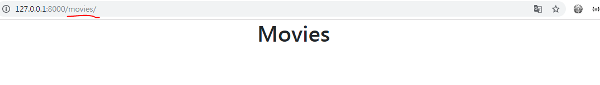

# 종합 실습 프로젝트 1

## 0. 환경 설정

### 0.1 프로젝트 폴더 생성

- VS Code에서 터미널을 실행한다. 모른다면 VS Code의 도구에서 Terminal - New Terminal로 가자.

- 새로운 프로젝트를 시작하기 위해서 `04_django_PJT_1 `를 생성해주자.


- bash를 이용해 새로 생성한 프로젝트 폴더로 이동하자.

  

### 0.2 새로운 가상환경 생성 및 Django 설치

- 해당 폴더 위치에서 venv 가상환경을 생해주자.

  ```bash
  student@M150123 MINGW64 ~/Desktop/TIL/05_Django/04_django_PJT_1 (master)
  $ python -m venv venv
  ```

- 새로 만들어진 가상환경을 activate 해주자.

  ```bash
  student@M150123 MINGW64 ~/Desktop/TIL/05_Django/04_django_PJT_1 (master)
  $ source venv/Scripts/activate
  ```

- 새로운 가상환경에 djang를 install 해주자.

  ```bash
  (venv)
  student@M150123 MINGW64 ~/Desktop/TIL/05_Django/04_django_PJT_1 (master)
  $ pip install django
  ```

### 0.3 Django 프로젝트 시작

- 장고 프로젝트를 시작해보자.

  ```bash
  (venv)
  student@M150123 MINGW64 ~/Desktop/TIL/05_Django/04_django_PJT_1 (master)
  $ django-admin startproject config .
  ```

- 해당 스크립트를 실행하면 프로젝트가 생성이 된다.

  ```
  04_django_PJT_1/
  	config/
  		__init__.py
  		setting.py
  		urls.py
  		wsgi.py
  	venv/
  	manage.py
  ```

- 프로젝트 생성 후 간단하게 `settings.py` 에서 언어와 시간을 설정해주자.

  ```python
  # config/settings.py
  ... 
  # 106번째 줄에 존재
  LANGUAGE_CODE = 'ko-kr'
  
  TIME_ZONE = 'Asia/Seoul'
  ...
  ```

- 설정이 끝났다면 runserver를 이용해 서버를 실행해보자.

  ```bash
  (venv)
  student@M150123 MINGW64 ~/Desktop/TIL/05_Django/04_django_PJT_1 (master)
  $ python manage.py runserver
  ```

  ```bash
  Watching for file changes with StatReloader
  Performing system checks...
  
  System check identified no issues (0 silenced).
  
  You have 17 unapplied migration(s). Your project may not work properly until you apply the migrations for app(s): admin, auth, contenttypes, sessions.
  Run 'python manage.py migrate' to apply them.
  November 01, 2019 - 09:42:50
  Django version 2.2.6, using settings 'config.settings'
  Starting development server at http://127.0.0.1:8000/
  Quit the server with CTRL-BREAK.
  ```

- 위와 같이 뜬다면 django server를 돌리는데 성공하였다. 해당 주소로 가서 로켓 모양 페이지를 확인해보자.

  

- 서버가 실행이 됐다면 다시 VS Code의 Terminal로 돌아와 `ctrl + c`를 이용해 서버를 잠시 꺼두도록 하자.

### 0.4 Application 생성

> Application을 생성하는 이유는 간단하게 Project는 여러 개의 Application 을 담을 수 있고, 커다란 Django Project는 각종 환경설정들이 담긴다.
>
>  Application은 실제 웹 서비스에서 어떠한 역할을 수행하는 것을 담당한다. 또한 Application 이름은 가능한 **복수형**(ex - pages, posts, ...)으로 짓도록 하자.

- 이제 해당 프로젝트의 movies app을 만들어보자.

```bash
(venv)
student@M150123 MINGW64 ~/Desktop/TIL/05_Django/04_django_PJT_1 (master)
$ python manage.py startapp movies
```

- 실행이 되었다면 아래의 사진과 같이 Directory가 구성된다.


- 위와 같이 구성이 되었다면 중요한 **출생신고**가 필요하다.
-  Project는 자동으로 Application을 인식하지 않으므로 `settings.py`에 등록을 해야한다. 

```python
# config/settings.py
# 출생신고 절대 잊지 말자...
INSTALLED_APPS = [
    # Local apps
    'movies',	# 생성된 Application을 등록해주자.
    
    # Third party apps
    
    # Django apps
    ...
]
```

### 0.5 Application 추가 설정

#### 0.5.1 Application URL 분리

- 방금 생성된 Application은 urls.py가 존재하지 않는다. 만들어주자.

  

```python
# config/urls.py

from django.urls import path, include	# include를 import

urlpatterns = [
    # 요청 경로가 rticles/로 시작하면 articles 앱 안에 있는 urls.py로 이동!
    path('movies/', include('movies.urls'))
    ...
]
```

```python
# movies/urls.py

from django.urls import path
from . import views

urlpatterns = [
    # movies/ 로 요청했을 경우 index 함수 실행
    # 아직은 만들지 않았으니 유의하자!
    path('', views.index),
]
```

#### 0.5.2 템플릿 경로 커스터마이징

> Django는 해당 html을 찾는데 `templates`폴더를 먼저 찾아 주소를 잡는다. 그래서 Application이 여러개이고 html 파일의 이름이 같을 경우 혼동이 생길수가 있다. 그래서 템플릿 경로의 커스터마이징이 필요하다.

- `config/`폴더로 돌아가서 `templates/movies/index.html` 을 생성해주자.

  

#### 0.5.3 템플릿이 상속될 `base.html` 생성

```
04_django_PJT_1/
	config/
		templates/
			movies/
				index.html
			base.html
```

```html
<!-- config/templates/base.html  -->
<!DOCTYPE html>
<html lang="ko">
<head>
  <meta charset="UTF-8">
  <meta name="viewport" content="width=device-width, initial-scale=1.0">
  <meta http-equiv="X-UA-Compatible" content="ie=edge">
  <title>PJT1</title>
  <!-- Bootstrap CSS -->
  <link rel="stylesheet" href="https://stackpath.bootstrapcdn.com/bootstrap/4.3.1/css/bootstrap.min.css" integrity="sha384-ggOyR0iXCbMQv3Xipma34MD+dH/1fQ784/j6cY/iJTQUOhcWr7x9JvoRxT2MZw1T" crossorigin="anonymous">
</head>
<body>
  <div class="container">
    
    
  </div>
  

  <!-- Bootstrap JS-->
  <script src="https://code.jquery.com/jquery-3.3.1.slim.min.js" integrity="sha384-q8i/X+965DzO0rT7abK41JStQIAqVgRVzpbzo5smXKp4YfRvH+8abtTE1Pi6jizo" crossorigin="anonymous"></script>
  <script src="https://cdnjs.cloudflare.com/ajax/libs/popper.js/1.14.7/umd/popper.min.js" integrity="sha384-UO2eT0CpHqdSJQ6hJty5KVphtPhzWj9WO1clHTMGa3JDZwrnQq4sF86dIHNDz0W1" crossorigin="anonymous"></script>
  <script src="https://stackpath.bootstrapcdn.com/bootstrap/4.3.1/js/bootstrap.min.js" integrity="sha384-JjSmVgyd0p3pXB1rRibZUAYoIIy6OrQ6VrjIEaFf/nJGzIxFDsf4x0xIM+B07jRM" crossorigin="anonymous"></script>
</body>
</html>
```

#### 0.5.4 템플릿 탐색 경로 수정

- 실제 파일의 경로는 바꿔 버렸지만 장고가 바라보는 템플릿 탐색 경로를 바꾸어 주지 않았다. 지금 서버를 돌리면 템플릿을 찾을 수 없기 때문에 에러를 뿜는다.

```python
# config/settings.py

TEMPLATES = [
    {
        'BACKEND': 'django.template.backends.django.DjangoTemplates',
        'DIRS': [os.path.join(BASE_DIR, 'config', 'templates')],
        'APP_DIRS': True,
        ...
    },
]
```

- 이제 기본적인 Django Application을 구동하기 위한 밑작업이 끝났다.

-----

## 1.  데이터베이스 모델링

- 프로젝트에서 제시된 데이터베이스 요구사항은 다음과 같다.


- `movies/models.py`

```python
class Movie(models.Model):
    title = models.CharField(max_length=100)    # CharField는 max_length가 필수
    title_en = models.CharField(max_length=100)
    audience = models.IntegerField()
    open_date = models.DateField()
    genre = models.CharField(max_length=100)
    watch_grade = models.CharField(max_length=20)
    score = models.FloatField()
    poster_url = models.TextField()
    description = models.TextField()

    # 객체 표시 형식 수정
    def __str__(self):
        return f'[{self.pk}] {self.title}'
```

- 이제 데이터베이스 테이블 정의가 끝났다. 설계도를 만들어보자.

```bash
$ python manage.py makemigrations
```

- 혹시나 만약에 정말로 오류가 발생한다면 `settings.py`에 해당 Application이 추가 되었는지 확인하자.

  ```python
  # config/settings.py
  # 출생신고 절대 잊지 말자...
  INSTALLED_APPS = [
      # Local apps
      'movies',	# 생성된 Application을 등록해주자.
      
      # Third party apps
      
      # Django apps
      ...
  ]
  ```

- 성공적으로 `makemigrations`가 되었다면 아래와 같은 문구가 출력된다.

```bash
Migrations for 'movies':
  movies\migrations\0001_initial.py
    - Create model Movie
```

- `showmigrations`를 통해 확인하자.

```bash
(venv)
student@M150123 MINGW64 ~/Desktop/TIL/05_Django/04_django_PJT_1 (master)
$ python manage.py showmigrations

...
movies
 [ ] 0001_initial
...
```

- `movies`가 확인이 되었다면`migrate`를 통해 등록하자.

```bash
(venv)
student@M150123 MINGW64 ~/Desktop/TIL/05_Django/04_django_PJT_1 (master)
$ python manage.py migrate
```

```bash
# 성공시 아래의 문구가 출력된다.
Operations to perform:
  Apply all migrations: admin, auth, contenttypes, movies, sessions
Running migrations:
  ...
  Applying movies.0001_initial... OK
  ...
```

- 성공적으로 데이터베이스가 등록되었는지 확인하고 싶다면 `ctrl + shift + p`를 누르고 SQLite : Open Database를 누르고 잠시 기다리면 항목이 뜨는데 항목 중에서 자신이 현재 진행하고 있는 프로젝트를 누른다.

- 그러면 좌측 하단에 그림과 같은 탭을 확인 가능하다.

  

- 계속해서 `db.sqlite3`을 클릭하면 여러가지가 나오는데 자신이 진행하고 있는 Application의 모델을 확인.

  

- 여기까지 왔다면 데이터베이스 모델링이 끝났다.

-----

## 2. Index

- 일단 페이지 확인을 위해 제목만 존재하는 Index 페이지를 만들어보자. 

```python
# movies/views.py

from django.shortcuts import render

# Create your views here.
def index(request):
    return render(request, 'movies/index.html')
```

```html
<!-- config/tempates/movies/index.html -->
<!-- 이전에 추가했었던 base.html을 상속받는다 -->



<h1 class="text-center">Movies</h1>


```

```python
# movies/urls.py

from django.urls import path
from . import views

urlpatterns = [
    path('', views.index),
]
```

- 이제 서버를 실행시켜 Index 페이지를 확인해보자.

```bash
$ python manage.py runserver
```

- 해당 페이지의 주소로 하면 다은과 같은 기본적인 Movies의 Index페이지가 보여진다.

