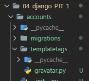

# 종합 실습 프로젝트 1

## 0. 환경 설정

### 0.1 프로젝트 폴더 생성

- VS Code에서 터미널을 실행한다. 모른다면 VS Code의 도구에서 Terminal - New Terminal로 가자.

- 새로운 프로젝트를 시작하기 위해서 `04_django_PJT_1 `를 생성해주자.


- bash를 이용해 새로 생성한 프로젝트 폴더로 이동하자.

  

### 0.2 새로운 가상환경 생성 및 Django 설치

- 해당 폴더 위치에서 venv 가상환경을 생해주자.

  ```bash
  student@M150123 MINGW64 ~/Desktop/TIL/05_Django/04_django_PJT_1 (master)
  $ python -m venv venv
  ```

- 새로 만들어진 가상환경을 activate 해주자.

  ```bash
  student@M150123 MINGW64 ~/Desktop/TIL/05_Django/04_django_PJT_1 (master)
  $ source venv/Scripts/activate
  ```

- 새로운 가상환경에 djang를 install 해주자.

  ```bash
  (venv)
  student@M150123 MINGW64 ~/Desktop/TIL/05_Django/04_django_PJT_1 (master)
  $ pip install django
  ```

### 0.3 Django 프로젝트 시작

- 장고 프로젝트를 시작해보자.

  ```bash
  (venv)
  student@M150123 MINGW64 ~/Desktop/TIL/05_Django/04_django_PJT_1 (master)
  $ django-admin startproject config .
  ```

- 해당 스크립트를 실행하면 프로젝트가 생성이 된다.

  ```
  04_django_PJT_1/
  	config/
  		__init__.py
  		setting.py
  		urls.py
  		wsgi.py
  	venv/
  	manage.py
  ```

- 프로젝트 생성 후 간단하게 `settings.py` 에서 언어와 시간을 설정해주자.

  ```python
  # config/settings.py
  ... 
  # 106번째 줄에 존재
  LANGUAGE_CODE = 'ko-kr'
  
  TIME_ZONE = 'Asia/Seoul'
  ...
  ```

- 설정이 끝났다면 runserver를 이용해 서버를 실행해보자.

  ```bash
  (venv)
  student@M150123 MINGW64 ~/Desktop/TIL/05_Django/04_django_PJT_1 (master)
  $ python manage.py runserver
  ```

  ```bash
  Watching for file changes with StatReloader
  Performing system checks...
  
  System check identified no issues (0 silenced).
  
  You have 17 unapplied migration(s). Your project may not work properly until you apply the migrations for app(s): admin, auth, contenttypes, sessions.
  Run 'python manage.py migrate' to apply them.
  November 01, 2019 - 09:42:50
  Django version 2.2.6, using settings 'config.settings'
  Starting development server at http://127.0.0.1:8000/
  Quit the server with CTRL-BREAK.
  ```

- 위와 같이 뜬다면 django server를 돌리는데 성공하였다. 해당 주소로 가서 로켓 모양 페이지를 확인해보자.

  

- 서버가 실행이 됐다면 다시 VS Code의 Terminal로 돌아와 `ctrl + c`를 이용해 서버를 잠시 꺼두도록 하자.

### 0.4 Application 생성

> Application을 생성하는 이유는 간단하게 Project는 여러 개의 Application 을 담을 수 있고, 커다란 Django Project는 각종 환경설정들이 담긴다.
>
>  Application은 실제 웹 서비스에서 어떠한 역할을 수행하는 것을 담당한다. 또한 Application 이름은 가능한 **복수형**(ex - pages, posts, ...)으로 짓도록 하자.

- 이제 해당 프로젝트의 movies app을 만들어보자.

```bash
(venv)
student@M150123 MINGW64 ~/Desktop/TIL/05_Django/04_django_PJT_1 (master)
$ python manage.py startapp movies
```

- 실행이 되었다면 아래의 사진과 같이 Directory가 구성된다.


- 위와 같이 구성이 되었다면 중요한 **출생신고**가 필요하다.
-  Project는 자동으로 Application을 인식하지 않으므로 `settings.py`에 등록을 해야한다. 

```python
# config/settings.py
# 출생신고 절대 잊지 말자...
INSTALLED_APPS = [
    # Local apps
    'movies',	# 생성된 Application을 등록해주자.
    
    # Third party apps
    
    # Django apps
    ...
]
```

### 0.5 Application 추가 설정

#### 0.5.1 Application URL 분리

- 방금 생성된 Application은 urls.py가 존재하지 않는다. 만들어주자.

  

```python
# config/urls.py

from django.urls import path, include	# include를 import

urlpatterns = [
    # 요청 경로가 rticles/로 시작하면 articles 앱 안에 있는 urls.py로 이동!
    path('movies/', include('movies.urls'))
    ...
]
```

```python
# movies/urls.py

from django.urls import path
from . import views

urlpatterns = [
    # movies/ 로 요청했을 경우 index 함수 실행
    # 아직은 만들지 않았으니 유의하자!
    path('', views.index),
]
```

#### 0.5.2 템플릿 경로 커스터마이징

> Django는 해당 html을 찾는데 `templates`폴더를 먼저 찾아 주소를 잡는다. 그래서 Application이 여러개이고 html 파일의 이름이 같을 경우 혼동이 생길수가 있다. 그래서 템플릿 경로의 커스터마이징이 필요하다.

- `config/`폴더로 돌아가서 `templates/movies/index.html` 을 생성해주자.

  

#### 0.5.3 템플릿이 상속될 `base.html` 생성

```
04_django_PJT_1/
	config/
		templates/
			movies/
				index.html
			base.html
```

```django
<!-- config/templates/base.html  -->
<!DOCTYPE html>
<html lang="ko">
<head>
  <meta charset="UTF-8">
  <meta name="viewport" content="width=device-width, initial-scale=1.0">
  <meta http-equiv="X-UA-Compatible" content="ie=edge">
  <title>PJT1</title>
  <!-- Bootstrap CSS -->
  <link rel="stylesheet" href="https://stackpath.bootstrapcdn.com/bootstrap/4.3.1/css/bootstrap.min.css" integrity="sha384-ggOyR0iXCbMQv3Xipma34MD+dH/1fQ784/j6cY/iJTQUOhcWr7x9JvoRxT2MZw1T" crossorigin="anonymous">
</head>
<body>
  <div class="container">
    
    
  </div>
  

  <!-- Bootstrap JS-->
  <script src="https://code.jquery.com/jquery-3.3.1.slim.min.js" integrity="sha384-q8i/X+965DzO0rT7abK41JStQIAqVgRVzpbzo5smXKp4YfRvH+8abtTE1Pi6jizo" crossorigin="anonymous"></script>
  <script src="https://cdnjs.cloudflare.com/ajax/libs/popper.js/1.14.7/umd/popper.min.js" integrity="sha384-UO2eT0CpHqdSJQ6hJty5KVphtPhzWj9WO1clHTMGa3JDZwrnQq4sF86dIHNDz0W1" crossorigin="anonymous"></script>
  <script src="https://stackpath.bootstrapcdn.com/bootstrap/4.3.1/js/bootstrap.min.js" integrity="sha384-JjSmVgyd0p3pXB1rRibZUAYoIIy6OrQ6VrjIEaFf/nJGzIxFDsf4x0xIM+B07jRM" crossorigin="anonymous"></script>
</body>
</html>
```

#### 0.5.4 템플릿 탐색 경로 수정

- 실제 파일의 경로는 바꿔 버렸지만 장고가 바라보는 템플릿 탐색 경로를 바꾸어 주지 않았다. 지금 서버를 돌리면 템플릿을 찾을 수 없기 때문에 에러를 뿜는다.

```python
# config/settings.py

TEMPLATES = [
    {
        'BACKEND': 'django.template.backends.django.DjangoTemplates',
        'DIRS': [os.path.join(BASE_DIR, 'config', 'templates')],
        'APP_DIRS': True,
        ...
    },
]
```

- 이제 기본적인 Django Application을 구동하기 위한 밑작업이 끝났다.

-----

## 1.  데이터베이스 모델링

- 프로젝트에서 제시된 데이터베이스 요구사항은 다음과 같다.


- `movies/models.py`

```python
class Movie(models.Model):
    title = models.CharField(max_length=100)    # CharField는 max_length가 필수
    title_en = models.CharField(max_length=100)
    audience = models.IntegerField()
    open_date = models.DateField()
    genre = models.CharField(max_length=100)
    watch_grade = models.CharField(max_length=20)
    score = models.FloatField()
    poster_url = models.TextField()
    description = models.TextField()

    # 객체 표시 형식 수정
    def __str__(self):
        return f'[{self.pk}] {self.title}'
```

- 이제 데이터베이스 테이블 정의가 끝났다. 설계도를 만들어보자.

```bash
$ python manage.py makemigrations
```

- 혹시나 만약에 정말로 오류가 발생한다면 `settings.py`에 해당 Application이 추가 되었는지 확인하자.

  ```python
  # config/settings.py
  # 출생신고 절대 잊지 말자...
  INSTALLED_APPS = [
      # Local apps
      'movies',	# 생성된 Application을 등록해주자.
      
      # Third party apps
      
      # Django apps
      ...
  ]
  ```

- 성공적으로 `makemigrations`가 되었다면 아래와 같은 문구가 출력된다.

```bash
Migrations for 'movies':
  movies\migrations\0001_initial.py
    - Create model Movie
```

- `showmigrations`를 통해 확인하자.

```bash
(venv)
student@M150123 MINGW64 ~/Desktop/TIL/05_Django/04_django_PJT_1 (master)
$ python manage.py showmigrations

...
movies
 [ ] 0001_initial
...
```

- `movies`가 확인이 되었다면`migrate`를 통해 등록하자.

```bash
(venv)
student@M150123 MINGW64 ~/Desktop/TIL/05_Django/04_django_PJT_1 (master)
$ python manage.py migrate
```

```bash
# 성공시 아래의 문구가 출력된다.
Operations to perform:
  Apply all migrations: admin, auth, contenttypes, movies, sessions
Running migrations:
  ...
  Applying movies.0001_initial... OK
  ...
```

- 성공적으로 데이터베이스가 등록되었는지 확인하고 싶다면 `ctrl + shift + p`를 누르고 SQLite : Open Database를 누르고 잠시 기다리면 항목이 뜨는데 항목 중에서 자신이 현재 진행하고 있는 프로젝트를 누른다.

- 그러면 좌측 하단에 그림과 같은 탭을 확인 가능하다.

  

- 계속해서 `db.sqlite3`을 클릭하면 여러가지가 나오는데 자신이 진행하고 있는 Application의 모델을 확인.

  

- 여기까지 왔다면 데이터베이스 모델링이 끝났다.

-----

## 2. Index

- 일단 페이지 확인을 위해 제목만 존재하는 Index 페이지를 만들어보자. 

```python
# movies/views.py

from django.shortcuts import render

# Create your views here.
def index(request):
    return render(request, 'movies/index.html')
```

```django
<!-- config/tempates/movies/index.html -->
<!-- 이전에 추가했었던 base.html을 상속받는다 -->



<h1 class="text-center">Movies</h1>


```

```python
# movies/urls.py

from django.urls import path
from . import views

urlpatterns = [
    path('', views.index),
]
```

- 이제 서버를 실행시켜 Index 페이지를 확인해보자.

```bash
$ python manage.py runserver
```

- 해당 페이지의 주소로 하면 다음과 같은 기본적인 Movies의 Index페이지가 보여진다.


-----

## 3. CREATE & READ

### 3.1 CREATE FORM 만들기

- Form으로 받는 `type`은 다음과 같다.


- 새로운 영화를 추가하는 로직을 작성해보자.

```python
# movies/views.py

...
# 사용자에게 게시글 작성 폼을 보여주는 함수
def new(request):
    return render(request, 'movies/new.html')
```

```django
<!-- config/templates/movies/new.html -->



<h1 class="text-center">영화 등록</h1>
<form action="/movies/create/" method="POST">

  영화명 : <input type="text" name="title"><br>
  영화명(영문명) : <input type="text" name="title_en"><br>
  누적 관객수 : <input type="number" name="audience"><br>
  개봉일 : <input type="date" name="open_date"><br>
  장르 : <input type="text" name="genre"><br>
  관람등급 : <input type="text" name="watch_grade"><br>
  평점 : <input type="number" name="score"><br>
  포스터 이미지 URL: <input type="text" cols="100" name="poster_url"><br>
  영화 소개 : <br>
  <textarea name="description" cols="30" rows="10"></textarea>
  <input type="submit">
</form>
<hr>
<a href="/movies/">[영화 목록으로]</a>

```

```python
# movies/urls.py
from django.urls import path
from . import views

urlpatterns = [
    path('', views.index),
    path('new/', views.new),
    path('create/', views.create),
]
```

- 하지만 여기까지 왔다고 해도 `index.html`에는 `new.html`로 이동하는 태그가 존재하지 않는다. 만들어주자.
- **잠깐!**  이 프로젝트는 현재 `urls.py`에서 **namespace를 이용해 url을 간결하게 표현 중**이다.
  - 그렇기 때문에 `urls.py`의 `app_name`과 각 `path`의 `name`을 합쳐서 `html`파일에서 `app_name:name`으로 표현 되고 있다.
  - `urls.py`를 지나치지 말고 꼭 확인 한 후 넘어가도록 하자.

```django
<!-- config/templates/movies/index.html -->



<h1 class="text-center">Movies</h1>
<a href="">[새 영화 등록]</a>


```

- 여기서 또한 해당 `movies:new`를 사용하기 위해서는 `movies/urls.py`에 `app_name` 속성 값을 정해줘야한다.

```python
# movies/urls.py
app_name = 'movies'
urlpatterns = [
    path('', views.index, name='index'),
    path('new/', views.new, name='new'),
    path('create/', views.create, name='create'),
]
```

- 여기까지 잘 따라 왔다면 server를 실행시켜보자.

```bash
$ python manage.py runserver
```

- index 페이지로 가보면


- 위와 같은 페이지를 확인 할 수 있고 `[새 영화 등록]`을 누르면 영화를 등록할 수 있는 폼이 있는 주소로 이동한다.


- 또한 `영화 목록으로` 돌아가는 페이지도 잘 동작 하는 것을 확인 가능하다.

- 이제 영화를 등록할 함수를 작성해보자.

### 3.2 CREATE & DB 저장 

```python
# movies/views.py
from django.shortcuts import render, redirect
from .models import Movie

# 사용자로부터 데이터를 받아서 DB에 저장하는 함수
def create(request):
    title = request.POST.get('title')
    title_en = request.POST.get('title_en')
    audience = request.POST.get('audience')
    open_date = request.POST.get('open_date')
    genre = request.POST.get('genre')
    watch_grade = request.POST.get('genre')
    score = request.POST.get('score')
    poster_url = request.POST.get('poster_url')
    description = request.POST.get('description')
	
    movie = Movie(title=title, title_en=title_en, audience=audience,
                  open_date=open_date, genre=genre, watch_grade=watch_grade,
                  score=score, poster_url=poster_url, description=description)
    movie.save()

    # 저장이 되었다면 방금 저장된 객체를 확인해야한다 Detail 페이지를 만들어 확인하자!
    return redirect(f'/movies/{movie.pk}/')
```

### 3.3 READ(Detail 페이지)

```python
# movies/views.py
# 영화 상세정보를 가져오는 함수
def detail(request, movie_pk):
    movie = Movie.objects.get(pk=movie_pk)
    context = { 'movie' : movie }
    return render(request, 'movies/detail.html', context)
```

```django
<!-- config/templates/movies/detail.html -->



<h1 class="text-center">영화 상세 정보</h1>
<p>영화 번호 : {{ movie.pk }}</p>
<p>영화명 : {{ movie.title }}</p>
<p>영화명(영문명) : {{ movie.title_en }}</p>
<p>누적 관객수 : {{ movie.audience }}</p>
<p>개봉일 : {{ movie.open_date }}</p>
<p>장르 : {{ movie.genre }}</p>
<p>관람등급 : {{ movie.watch_grade }}</p>
<p>평점 : {{ movie.score }}</p>

<p>영화 소개</p><br>
<p> {{ movie.description }}</p>
<hr>
<a href="">[영화 목록으로]</a>

```

```python
# movies/urls.py
app_name = 'movies'
urlpatterns = [
    ...
    path('<int:movie_pk>/', views.detail, name='detail'),
]
```

- 이제 영화를 등록하면 등록한 영화의 상세 정보 페이지를 확인 할 수 있다.


### 3.4 Index 추가사항

- 현재 Index 페이지에 가면 새 영화를 등록하는 버튼만이 존재하는 것을 확인 할 수 있다.

- 이제 Index에서 등록된 영화들의 목록을 볼 수 있게 `views.py`와 `index.html`을 수정해보자.

```python
# movies/views.py

def index(request):
    movie = Movie.objects.all()
    context = {'movies' : movie}
    return render(request, 'movies/index.html', context)
```

```django
<!-- config/templates/movies/index.html -->
...

<h1 class="text-center">Movies</h1>
<a href="">[새 영화 등록]</a>
<hr>

   <p>
    [{{ movie.pk }}] <a href="">{{ moive.title }}</a>
  </p>
<hr>


...
```

- ``의 의미는 `movies`라는 `app_name`의 `detail`이라는 `name`을 가진 `html `파일을 찾아서 인자로 `movie.pk`를 받아들인다. 
- 만약 인자가 여러개라면 순서를 꼭 지켜줘야한다.


- 이제 영화 제목을 누르면 해당 영화의 상세 정보를 볼 수 있다.

### 3.5  Admin 페이지 등록

- 데이터가 정상적으로 들어갔는지를 확인하기 위해 admin 페이지로 들어가보자.
- 먼저 `bash`에서 적당한 관리자 계정을 하나 생성하자.

```bash
$ python manage.py createsuperuser
```

```python
# movies/admin.py
from django.contrib import admin
from .models import Movie
# Register your models here.

class MovieAdmin(admin.ModelAdmin):
    list_display = ('pk', 'title', 'title_en', 'audience', 
                    'open_date', 'genre', 'watch_grade', 'score', 
                    'poster_url', 'description')

admin.site.register(Movie, MovieAdmin)
```

- 이제 서버를 실행하고 ` http://127.0.0.1:8000/admin/ `로 이동하면 다음과 같은 페이지가 뜬다.


- 앞서 생성해둔 관리자 계정으로 접속하면 Django 관리자 페이지에 접속할 수 있다.


- 사이트 관리 에 MOVIES Application을 확인 할 수 있다. 들어가서 자료를 확인 해보자.


-----

## 4. UPDATE

### 4.1 UPDATE Form으로 가는 함수

- 업데이틀를 하는 Form의 데이터 `type`은 다음과 같다.


- 먼저 `views.py`에서 수정 하는 폼으로 가는 함수부터 생성해보자!

```python
# movies/views.py 
# 사용자한테 게시글 수정 폼을 전달
def edit(request, movie_pk):
    movie = Movie.objects.get(pk=movie_pk)
    context = { 'movie': movie }
    return render(request, 'movies/edit.html', context)
```

- `edit.html`을 작성할때 `form`의 `action` 속성은 잠시 비워두자!

```django
<!-- config/templates/movies/edit.html -->



<h1 class="text-center">영화 정보 수정</h1> 

<form action="" method="POST">

  영화명 : <input type="text" name="title" value="{{ movie.title }}"><br>
  영화명(영문명) : <input type="text" name="title_en" value="{{ movie.title_en }}"><br>
  누적 관객수 : <input type="number" name="audience" value="{{ movie.audience }}"><br>
  개봉일 : <input type="date" name="open_date" value="{{ movie.open_date }}"><br>
  장르 : <input type="text" name="genre" value="{{ movie.genre }}"><br>
  관람등급 : <input type="text" name="watch_grade" value="{{ movie.watch_grade }}"><br>
  평점 : <input type="number" name="score" value="{{ movie.number }}"><br>
  포스터 이미지 URL: <input type="text" cols="100" name="poster_url" value="{{ movie.poster_url }}"><br>
  영화 소개 : <br>
  <textarea name="description" cols="30" rows="10" value="{{ movie.description }}"></textarea>
  <input type="submit">
</form>
<hr>
<a href="/movies/">[영화 목록으로]</a>

```

```python
# movies/urls.py
app_name = 'movies'
urlpatterns = [
    ...
    path('<int:movie_pk>/edit/', views.edit, name='edit'),
]
```

- 이렇게 되면 edit form 이 완성 되었다.


- 하지만, 상세 영화 정보에서 수정하는 버튼이 존재하지 않아, 수정을 할 수가 없다.
- 상세 영화 페이지 하단에 `영화 정보 수정하기`버튼을 생성해보자!

```django
<!-- config/templates/movies/detail.html -->

...
<a href="">[영화 정보 수정하기]</a>

```


### 4.2 UPDATE Form에서 자료를 받아 UPDATE 하는 함수

- 이제 수정 폼에서 수정된 데이터를 입력하고 수정하는 함수를 작성해 보자!

```python
# movies/view.py

# 수정 내용 전달 받아서 DB에 저장(반영)
def update(request, movie_pk):
    # 1. 수정할 게시글 인스턴스 가져오기
    movie = Movie.objects.get(pk=movie_pk)
    
    # 2. 폼에서 전달받은 데이터 덮어쓰기
    movie.title = request.POST.get('title')
    movie.title_en = request.POST.get('title_en')
    movie.audience = request.POST.get('audience')
    movie.open_date = request.POST.get('open_date')
    movie.genre = request.POST.get('genre')
    movie.watch_grade = request.POST.get('genre')
    movie.score = request.POST.get('score')
    movie.poster_url = request.POST.get('poster_url')
    movie.description = request.POST.get('description')
    
    # 3. DB 저장
    movie.save()
    
    # 4. 저장 끝났으면 게시글 Detail로 redirect 시키기
    return redirect(f'/movies/{movie.pk}/')
```

- 아까 `edit.html`의 `form` 태그의 `action` 속성을 작성해주자!

```django
<!-- config/templates/movies/edit.html -->

...

<h1 class="text-center">영화 정보 수정</h1> 
<form action="" method="POST">
...
```

```python
# movies/urls.py

app_name = 'movies'
urlpatterns = [
	...
    path('<int:movie_pk>/update/', views.update, name='update'),
]
```

- 영화 소개를 "I WILL BE BACK" 에서 "내가 돌아왔다" 로 바꿔보자.


- 바뀐 모습을 확인해보자!


-----

## 5. DELETE

- 이제 영화를 삭제하는 로직을 작성해보자!

```python
# movies/views.py
def delete(request, movie_pk):
    movie = Movie.objects.get(pk=movie_pk)
    movie.delete()
    return redirect('/movies/')
```

```python
# movies/urls.py
app_name = 'movies'
urlpatterns = [
	...
    path('<int:movie_pk>/delete/', views.delete, name='delete'),
]
```

- 로직은 작성 되었지만 아직은 삭제할 수 있는 버튼이 없어 삭제가 불가능하므로 상세 정보 페이지에서 삭제 버튼을 생성해주자!

```django
<!-- config/templates/movies/detail.html -->
...
<a href="">[영화 삭제하기]</a>

```


- 영화를 삭제해보자!


- 삭제를 한 후에 `index.html`로 redirect 된 모습이다. 영화가 삭제 되었다.

-----

- **추가사항 **

  - 등록, 수정, 삭제 시 `등록 되었습니다` 를 넣고싶다면 각 태그에 아래 코드를 추가해주자!

    ```django
    <!-- new.html -->
    <input type="submit" onclick="alert('등록되었습니다!');">
    ```

    ```django
    <!-- edit.html -->
    <input type="submit" onclick="alert('수정 되었습니다!');">
    ```

    ````django
    <!-- detail.html -->
    <a href="" onclick="alert('삭제 되었습니다');">[영화 삭제하기]</a>
    ```
  
  - 코드들을 살펴보면 `views.py`에 쓰이는 모델들 (ex-`Movie`)에 빨간줄이 들어오는데 이를 해결하기 위해서는 한가지 파이썬 모듈을 설치하고 설정해야한다.
  
    ```bash
    $ pip install pylint-django
    ```
  
    - `ctrl + shift + p`를 를 통해 터미널을 열고 `Open Settings(JSON)`를 연다.
    - 해당 json 파일에 다음의 코드를 넣어주면 문제가 해결된다.
  
    ```json
    ...,
    "python.linting.pylintArgs":[
    	"--load-plugins=pylint_django",
    	"--erros-only",
    ],
    ```

-----

-----

# Seed Data(Initial Data) 입력하기

>  우리가 애플리케이션을 제작할 때 미리 준비해둔 데이터 혹은 애플리케이션 테스트용 데이터가 필요한 경우가 있다. 이때, 데이터를 하드코딩으로 일일이 넣을 수도 있다. **하지만 `fixtures`라는 기능을 이요해서 준비해둔 데이터를 쉽게 데이터베이스에 넣을 수 있다.**

## 1. 이미 데이터가 있을 경우

- `manage.py dumpdata > movies.json` 명령어를 통해서 현재 앱에서 가지고 있는 데이터를 빼낼 수 있다.

  ```bash
  $ python manage.py dumpdata > movies.json
  ```

- 이전 DB가 날아가더라도 dumpdata를 통해 빼둔 데이터들을 다시 한번 활용할 수 있다.

## 2. 준비해둔 fixture 데이터들을 넣고 싶을 경우

- `CSV`(Comma-Seperated Values)

  - 데이터들을 콤마( , )로 구분해서 비교적 간단한 텍스트 형태의 포맷으로 바꾼 형식
  - 스프레드시트, 엑셀에서 주로 활용한다.(데이터 크기 축소)

- `fixture`는 **장고가 데이터베이스에 import할 수 있는 데이터의 모음**

  - `JSON`, `XML`, `YAML` 포맷의 fixture들을 불러올 수 있다.

- 장고에서 모델링한 데이터가 어떻게 생겼는지 확인

  ```json
  [
      {
          "model": "movies.movie",
          "pk": 5,
          "fields": {
              "title": "\ud130\ubbf8\ub124\uc774\ud130",
              "title_en": "The Terminator",
              "audience": 5000000,
              "open_date": "1984-12-22",
              "genre": "\uc561\uc158",
              "watch_grade": "\uc561\uc158",
              "score": 9.0,
              "poster_url": "https://encrypted-tbn0.gstatic.com/images?q=tbn%3AANd9GcQ8zmYulntNzfbi-2w7igpctwVF9bj1KKxpep3O6zw2lray94Qv",
              "description": "jo"
          }
      },
      ...
  ]
  ```

- 프로젝트를 진행할 때 Seed Data(Initial Data)를 제공받았을 경우, Seed Data 형식을 먼저 확인하고 형식에 맞게 모델링을 진행하자!

- Seed Data 활용하는 방법

  1. Application의 데이터베이스를 하드코딩으로 미리 만들어둔 뒤, `dumpdata` 명령어를 통해 fixture 데이터 형태로 만들어두고 , 그 다음부턴 데이터베이스를 초기화시켜도 `loaddata` 명령어를 통해 다시 데이터를 불러와서 사용할 수 있다.
  2. 이미 Seed Data를 제공받았을 경우, 그냥 fixtures 폴더에 넣어두고 불러와서 사용한다.

- `fixture` 데이터 내용을 바꾸거나, 모델링해둔 내용을 바꾸고 싶으면 당연히 다시 `loaddata` 과정을 수행한다.

### 2.0 CSV to JSON

1. 먼저 준비해둔 `csv`파일을 다운로드 받는다.
2. 받은 `csv`파일을 excel로 열지말고 구글 스프레드시트 같은 editor로 열어서 pk를 넣고 번호를 넣는다.


3. 수정된 `csv`파일을 다운로드 받는다.

4. `csv`파일을 `json` 형식으로 바꾸기 위해서 ` https://github.com/educiao-hphk/csv2json-fixture `에서 `csv2json.py`파일을 포함한 모든 파일을 적당한 장소에 다운로드 받는다.

   - 잘 모르겠다면 다음과 같이 받을 수 있다.

     

5. `csv2json.py` 파일을 열어서 encoding 문제를 해결하기 위해서 다음과 같이 수정해 주자.

   ```python
   with open(out_file, 'w', encoding=ENCODING) as fo:
       fo.write('%s' % json.dumps(entries, indent=4, ensure_ascii=False))
   fo.close()
   ```

6. `csv2json.py` 파일이 포함된 폴더에 `csv`파일을 넣는다.

7. 해당 폴더에서 `bash`로 열어서 다음과 같이 쳐주자!

   ```bash
   $ python csv2json.py movies.csv movies.Movie
   ```

   ```bash
   $ python csv2json.py csv파일 애플리케이션.모델
   ```

8. 성공적으로 변환이 되었다면 다음과 같이 출력된다.

   ```bash
   Converting movies.csv from CSV to JSON as movies.json
   ```

9. 그렇다면 해당 폴더를 살펴보면 `movies.json`파일이 생성된다.

   

10. `json`파일을 `movies/`의 `fixture/`폴더에 넣어주자. 없으면 만들어야한다.

    

11. 이제 진행중이던 프로젝트에서 다음과 같이 쳐주자.

    ```bash
    student@M150123 MINGW64 ~/Desktop/TIL/05_Django/04_django_PJT_1 (master)
    $ python manage.py loaddata movies.json
    ```

    - 성공했다면

      ```bash
      Installed 6 object(s) from 1 fixture(s)
      ```

    - 실패했다면 type이 맞는지 확인해보자.

12. 이제 sqlite를 열어 `json`파일이 잘 모델링 되었는지 확인해보자.

    

## 3. 장고가 Fixture 파일을 찾는 방식

- 기본적으로 애플리테이션 안에 있는 `fixtures`라는 디렉토리를 탐색한다.

- 환경설정에 `FIXTURE_DIRS` 옵션을 통해 장고가 바라보는 또다른 디렉토리를 정의할 수 있다.

  - `loaddata` 명령어 수행할 때, 다른 경로보다 우선으로 탐색한다.

  ```
  04_django_PJT_1/
  	config/
  	movies/
  		fixtures/
  			movies.json
  ```

-----

# RESTful 하게 로직 변경하기

## 1. CREATE 변경

- `movies/views.py`

  - 사용자에게 게시글 작성 폼을 보여주는 함수`new` 를 삭제하고 `views.py`를 다음과 같이 고치자.

  ```python
  # 사용자로부터 데이터를 받아서 DB에 저장하는 함수
  def create(request):
      if request.Method == 'POST':
  
          title = request.POST.get('title')
          title_en = request.POST.get('title_en')
          audience = request.POST.get('audience')
          open_date = request.POST.get('open_date')
          genre = request.POST.get('genre')
          watch_grade = request.POST.get('genre')
          score = request.POST.get('score')
          poster_url = request.POST.get('poster_url')
          description = request.POST.get('description')
  
          movie = Movie(title=title, title_en=title_en, audience=audience,
                        open_date=open_date, genre=genre, watch_grade=watch_grade,
                        score=score, poster_url=poster_url, description=description)
          movie.save()
  
          return redirect(f'/movies/{movie.pk}/')
      else:
          return render(request, 'movies/create.html')
  ```

- `new.html` 파일을 `create.html`로 이름을 변경하자.


- `index.html`

  ```django
  <a href="" class="badge badge-dark">[새 영화 등록]</a>
  <!-- new를 create로 변경 -->
  <a href="" class="badge badge-dark">[새 영화 등록]</a>
  ```

- `movies/urls.py`

  - `urlpatterns`의 `new` 함수를 삭제해준다.

  ```python
  app_name = 'movies'
  urlpatterns = [
      path('', views.index, name='index'),
      # path('new/', views.new, name='new'),
      path('create/', views.create, name='create'),
      path('<int:movie_pk>/', views.detail, name='detail'),
      path('<int:movie_pk>/edit/', views.edit, name='edit'),
      path('<int:movie_pk>/update/', views.update, name='update'),
      path('<int:movie_pk>/delete/', views.delete, name='delete'),
  ]
  ```

-----

## 2. UPDATE 변경

- `views.py`

  - 사용자에게 게시글 수정 폼을 보여주는 `edit` 함수를 삭제하고 `views.py`를 다음과 같이 고치자.

  ```python
  # 수정 내용 전달 받아서 DB에 저장(반영)
  def update(request, movie_pk):
      # 1. 수정할 게시글 인스턴스 가져오기
      movie = Movie.objects.get(pk=movie_pk)
      if request.method == 'POST':
          # 2. 폼에서 전달받은 데이터 덮어쓰기
          movie.title = request.POST.get('title')
          movie.title_en = request.POST.get('title_en')
          movie.audience = request.POST.get('audience')
          movie.open_date = request.POST.get('open_date')
          movie.genre = request.POST.get('genre')
          movie.watch_grade = request.POST.get('genre')
          movie.score = request.POST.get('score')
          movie.poster_url = request.POST.get('poster_url')
          movie.description = request.POST.get('description')
  
          # 3. DB 저장
          movie.save()
  
          # 4. 저장 끝났으면 게시글 Detial로 이동시키기
          return redirect(f'/movies/{movie.pk}/')
      else:
          context = { 'movie': movie }
          return render(request, 'movies/update.html', context)
  ```

- `edit.html` 파일을 `update.html`로 이름을 변경하자.

  

  - `detail.html`의 하단의 정보를 수정하는 url을 update로 변경하자.

  ```django
  ...
  <div class="btn-group" role="group" aria-label="Basic example">
    <button type="button" class="btn btn-secondary" onclick="location.href=''">영화 목록으로</button>
    <button type="button" class="btn btn-secondary" onclick="location.href=''">영화 정보 수정하기</button>
    <button type="button" class="btn btn-secondary" onclick="location.href=''">영화 삭제하기</button>
  </div>
  ...
  ```

- `movies/urls.py`

  - `urlpatterns`의 `edit` 함수를 삭제해준다.

  ```python
  app_name = 'movies'
  urlpatterns = [
      path('', views.index, name='index'),
      path('create/', views.create, name='create'),
      path('<int:movie_pk>/', views.detail, name='detail'),
      # path('<int:movie_pk>/edit/', views.edit, name='edit'),
      path('<int:movie_pk>/update/', views.update, name='update'),
      path('<int:movie_pk>/delete/', views.delete, name='delete'),
  ]
  ```

# 댓글 기능 추가하기

- 댓글을 추가하기 위해서는 먼저 `models.py` 에서 `comment` 관련 사항을 정의해야한다.

```python
from .models import Movie, Comment	# 까먹지말자 import 

class Comment(models.Model):
    movie = models.ForeignKey(Movie, on_delete=models.CASCADE)
    content = models.CharField(max_length=250)
    created_at = models.DateTimeField(auto_now_add=True)
    updated_at = models.DateTimeField(auto_now=True)

    # Model Level에서 Metadata 설정
    class Meta:
        ordering = ['pk',]

    def __str__(self):
        return lf.content
```

- 댓글 기능 또한 RESTful 하게 만들도록 하자.

## 1. CREATE(댓글 쓰기)

- `movies/views.py`

  ```python
  # 댓글 생성 뷰 함수
  def comments_create(request, movie_pk):
      movie = Movie.objects.get(pk=movie_pk)
      if request.method == 'POST':
          content = request.POST.get('content')
          comment = Comment(movie=movie, content=content)
          comment.save()
          return redirect('movies:detail', movie_pk)
      else:
          return redirect('movies:detail', movie_pk)
  ```

- `config/templates/movies/detail.html`

  ```django
  <!-- detail.html 하단에 작성하자 -->
  ...
  <hr>
   댓글 작성 Form 
  <form action="" method="POST">
      
      <input type="text" name="content">
      <input type="submit" value="댓글 작성하기">
  </form>
  <hr>
  ...
  ```

- `movies/urls.py`

  ```python
  urlpatterns = [
      ...
      path('<int:movie_pk>/comments/', views.comments_create, name='comments_create'),
  ]
  ```

- 서버를 실행하고 `detail.html`을 열어 확인하자.

  

- 하지만 댓글이 작성되는지는 확인 할 수 없다. 이제 댓글을 확인하는 작업을 해보자.

## 2. DETAIL(댓글 보기)

- `movies/views.py`

  ```python
  # detail 함수를 다음과 같이 수정하자.
  def detail(request, movie_pk):
      movie = Movie.objects.get(pk=movie_pk)
      comments = movie.comment_set.all()
      context = {
           'movie' : movie,
           'comments' : comments,
      }
      return render(request, 'movies/detail.html', context)
  ```

  - `comment_set.all()`은 해당 movie에 관련된 댓글들을 모두 불러온다.

- `datail.html`

  ```django
  ...
  
  <li>
      {{ comment.content }}
  </li>
  
  <p>
      악플보다 무섭다는 무플 ㅠㅠ
  </p>
  
  ```

  - ``를 이용하면 댓글이 없는 상황의 메시지를 보여준다.

  - **댓글이 없는 경우**

    

  - **댓글이 있는 경우**

    

## 3. DELETE(댓글 삭제)

- `movies/views.py`

  ```python
  # 댓글 삭제 뷰 함수
  def comments_delete(request, movie_pk, comment_pk):
      if request.method =='POST':
          comment = Comment.objects.get(pk=comment_pk)
          comment.delete()
      return redirect('movies:detail', movie_pk)
  ```

- `detail.html`

  - 다음과 같이 수정하자.

  ```django
  ...
  <li>
      {{ comment.content }}
      <form action="" method="POST" style="display: inline;"
          onclick="return confirm('진짜 삭제...?')">
          
          <input type="submit" value="DELETE">
      </form>
  </li>
  ...
  ```

- `urls.py`

  ```python
  ...
  urlpatterns = [
      ...
      path('<int:movie_pk>/comments/<int:comment_pk>/delete/', views.comments_delete, name='comments_delete'),
  ]
  ...
  ```

- 이제 삭제해보자.

  

- 삭제한 후의 모습

  

## Athentication

## 1. Accounts

### 1.1 accounts application 생성

- `accounts` 앱을 생성하자.

```bash
(venv)
student@M150123 MINGW64 ~/Desktop/TIL/05_Django/04_django_PJT_1 (master)
$ python manage.py startapp accounts
```

### 1.2 `settings.py` 등록

- `INSTALLED_APPS`에 등록(잊지말자 출생신고)

```python
INSTALLED_APPS = [
    ...
    'accounts',
    ...
]
```

### 1.3 URL 분리

- URL 분리을 분리하자.

```python
# config/urls.py

urlpatterns = [
    ...
    path('accounts/', include('accounts.urls')),
]

# accounts/urls.py

from django.urls import path
from . import views

app_name = 'accounts'
urlpatterns = [
    
]
```

## 2. SignUp

- 회원가입하는 로직을 작성하자.

- `views.py`

```python
from django.contrib.auth.forms import UserCreationForm, AuthenticationForm
from django.contrib.auth import login as auth_login
from .forms import CustomUserChangeForm, CustomUserCreationForm

def signup(request):
    if request.method == 'POST':
        form = CustomUserCreationForm(request.POST)
        if form.is_valid():
            user = form.save()
            # 회원가입이 완료되면 로그인하고 인덱스 페이지로...
            auth_login(request, user)
            return redirect('movies:index')
    else:
        form = CustomUserCreationForm
    context = {'form':form}
    return render(request, 'accounts/auth_form.html', context)
```

- `forms.py`

```python
from django import forms
from django.contrib.auth import get_user_model
from django.contrib.auth.forms import UserChangeForm, UserCreationForm

class CustomUserChangeForm(UserChangeForm):

    class Meta:
        # User 클래스를 바로 사용하는 것이 아니라, get_user_model()을 사용해서 User 클래스를 참조한다.
        model = get_user_model()
        # UserChangeForm -> User 클래스 -> AbstractUser 클래스
        # Django 공식문서 : user-model
        fields = ('email', 'last_name', 'first_name',)

class CustomUserCreationForm(UserCreationForm):
    class Meta:
        model = get_user_model()
        fields = ('username', 'password1', 'password2', 'email',)
```

- `urls.py`

```python
urlpatterns = [
    path('signup/', views.signup, name='signup'),
]
```

- `base.html`

  - bootstrap을 사용하기 위해서 깔아주자.

    ```bash
    $ pip install bootstrap4
    ```

  - 깔았다면 `INSTALLED_APP`에 출생 신고하자.

    ```python
    INSTALLED_APPS = [
        ...
        'bootstrap4',
        ...
    ]
    ```

- Django에서 제공하는 bootstrap 모듈을 이용해서 `base.html`을 수정하자.
```django


<!DOCTYPE html>
<html lang="ko">

<head>
    <meta charset="UTF-8">
    <meta name="viewport" content="width=device-width, initial-scale=1.0">
    <meta http-equiv="X-UA-Compatible" content="ie=edge">
    <title>auth</title>
    <!-- Bootstrap CSS -->
    
</head>

<body>
    <div class="container">
    
        <h2>
        
        어서오세요, {{ user.username}}
        </h2>
        <a href="">로그아웃</a>
        <form action="" method="POST" style="display:inline;">
            
            <input type="submit" value="회원탈퇴">
        </form>
        <a href="">정보수정</a>
        <form action="" method="POST" style="display:inline;">
            
            <input type="submit" value="암호변경">
        </form>
    
        <a href="">로그인</a>
        <a href="">회원가입</a>
    
    
    
        
        
    </div>

    <!-- Bootstrap JS-->
    
</body>

</html>
```
- `auth_form.html`

```django




    <h1>회원가입</h1>

    <h1>로그인</h1>

    <h1>회원정보수정</h1>

    <h1>비밀번호변경</h1>

<hr>
<form action="" method="POST">
    
    
    
    
</form>

```

- 회원가입 페이지를 확인하자.

  

## 3. LogIn

- `views.py`

```python
def login(request):
    if request.user.is_authenticated:
        return redirect('movies:index')

    if request.method=='POST': 
        form = AuthenticationForm(request, request.POST)
        if form.is_valid():
            auth_login(request, form.get_user())
            # return redirect('articles:index')
            return redirect(request.GET.get('next') or 'movies:index')
    else:
        form = AuthenticationForm()
    context = {'form' : form}
    return render(request, 'accounts/auth_form.html', context)
```

- `urls.py`

```python
urlpatterns = [
    path('signup/', views.signup, name='signup'),
    path('login/', views.login, name='login'),
]
```

- tempatetags

  

  - `gravatar.py`

    ```python
    import hashlib
    from django import template
    
    # 기존 템플릿 라이브러리에 새로운 템플릿 추가
    register = template.Library()
    
    # 아래 함수를 필터로 등록
    @register.filter
    def makemd5(email):
        return hashlib.md5(email.encode('utf-8').lower().strip()).hexdigest()
    ```

## 4.  LogOut

- `views.py`

  ```python
  from django.contrib.auth import logout as auth_logout
  
  def logout(request):
      auth_logout(request)
      return redirect('articles:index')
  ```

- `urls.py`

  ```python
  urlpatterns = [
      path('signup/', views.signup, name='signup'),
      path('login/', views.login, name='login'),
      path('logout/', views.logout, name='logout'),
  ]
  ```

  