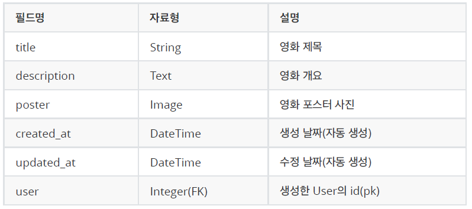
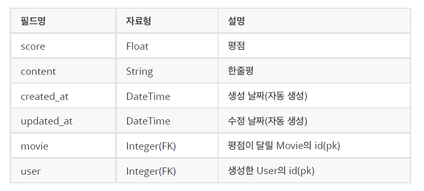
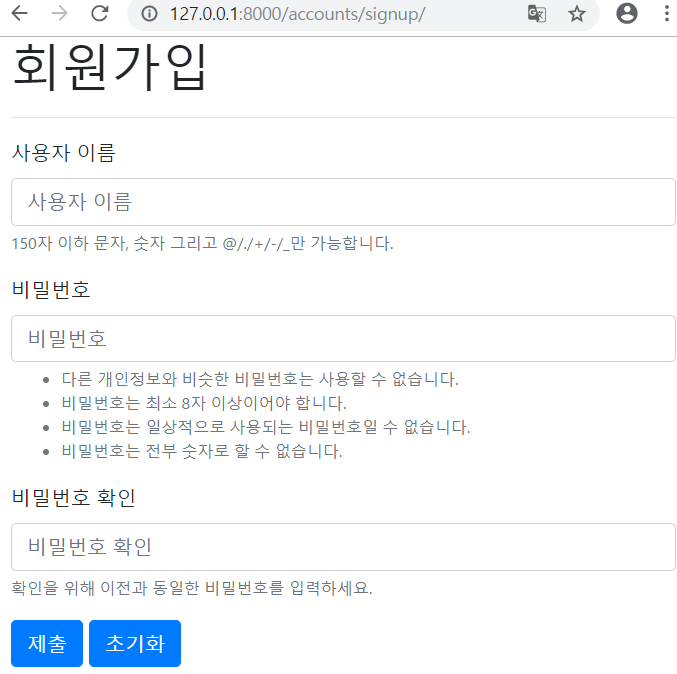
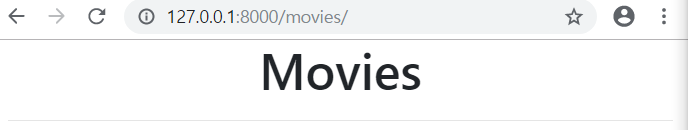
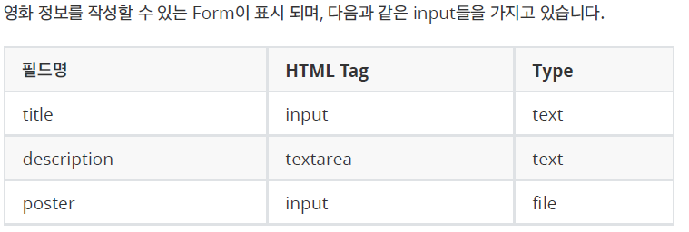

# 종합 실습 프로젝트 2

## 0. 개발 환경 설정

### 0.1 프로젝트 경로 및 앱 생성

#### 0.1.1 경로 생성

```bash
$ mkdir 07_django_PJT_2
```

#### 0.1.2 pip install

```bash
$ pip install django

$ pip install django-bootstrap4

$ pip install bootstrap4

$ pip install django-imagekit
```

#### 0.1.3 Project 생성

```bash
$ django-admin startproject config .
```

#### 0.1.4 Application 생성

```bash
$ python manage.py startapp movies
```

#### 0.1.5 `config/settings.py` 설정

```python
...
INSTALLED_APPS = [
    'movies',
    'bootstrap4',
    'imagekit',
    ...
]
...
LANGUAGE_CODE = 'ko-kr'

TIME_ZONE = 'Asia/Seoul'
...
```

### 0.2 URL 분리 & `app_name` 설정

- `movies/` 에 `urls.py ` 생성

  ```python
  from django.urls import path
  from . import views
  
  app_name = 'movies'
  urlpatterns=[
      # 현재는 비어 있음
  ]
  ```

- `config/urls.py`

  ```python
  urlpatterns = [
      ...
      path('movies/', include('movies.urls')),
  ]
  ```

### 0.3 템플릿 경로 커스터마이징

- `config/` 에 `templates/movies/` 생성

```
config/
	templates/
		movies/
```

- `templates/` 에 `base.html` 생성

```django
<!-- base.html -->
<!DOCTYPE html>

<html lang="ko">
<head>
    <meta charset="UTF-8">
    <meta name="viewport" content="width=device-width, initial-scale=1.0">
    <meta http-equiv="X-UA-Compatible" content="ie=edge">
    <title>auth</title>
    <!-- Bootstrap CSS -->
       
</head>

<body>
    <div class="container">
        
        
    </div>
    <!-- Bootstrap JS-->
    
</body>
</html>
```

- `config/settings.py`템플릿 탐색 경로 수정

```python
TEMPLATES = [
    {
        'BACKEND': 'django.template.backends.django.DjangoTemplates',
        'DIRS': [os.path.join(BASE_DIR, 'config', 'templates')],
        'APP_DIRS': True,
        ...
    },
]
```

-----

## 1. 데이터베이스 모델링

- Movie



- Rating



```python
# movies/models.py
        
class Movie(models.Model):
    title = models.CharField(max_length=100)
    description = models.TextField()
    poster = ProcessedImageField(
        upload_to='movies/posters',
        processors=[ResizeToFill(400, 600)],
        format='PNG', # or JPEG, etc.
        blank=True,
    )
    created_at = models.DateTimeField(auto_now_add=True)
    updated_at = models.DateTimeField(auto_now=True)
    user = models.ForeignKey(settings.AUTH_USER_MODEL, on_delete=models.CASCADE)


class Rating(models.Model):
    score = models.FloatField()
    content = models.CharField(max_length=200)
    created_at = models.DateTimeField(auto_now_add=True)
    updated_at = models.DateTimeField(auto_now=True)
    movie = models.ForeignKey(Movie, on_delete=models.CASCADE)
    user = models.ForeignKey(settings.AUTH_USER_MODEL, on_delete=models.CASCADE)
```

- 이제 마이그레이션 하자.

```bash
$ python manage.py makemigrations

$ python manage.py migrate
```

-----

## 2. Accounts

### 2.1 accounts Application 생성

```bash
$ python manage.py startapp accounts
```

- `INSTALLED_APPS` 등록

```python
INSTALLED_APPS = [
    'accounts',
]
```

- URL 분리

```python
# config/urls.py

urlpatterns = [
    path('accounts/', include('accounts.urls')),
]

# accounts/urls.py

from django.urls import path
from . import views

app_name = 'accounts'
urlpatterns = [
    # 비워두자
]
```

### 2.2 SignUp

- `accounts/views.py`

```python
from django.contrib.auth.forms import UserCreationForm, AuthenticationForm
from django.contrib.auth import login as auth_login

def signup(request):
    # 로그인을 했을 경우
    if request.user.is_authenticated:
        return redirect('movies:index')
    
    # POST 요청일 경우
    if request.method == 'POST':
        form = UserCreationForm(request.POST)
        if form.is_valid():
            user = form.save()
            auth_login(request, user)
            return redirect('movies:index')
    else:
        form = UserCreationForm
    context = {
        'form':form
    }
    return render(request, 'accounts/auth_form.html', context)
```

- `templates/accounts/auth_form.html`

```django




    <h1>회원가입</h1>

    <h1>로그인</h1>

<hr>
<form action="" method="POST">
    
    
    
    
</form>

```

- 실행 화면



### 2.3 LogIn

- `accounts/views.py`

```python
def login(request):
    # 로그인 했을 경우
    if request.user.is_authenticated:
        return redirect('movies:index')

    # POST 요청일 경우
    if request.method == 'POST':
        form = AuthenticationForm(request, request.POST)
        if form.is_valid():
            user = form.get_user()
            auth_login(request, user)
            return redirect(request.GET.get('next') or 'movies:index')
    # GET 요청일 경우
    else:
        form = AuthenticationForm()

    context = {
        'form': form,
    }
    return render(request, 'accounts/login.html', context)
```

- `accounts/urls.py`

```python
urlpatterns = [
    path('login/', views.login, name='login'),
]
```

### 2.4 LogOut

- `accounts/views.py`

```python
from django.contrib.auth import logout as auth_logout
from django.contrib.auth.decorators import login_required

@login_required
def logout(request):
    auth_logout(request)
    return redirect('movies:index')
```

-----

## 3. Movie

### 3.1 Index

- `movies/views.py`

```python
from .models import Movie

# Create your views here.
def index(request):
    movie = Movie.objects.all()
    context = {
        'movies' : movie
    }
    return render(request, 'movies/index.html', context)
```

- `movies/urls.py`

```python
urlpatterns=[
    path('', views.index, name='index'),
]
```

- `config/templates/movies/index.html`

```django




<h1>Movie List</h1>


<a href="">새 영화 등록</a>


<ul>
  
  <li>
    <a href="">{{ movie.title }}</a>
  </li>
  
</ul>


```

- `127.0.0.1:8000/movies/` 로 접속시



### 3.2 Create



- `movies/forms.py`

```python
from django import forms
from .models import Movie, Rating


class MovieForm(forms.ModelForm):
    class Meta:
        model = Movie
        fields = ('title', 'description', 'poster',)


class RatingForm(forms.ModelForm):
    score = forms.FloatField(
            initial=5,
            max_value=5, min_value=0,
            widget=forms.NumberInput(attrs={'step': '0.1'}),
        )

    class Meta:
        model = Rating
        fields = ('score', 'content',)
```

- `movies/views.py`

```python
@login_required
def new(request):
    if request.method == 'POST':
        form = MovieForm(request.POST, request.FILES)
        if form.is_valid():
            movie = form.save(commit=False)
            movie.user = request.user
            movie.save()
            return redirect('movies:detail', movie.pk)
    else:
        form = MovieForm()
    
    context = {
        'form': form,
    }
    return render(request, 'movies/form.html', context)
```

- `movies/urls.py`

```python
urlpatterns=[
    path('new/', views.new, name='new'),
]
```

- `config/templates/movies/form.html`
  - edit와 new html 통합

```django




<h1>Movie Form</h1>

<form action="" method="POST" enctype="multipart/form-data">
  
  {{ form.as_p }}
  <input type="submit">
</form>


```

### 3.3 Detail

- `movies/views.py`

```python
def detail(request, pk):
    movie = Movie.objects.get(pk=pk)
    ratings = movie.rating_set.all()
    rating_form = RatingForm()

    context = {
        'movie': movie,
        'ratings': ratings,
        'rating_form': rating_form,
    }
    return render(request, 'movies/detail.html', context)
```

- `movies/urls.py`

```python
urlpatterns=[
    path('<int:movie_pk>/', views.detail, name='detail'),
]
```

- `config/templates/movies/detail.html`

```django





<h1>Movie Detail</h1>

<p>User: {{ movie.user.username }}</p>
<p>Title: {{ movie.title }}</p>
<p>Description: {{ movie.description }}</p>

<p>Poster: </p>

<p>Created At: {{ movie.created_at }}</p>
<p>Updated At: {{ movie.updated_at }}</p>

<div>
  <a href="">목록</a>
  
  <a href="">수정</a>
  <form action="" method="POST" style="display: inline-block;">
    
    <input type="submit" value="삭제">
  </form>
  
</div>

<hr>

```

### 3.5 Update

- `movies/views.py`

```python
@login_required
def edit(request, pk):
    movie = Movie.objects.get(pk=pk)
    if movie.user != request.user:
        return redirect('movies:index')

    if request.method == 'POST':
        form = MovieForm(request.POST, request.FILES, instance=movie)
        if form.is_valid():
            movie = form.save()
            return redirect('movies:detail', movie.pk)
    else:
        form = MovieForm(instance=movie)
    
    context = {
        'form': form,
    }
    return render(request, 'movies/form.html', context)
```

- `movies/urls.py`

```python
urlpatterns=[
    path('<int:movie_pk>/edit/', views.edit, name='edit'),
]
```

### 3.6 Delete

- `movies/views.py`

```python
def delete(request, movie_pk):
    movie = Movie.objects.get(pk=movie_pk)
    movie.delete()
    return redirect('/movies/')
```

- `movies/urls.py`

```python
urlpatterns=[
    path('<int:movie_pk>/delete/', views.delete, name='delete'),
]
```

