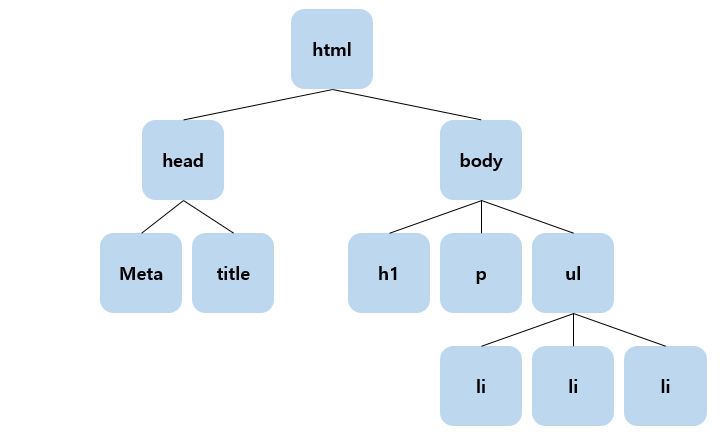
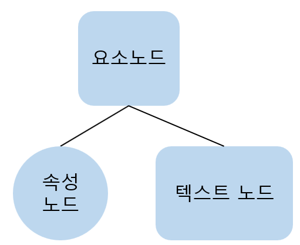

# JavaScript_02

## 1. DOM(문서 객체 모델)

### 1.1 DOM?

- **D(Document)**
  - DOM은 문서가 없으면 움직이지 않음
  - 웹 문서를 만들어 웹 브라우저에 띄우는 순간 작성한 문서가 객체로 바뀜

- **O(Object)**
	- 객체란 자기 자신을 포함하는 데이터 묶음
	- 프로퍼티 : 객체에 포함된 변수
	- 메소드 : 객체에 의해 실행되는 함수
	
- **M(Model)**
  - 웹 브라우저 창 안에서 읽은 웹 문서를 나타내주는 것

### 1.2 DOM 구조

- **DOM은 트리 구조**로 이루어져 있음

  

- **요소 노드**
  
  - 태그로 구성된 요소
  
- **텍스트 노드**
  - 요소 노드에 들어있는 내용
  - 모든 요소가 텍스트 노드를 포함하지는 않음

- **속성 노드**
  
  - 요소에 대한 좀더 정확한  정보를 표현할 때 사용
  - 모든 요소는 속성을 포함하진 않지만, 모든 속성은 요소 안에 포함



### 1.3 DOM 기본 제어  메소드

- **`getElementById(arg)`**

  - 특정 아이디 속성을 가진 요소에 접근 가능한 메소드

  ```html
  <p id="p1">
      이것은 p1
  </p>
  ```

  ```javascript
  document.getElementById("p1")
  ```

  - ID가 설정되어 있으면 그냥 ID로만으로도 불러올 수 있음

    ```javascript
    p1
    ```

    - 이 방법은 과거에 사용되던 방법으로, 현재는 지양하는 방법
    - **개발을 진행할 때 클로저 관련 문제를 유발할 수 있으니 주의가 필요**

- **`getElementsByTagName(arg)`**

  - 특정 태그를 사용하는 요소들을 배열로서 접근 가능한 메소드

  ```html
  <ul>
      <li>1</li>
      <li>2</li>
      <li>3</li>
  </ul>
  ```

  ```javascript
  document.getElementsByTagName("li")
  ```

- **`getElementsByClassName(arg)`**

  - 특정 클래스 속성을 가진 요소들에 접근 가능한 메소드

  ```html
  <ul>
      <li class="c1">1</li>
      <li class="c1">2</li>
      <li class="c2">3</li>
  </ul>
  ```

  ```javascript
  document.getElementsByClassName("c1")
  ```

- **`getAttribute(arg)`**

  - 요소의 속성의 정보를 가져오는 메소드

  ```html
  <ul>
      <li class="c1">1</li>
      <li class="c1">2</li>
      <li class="c2">3</li>
      <li>사</li>
  </ul>
  ```

  ```javascript
  let arr = document.getElementsByTagName("li")
  
  for (let i = 0; i < arr.length; i++) {
      alert(arr[i].getAttribute("class"))
  }
  ```

- **`setAttribute(attribute, value)`**

  - 요소의 속성의 정보를 바꿀 수 있는 메소드
  - 첫번째 인자는 바꾸고 싶은 속성, 두 번째 인자는 바꿀 값

  ```html
  <ul>
      <li class="c1">1</li>
      <li class="c1">2</li>
      <li class="c2">3</li>
      <li>사</li>
  </ul>
  ```

  ```javascript
  let arr = document.getElementsByTagName("li")
  
  arr[0].setAttribute("class", "c2")
  ```


## 2. 이벤트

### 2.1 이벤트란?

- 사용자와 웹 페이지 간의 상호작용
- 이벤트가 발생했다는 것은 웹 페이지에서 특정 동작이 발생하여, 브라우저가 그 사실을 알려주는 것을 의미

### 2.2 이벤트 핸들러(이벤트 리스너)

- 특정 요소에서 발생하는 이벤트를 처리하기 위해서는 이벤트 핸들러 함수를 작성하여 연결
- 이벤트 핸들러가 연결된 요소에서 지정된 이벤트 발생 시, 브라우저는 연결된 이벤트 핸들러를 실행

#### 2.2.1 DOM Level-0

- 하나의 콜백만을 지정 가능
- 같은 이벤트 핸들러를 두 번 이상 사용한다면, 마지막 이벤트 핸들러만이 작동

```javascript
window.onload = function() {	// window.onload는 HTML 문서가 로드될 때 실행
	let btn = document.getElementById("btn1")
    const idText = document.getElementById("text")

    btn.onclick = function() {
        idText.append("마우스가 버튼을 클릭!")
    }
    btn.onmouseover = function() {
        idText.append("마우스가 버튼 위로 진입!")
    }
    btn.onmouseleave = function() {
        idText.append("마우스가 버튼 위에서 탈출!")
    }
}
```

#### 2.2.2 DOM Level-2 +

- 여러 개의 이벤트 리스너 추가 가능

- 기존 이벤트 핸들러를 덮어 쓰지 않고 핸들러 추가해도 모든 핸들러 정상 작동

- 함수가 버블링 또는 캡처링으로 작동할지 작성시 판단 가능

- IE 6, 7, 8 버전을 지원하지 않아 주의 필요

- 원형

  ```javascript
  대상객체.addEventListener(이벤트명, 실행할 이벤트 리스너[, 이벤트 전파 방식])
  ```

  - **이벤트 명** : 이벤트 리스터를 등록할 이벤트 타입을 문자열로 전달

  - **실행할 이벤트 리스너** : 지정된 이벤트가 발생했을 때 실행할 이벤트 리스너를 전달

  - **이벤트 전파 방식(Optional)** : false면 버블링(Bubbling), true면 캡처링(Capturing) 방식

    - 버블링 : 이벤트가 발생한 요소부터 window까지 이벤트를 전파
    
    - 캡처링 : window로부터 이벤트가 발생한 요소까지 이벤트 전파
    
    - 하지만 options 객체로 여러개를 줄 수도 있음
    
      ```javascript
      대상객체.addEventListener(이벤트명, 실행할 이벤트 리스너, {
      	capture: false,
          once: true,
          passive: false,
      });
      ```
    
      - **capture**: 위의 기본적인 이벤트 전파 방식과 같음
      - **once**: true면 이벤트가 딱 한번만 발생됨
      - **passive**: true면 콜백 함수 내부에 preventDefault()가 있다해도 실행되지 않음
    

```javascript
window.onload = function () {
    let btn = document.getElementById("btn")
    const idText = document.getElementById("text")

    btn.addEventListener("click", clickBtn, false)
    btn.addEventListener("mouseover", overBtn, false)
    btn.addEventListener("mouseleave", leaveBtn, false)
    
    function clickBtn() {
        idText.append("마우스가 버튼을 클릭!")
    }
    function overBtn() {
        idText.append("마우스가 버튼 위로 진입!")
    }
    function leaveBtn() {
        idText.append("마우스가 버튼 위를 탈출!")
    }
}
```

```javascript
// 익명 함수로 처리하는 방법
window.onload = function () {
	let btn = document.getElementById("btn")
	const idText = document.getElementById("text")

	btn.addEventListener("click", () => {
    	idText.append("마우스가 버튼을 클릭!")
    }, false)
    btn.addEventListener("mouseover", () => {
        idText.append("마우스가 버튼 위로 진입!")
    }, false)
    btn.addEventListener("mouseleave", () => {
        idText.append("마우스가 버튼 위에서 탈출!")
    }, false)
}
```

#### 2.2.3 이벤트 종류

- 이벤트 핸들러는 이벤트 앞에 on을 붙여줌(2.2.1 참고)

|   종류    |                 설명                  |
| :-------: | :-----------------------------------: |
|   blur    |    포커스를 다른 곳으로 옮길 경우     |
|   click   |    링크나 폼의 구성원을 클릭할 때     |
|  change   |          선택값을 바꿀 경우           |
|   focus   |         포커스가 위치할 경우          |
| mouseover |         마우스가 올라올 경우          |
| mouseout  |          마우스가 떠날 경우           |
| mousedown |          마우스를 누를 경우           |
| mousemove |         마우스를 움직일 경우          |
|  mouseup  |       마우스를 눌렀다 놓을 경우       |
|  select   |     입력 양식의 하나가 선택될 때      |
|  submit   |          폼을 전송하는 경우           |
|   load    | 페이지, 윈도우가 브라우저로 읽혀질 때 |
|  unload   |   현재의 브라우저, 윈도우를 떠날 때   |
|   error   |  문서나 이미지에서 에러를 만났을 때   |
|   reset   |         리셋 버튼이 눌렸을 때         |
|  dbclick  |              더블 클릭시              |
| dragdrop  |        마우스 누르고 움직일 때        |
|  keydown  |              키 입력 시               |
| keypress  |              키 누를 때               |
|   keyup   |         키를 누르고 놓았을 때         |
|   move    |      윈도우나 프레임을 움직일 때      |
|  resize   |  윈도우나 프레임 사이즈를 움직일 때   |

### 2.3 이벤트 거는 방법

#### 2.3.1 DOM을 이용한 방법

```html
<button id-"btn">버튼</button>
```

- 이전에 사용한 방법

```javascript
let btn = document.getElementById("btn")
btn.onclick = function() {
    // 이벤트
}
```

- addEventListener를 이용한 방법

```javascript
let btn = document.getElementById("btn")
btn.addEventListener("click", () => {
    // 이벤트
})
```

- 한번만 동작하는 이벤트 선언

```javascript
let btn = document.getElementById("btn")
btn.addEventListener('click', () => {
    // 이벤트
}, {once: true});
```

#### 2.3.2 jQuery를 이용한 방법

```javascript
$("#btn").click(function(){
    // 이벤트
})
```

#### 2.3.3 태그에 거는 방법

- 기본 방법

  ```html
  <button onclick="click()">버튼</button>
  ```

  ```javascript
  function click(){
      // 이벤트
  }
  ```

- data 속성을 이용해 인자를 보내고 쓰는 방법

  - 바닐라 JS 
  
    - 첫번째 방법
  
      ```html
      <button onclick="click(this)" data-d1="d1" data-d2="d2">버튼</button>
      ```
    
      ```javascript
      function(para) {
          para.getAttribute("data-d1")
      }
      ```
      
    - onclick을 안쓰는 방법
    
      ```html
      <button id="btn" data-d1="d1" data-d2="d2">버튼</button>
      ```
    
      ```javascript
      let btn = document.getElementById("btn")
      btn.addEventListener("click", () => {
          btn.dataset.d1
          btn.dataset.d2
          // 이벤트
      })
      ```
    
  - jQuery 
  
    ```html
    <button onclick="click(this)" data-d1="d1" data-d2="d2">버튼</button>
    ```
  
    ```javascript
    function click(para) {
        $(para).data("d1")
        // ...
    }
    ```

#### 2.3.4 동적 요소 이벤트 걸기

```javascript
document.addEventListener('click', event => {
    if (event.target.className == 'btn-copy') {
    	// ...
    }
});
```

## 3. 클로저(Closure)

### 3.1 정적 유효범위(Lexical Scope)

- JavaScript에서는 **코드가 적힌 순간 변수의 유효범위가 정해짐**
- 즉, 함수를 어디서 선언하였는지에 따라 상위 스코프를 결정하며, **함수의 호출이 아니라 함수를 어디에 선언하였는지에 따라 결정 됨**
  - 함수를 어디에서 호출하였는지는 스코프 결정에 아무런 의미를 주지 않음

- 이것을 Lexical Scope 또는 Static Scope라고 부름

```javascript
function main() {
    var name = 'main'
}
```

- `var`로 선언한 변수의 유효범위는 함수를 벗어날 수 없음 즉, 함수 안에서 선언한 변수는 함수 밖에서 접근 불가능

```javascript
var name = 'main'

function print() {
    console.log(name)
}
function main() {
    name = 'fMain'
    print()
}

main()		// fMain 출력
```

- `main()` 메서드가 실행된 후 전역변수인 `name`의 값을 변경하였기 때문에  `fMain` 출력

```javascript
var name = 'main'

function print() {
    console.log(name)
}
function main() {
    var name = 'fMain'
    print()
}

main()		// main 출력
```

- `main()` 메서드의 `name` 변수는 전역변수인 `name` 변수가 아니고 `main()` 함수 안에서 선언되어 함수 밖으로 벗어날 수 없기 때문

```javascript
let name = 'main'

function main() {
    let name = 'fMain'
    print()
    
    function print() {
        console.log(name)
    }
}

main()		// fMain 출력
console.log(name) // main 출력
```

- 위와 같이 코드를 고치면 `print()`함수가 `main()` 메서드 안에서 선언되어 스코프가 main 함수 내부이므로 fMain을 출력

### 3.2 클로저란?

- 함수와 그 함수가 선언됐을 때의 렉시컬 환경(Lexcical Environment)과의 조합
  - **함수가 선언됐을 때의 환경의 스코프를 기억하여, 스코프 밖에서 호출되어도 선언됐을 당시의 스코프에 접근 가능한 함수**
- 외부함수의 맥락(Context)에 접근 가능한 내부함수, 좀 더 포괄적으로는 함수 선언시 생성되는 유효범위
  - 즉, 외부 scope에서 내부 scope로 접근이 불가능하지만, 내부 scope에서는 외부 scope로 접근 가능

- **함수 내에 선언된 로컬 변수를 외부에서도 참조 가능한 기능**
- 관점에 따라 모든 JavaScript 함수가 클로저라고 볼 수 있음
  - 하지만 클로저는 JavaScript 고유의 개념이 아니라, 여러 함수형 프로그래밍 언어에서 공통적으로 발견되는 특성
  - 부수 효과(Side Effect)를 최대한 억제하여 오류를 피하고 프로그램의 안정성을 높이기 위해 클로저는 적극적으로 사용됨

- 클로저는 남발하면 위험, **가비지컬렉션 대상이 되어야할 객체들이 메모리 상에 남게 되므로, 클로저를 남발하면 오버플로우 발생 가능**
  - 클로저에 꼭 필요한 작업만 남겨두지 않으면 메모리를 불필요하게 잡아먹는 결과 야기
  - 클로저 사용을 적절한 스코프로 가둬두지 않으면 성능에 악영향을 미침
  - 즉, **클로저는 공짜가 아니**므로 클로저를 사용할 때 주의가 필요

```javascript
function outFunc(value) {
    var outVal = 'this value is '
    
    function inFunc() {
        return outVal + value
    }
    
    return inFunc
}

var result  = outFunc('value01')
console.log('result : ' + result())	// result : this value is value01
```

- 내부함수 `inFunc()`에서 `outFunc()`의 인자와 지역변수에 접근이 가능
- `outFunc()`의 return 값은 `inFunc()`라는 내부함수
- `outFunc()` 함수가 실행되면, `outFunc()`의 Scope는 끝이 나기 때문에 `outFunc()` 인자인 value와 지역변수인 outVal는 메모리에서 정리되어야 하지만, 실제 console.log에서 result를 호출하면, 내부함수 `inFunc()`가 선언될 때 `outFunc()` 함수의 인자와 outVal 지역변수를 `inFunc()`의 클로저 객체로 남아 실제로 `inFunc()`가 호출될 때 클로저 객체를 통해서 `outFunc()`의 인자와 변수에 접근이 가능
- 이것이 클로저가 하는 일
