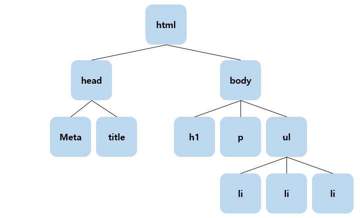

# JavaScript_02

## 1. DOM(문서 객체 모델)

### 1.1 DOM?

- **D(Document)**
- DOM은 문서가 없으면 움직이지 않음
	- 웹 문서를 만들어 웹 브라우저에 띄우는 순간 작성한 문서가 객체로 바뀜
	
- **O(Object)**

	- 객체란 자기 자신을 포함하는 데이터 묶음
	- 프로퍼티 : 객체에 포함된 변수
	- 메소드 : 객체에 의해 실행되는 함수

- **M(Model)**
- 웹 브라우저 창 안에서 읽은 웹 문서를 나타내주는 것

### 1.2 DOM 구조

- **DOM은 트리 구조**로 이루어져 있음

  

- **요소 노드**
  
- 태그로 구성된 요소
  
- **텍스트 노드**
  - 요소 노드에 들어있는 내용
  - 모든 요소가 텍스트 노드를 포함하지는 않음

- **속성 노드**
  
  - 요소에 대한 좀더 정확한  정보를 표현할 때 사용
  - 모든 요소는 속성을 포함하진 않지만, 모든 속성은 요소 안에 포함


### 1.3 DOM 기본 제어  메소드

- **`getElementById(arg)`**

  - 특정 아이디 속성을 가진 요소에 접근 가능한 메소드

  ```html
  <p id="p1">
      이것은 p1
  </p>
  ```

  ```javascript
  document.getElementById("p1")
  ```

- **`getElementsByTagName(arg)`**

  - 특정 태그를 사용하는 요소들을 배열로서 접근 가능한 메소드

  ```html
  <ul>
      <li>1</li>
      <li>2</li>
      <li>3</li>
  </ul>
  ```

  ```javascript
  document.getElementsByTagName("li")
  ```

- **`getElementsByClassName(arg)`**

  - 특정 클래스 속성을 가진 요소들에 접근 가능한 메소드

  ```html
  <ul>
      <li class="c1">1</li>
      <li class="c1">2</li>
      <li class="c2">3</li>
  </ul>
  ```

  ```javascript
  document.getElementsByClassName("c1")
  ```

- **`getAttribute(arg)`**

  - 요소의 속성의 정보를 가져오는 메소드

  ```html
  <ul>
      <li class="c1">1</li>
      <li class="c1">2</li>
      <li class="c2">3</li>
      <li>사</li>
  </ul>
  ```

  ```javascript
  let arr = document.getElementsByTagName("li")
  
  for (let i = 0; i < arr.length; i++) {
      alert(arr[i].getAttribute("class"))
  }
  ```

- **setAttribute(attribute, value)**

  - 요소의 속성의 정보를 바꿀 수 있는 메소드
  - 첫번째 인자는 바꾸고 싶은 속성, 두 번째 인자는 바꿀 값

  ```html
  <ul>
      <li class="c1">1</li>
      <li class="c1">2</li>
      <li class="c2">3</li>
      <li>사</li>
  </ul>
  ```

  ```javascript
  let arr = document.getElementsByTagName("li")
  
  arr[0].setAttribute("class", "c2")
  ```


## 2. 이벤트

### 2.1 이벤트란?

- 사용자와 웹 페이지 간의 상호작용
- 이벤트가 발생했다는 것은 웹 페이지에서 특정 동작이 발생하여, 브라우저가 그 사실을 알려주는 것을 의미

### 2.2 이벤트 핸들러(이벤트 리스너)

- 특정 요소에서 발생하는 이벤트를 처리하기 위해서는 이벤트 핸들러 함수를 작성하여 연결
- 이벤트 핸들러가 연결된 요소에서 지정된 이벤트 발생 시, 브라우저는 연결된 이벤트 핸들러를 실행

#### 2.2.1 DOM Level-0

- 하나의 콜백만을 지정 가능
- 같은 이벤트 핸들러를 두 번 이상 사용한다면, 마지막 이벤트 핸들러만이 작동

```javascript
window.onload = function() {	// window.onload는 HTML 문서가 로드될 때 실행
	let btn = document.getElementById("btn1")
    const idText = document.getElementById("text")

    btn.onclick = function() {
        idText.append("마우스가 버튼을 클릭!")
    }
    btn.onmouseover = function() {
        idText.append("마우스가 버튼 위로 진입!")
    }
    btn.onmouseleave = function() {
        idText.append("마우스가 버튼 위에서 탈출!")
    }
}
```

#### 2.2.2 DOM Level-2 +

- 여러 개의 이벤트 리스너 추가 가능

- 기존 이벤트 핸들러를 덮어 쓰지 않고 핸들러 추가해도 모든 핸들러 정상 작동

- 함수가 버블링 또는 캡처링으로 작동할지 작성시 판단 가능

- IE 6, 7, 8 버전을 지원하지 않아 주의 필요

- 원형

  ```javascript
  대상객체.addEventListener(이벤트명, 실행할 이벤트 리스너[, 이벤트 전파 방식])
  ```

  - **이벤트 명** : 이벤트 리스터를 등록할 이벤트 타입을 문자열로 전달

  - **실행할 이벤트 리스너** : 지정된 이벤트가 발생했을 때 실행할 이벤트 리스너를 전달

  - **이벤트 전파 방식** : false면 버블링(Bubbling), true면 캡처링(Capturing) 방식

    - 버블링 : 이벤트가 발생한 요소부터 window까지 이벤트를 전파
    - 캡처링 : window로부터 이벤트가 발생한 요소까지 이벤트 전파

    

```javascript
window.onload = function () {
    let btn = document.getElementById("btn")
    const idText = document.getElementById("text")

    btn.addEventListener("click", clickBtn, false)
    btn.addEventListener("mouseover", overBtn, false)
    btn.addEventListener("mouseleave", leaveBtn, false)
    
    function clickBtn() {
        idText.append("마우스가 버튼을 클릭!")
    }
    function overBtn() {
        idText.append("마우스가 버튼 위로 진입!")
    }
    function leaveBtn() {
        idText.append("마우스가 버튼 위를 탈출!")
    }
}
```

```javascript
// 익명 함수로 처리
window.onload = function () {
	let btn = document.getElementById("btn")
	const idText = document.getElementById("text")

	btn.addEventListener("click", () => {
    	idText.append("마우스가 버튼을 클릭!")
    }, false)
    btn.addEventListener("mouseover", () => {
        idText.append("마우스가 버튼 위로 진입!")
    }, false)
    btn.addEventListener("mouseleave", () => {
        idText.append("마우스가 버튼 위에서 탈출!")
    }, false)
}
```

#### 2.2.3 이벤트 종류

- 이벤트 핸들러는 이벤트 앞에 on을 붙여줌(적용 방법 1 참고)

|   종류    |                 설명                  |
| :-------: | :-----------------------------------: |
|   blur    |    포커스를 다른 곳으로 옮길 경우     |
|   click   |    링크나 폼의 구성원을 클릭할 때     |
|  change   |          선택값을 바꿀 경우           |
|   focus   |         포커스가 위치할 경우          |
| mouseover |         마우스가 올라올 경우          |
| mouseout  |          마우스가 떠날 경우           |
| mousedown |          마우스를 누를 경우           |
| mousemove |         마우스를 움직일 경우          |
|  mouseup  |       마우스를 눌렀다 놓을 경우       |
|  select   |     입력 양식의 하나가 선택될 때      |
|  submit   |          폼을 전송하는 경우           |
|   load    | 페이지, 윈도우가 브라우저로 읽혀질 때 |
|  unload   |   현재의 브라우저, 윈도우를 떠날 때   |
|   error   |  문서나 이미지에서 에러를 만났을 때   |
|   reset   |         리셋 버튼이 눌렸을 때         |
|  dbclick  |              더블 클릭시              |
| dragdrop  |        마우스 누르고 움직일 때        |
|  keydown  |              키 입력 시               |
| keypress  |              키 누를 때               |
|   keyup   |         키를 누르고 놓았을 때         |
|   move    |      윈도우나 프레임을 움직일 때      |
|  resize   |  윈도우나 프레임 사이즈를 움직일 때   |

## 3. 클로저(Closure)

### 3.1 정적 유효범위

- JavaScript에서는 코드가 적힌 순간 변수의 유효범위가 점해짐
- 이것을 정적 유효범위(Lexical Scope)라고 부름

```javascript
function main) {
    var name = 'main'
}
```

- `var`로 선언한 변수의 유효범위는 함수를 벗어날 수 없음 즉, 함수 아네서 선언한 변수는 함수 밖에서 접근 불가능

```javascript
var name = 'main'

function print() {
    console.log(name)
}
function main() {
    name = 'fMain'
    print()
}

main()
```

- 위의 코드의 실행 결과는 `fMain`
- `main()` 메서드가 실행된 후 전역변수인 `name`의 값을 변경하였기 때문에  `fMain` 출력

```javascript
var name = 'main'

function print() {
    console.log(name)
}
function main() {
    var name = 'fMain'
    print()
}

main()
```

- 위의 코드의 실행 결과는 `main`
- `main()` 메서드의 `name` 변수는 전역변수인 `name` 변수가 아니고 `main()` 함수 안에서 선언되어 함수 밖으로 벗어날 수 없기 때문