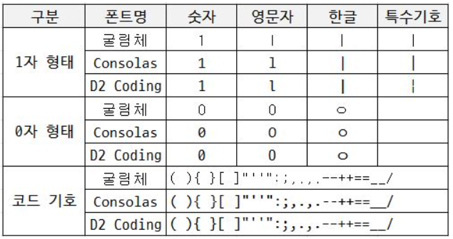
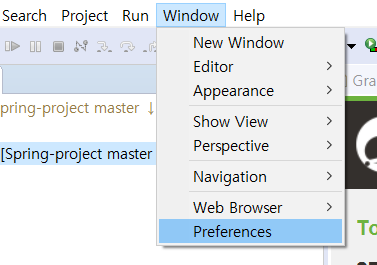
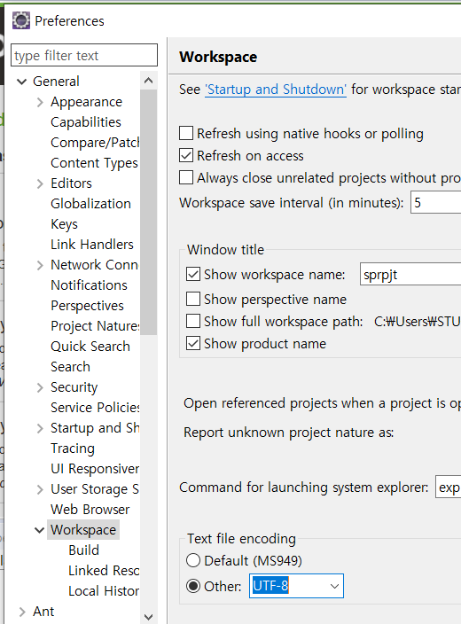
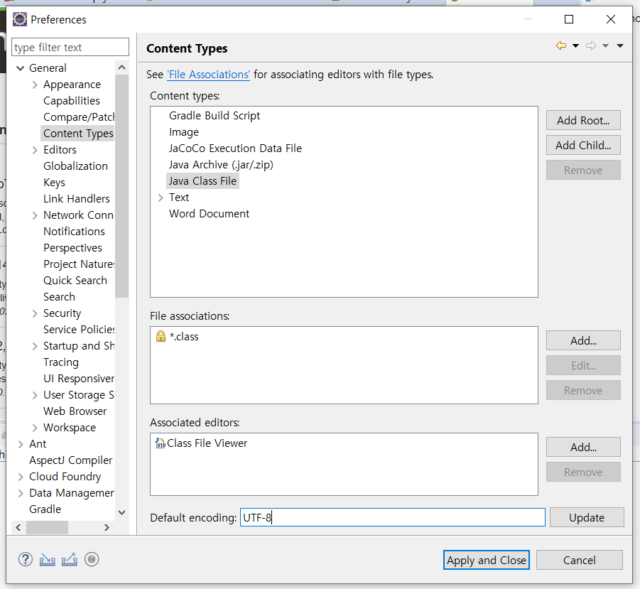
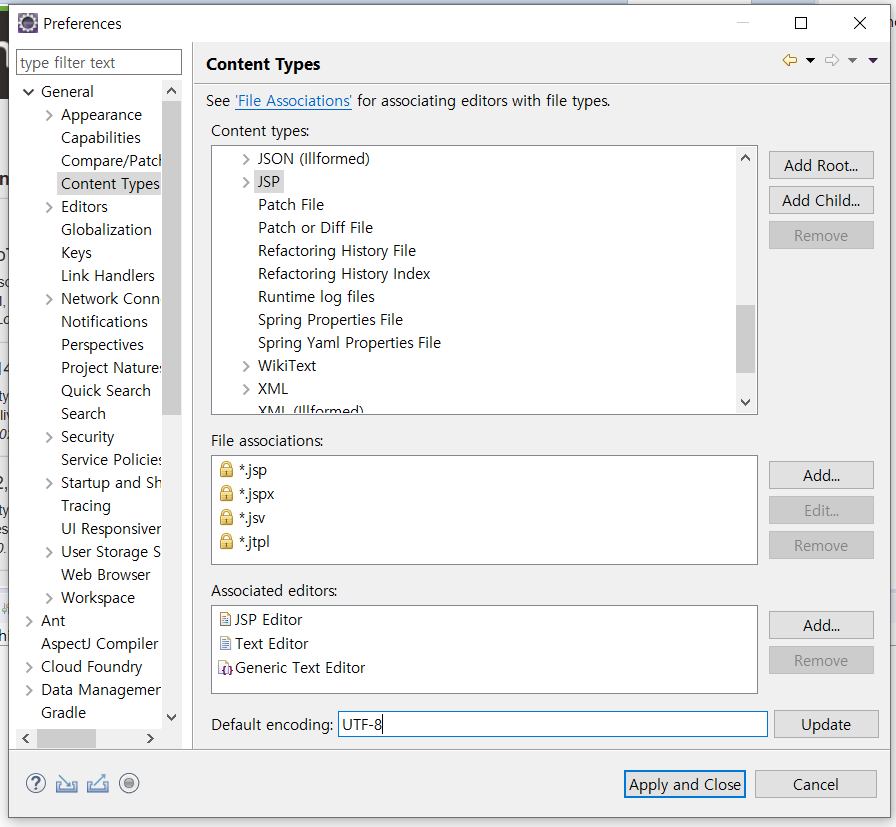
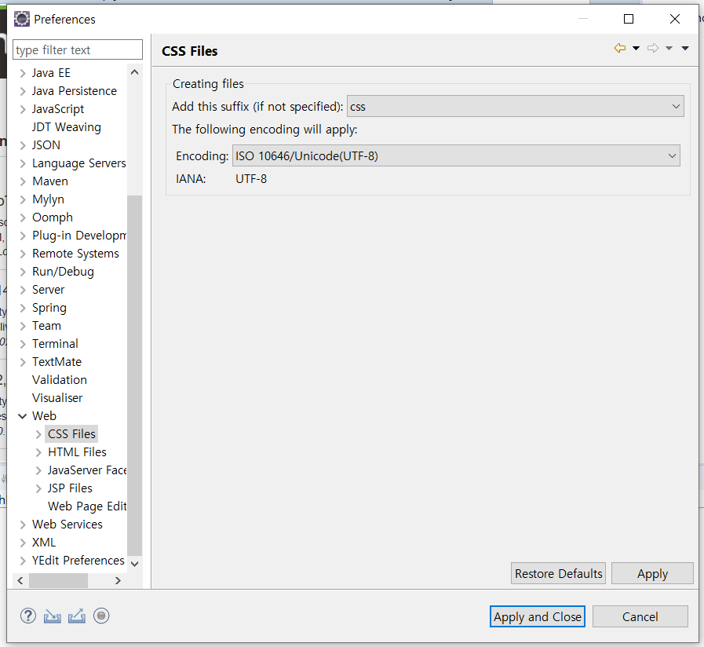

# 01_문자, 폰트

## 1. D2 Coding 글꼴

- [다운로드](https://github.com/naver/d2codingfont/releases/tag/VER1.3.2)

- 개발자의 코딩을 위해 가독성 및 유사 문자간 변별력을 높임

- 유사한 형태의 문자 등에 대한 변별력과 가독성을 강화

- 고정폭 글꼴로 제작 되어 어떤 개발환경에서도 자간과 행간을 유지

  

## 2. 문자 인코딩

- 인코딩은 문자나 기호들의 집합을 컴퓨터에서 표현하는 방법
- 복호화가 지닌 본래의 문자나 기호를 뜻하게 되는 부호를 **문자 코드**라고 한다.

### 2.1 문자 집합(Charset)

- 정보를 표현하기 위한 글자들의 집합을 정의한 것
- 사용되지 않을 수도 있고, 한 문자 집합을 여러 문자 인코딩에서도 사용 가능
- 집합 안의 문자들에 음수가 아닌 정수들을 배정한 것을 **부호화된 문자 집합**이라 함

### 2.2 문자 인코딩 형태(Character Encoding Form, CEF)

- 특정한 문자 집합 안의 문자들을 시스템에서 사용할 목적으로 일정한 범위 안의 정수들로 변환하는 방법

### 2.3 문자 인코딩 구조(Character Encoding Scheme, CES)

- 문자 인코딩 형태로 변환된 코드값을 옥텟 기반의 시스템에서 사용하기 위하여 옥텟들로 변환하는 방법

## 3. Eclipse UTF-8 설정

- 이클립스를 켜고 Windows - Preferences 

  

- General - Workspace - Text file encoding 에서 UTF-8 선택

  

- 같은 General에서 Content Types - Java Class FIle - Default encoding에 `UTF-8` 입력 후 Update

  

- 같은 Content Types - Text - JSP에도 `UTF-8` 입력 후 업데이트

  

- Preferences - Web 아래의 CSS Files, HTML Files, JSP Files 모두 `UTF-8` 로 변경

  

## 3. 