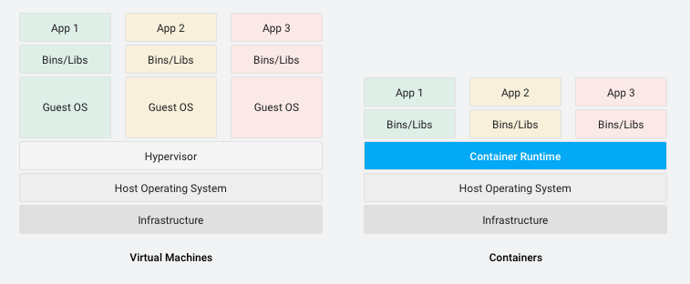

# Container

## 1. Container?

- 애플리케이션을 실제 구동 환경으로부터 추상화 가능한 논리 패키지 메커니즘
- 사설 데이터 센터, 퍼블릭 클라우드, 개인 PC **어떤 환경에서든 애플리케이션을 쉽게 지속적으로 배포 가능**
- 컨테이너화를 통해 업무 영역을 깔끔하게 분리 가능
  - 개발자는 **애플리케이션의 로직과 종속 항목에 집중 가능**
  - 운영팀은 소프트웨어 버전, 개별 앱 구성 등 세부 업무에 시간 낭비하지 않고 **배포와 관리에 집중 가능**
- 컨테이너는 가상 머신과 마찬가지로 애플리케이션을 관련 라이브러리 및 종속 항목과 함께 패키지로 묶어 소프트웨어 서비스 구동을 위한 격리 환경을 마련

## 2. 장점

- **가벼움**
  - 사용자의 Request가 증가할 경우
    - 가상머신을 추가한다면 Guest OS가 포함되어 최소 몇 GB 단위의 용량이 필요
    - **컨테이너는 Guest OS가 없기에 MB 단위의 용량이 필요**
  - 결과적으로 가상머신은 배포하는데 수분에서 수십분의 시간 소요되지만, 컨테이너는 몇초의 시간이 소요

- **탄력성**
  - 컨테이너는 Linux, Window, Mac, Cloud 등 **어느 환경에서나 구동** 되므로 개발 및 배포에 용이
- **유지관리 효율**
  - OS 수준에서 업데이트 또는 패치 작업을 한 번만 수행하면 모든 컨테이너에 적용 가능
  - 이를 통해 서버를 더 효율적으로 운영하고 유지 관리가 쉬워짐
  - **애플리케이션이 배포되는 최종 위치에 관계없이 항상 일관성이 있음에 따라 생산성 향상**
  - 개발 및 테스트 환경에서 세운 가정이 실제 환경에서 그대로 실현될 것이기 때문에 버그 자체도 감소

https://cloud.google.com/containers?hl=ko

https://tech.osci.kr/2020/03/03/91690167/