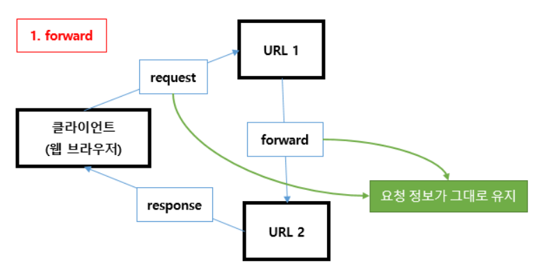
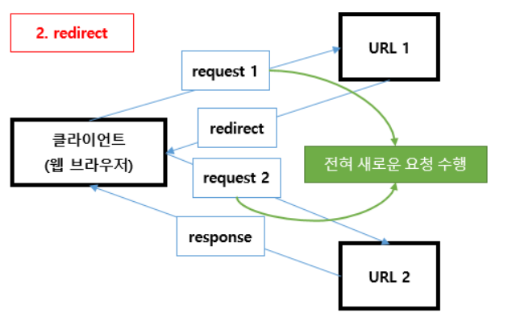

# Forward vs Redirect

## 1. Forward

- Web Container 차원에서의 페이지 이동만 존재
- 실제 웹 브라우저는 다른 페이지로 이동했음을 모름
- 그러므로 웹 브라우저에는 최초에 호출한 URL이 표시되고 이동한 페이지의 URL 정보 확인 불가
- 동일한 Web Container 차원에서의 페이지 이동만 가능
- **현재 실행 중인 페이지와 forward에 의해 호출될 페이지는 request, response 객체를 공유**
- 말 그대로 forward(건네주기)

## 2. Redirect

- Web Container는 redirect 명령이 들어오면 웹 브라우저에게 다른 페이지로 이동 명령 내림
- 웹 브라우저는 URL을 지시된 주소로 바꾸고 그 주소로 이동
- 다른 Web Container에 있는 주소로 이동 가능
- **새로운 페이지에서는 request, response 객체가 새롭게 생성**

## 3. 정리

- **forward** : 변화 X, 재사용 O
  - 시스템에 변화가 생기지 않는 단순 조회(리스트, 검색)
- **redirect** : 변화 O, 재사용 X
  - 시스템(Session, DB)에 변화가 생기는 요청(로그인, 회원가입, 글쓰기)