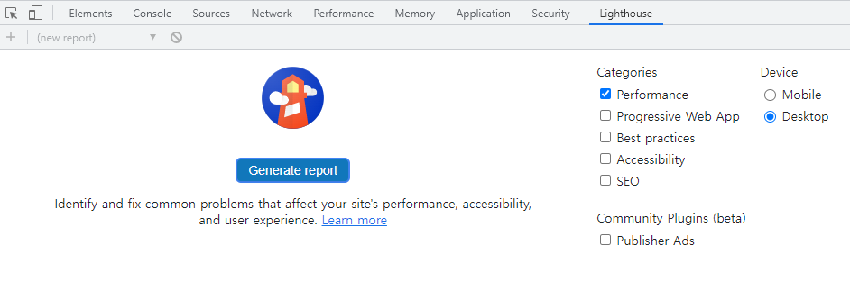
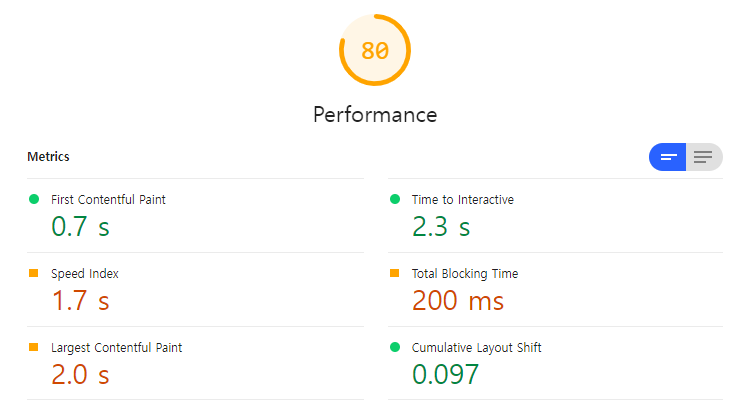

# Front-End 성능 최적화

## 1. 크롬 개발자 도구

### 1.1 Lighthouse

#### 1.1.1 첫 화면

- Lighthouse는 구글에서 개발한, 웹 페이지의 품질 개선을 위한 오픈 소스 형태의 자동화 도구

- 원래는 따로 설치해서 사용해야 했지만, 크롬 웹 브라우저 개발자 도구에서 사용 가능하게 됨

  

  - **Performacne**
    - 웹 페이지의 로딩 속도 등 실제 성능을 측정

  - **Progressive Web App**
    - PWA로 부르며, 웹과 네이티브 앱의 기능 모두의 이점을 가지도록 만들어진 서비스인지 체크

  - **Best practices**
    - Best practices를 따라 개발되었는지 체크

  - **Accessibility**
    - Document가 title element를 가지고 있는지, html이 lang 속성이 있는지, 태그에 알맞은 속성 부여댔는지 **접근성 체크**

  - **SEO**
    - Search Engine OPtimization의 약자로 검색 엔진 수집 최적화에 관련된 부분

- ***Generate report* 버튼을 눌러 확인 하면** Metrics 확인

#### 1.1.2 Metrics

  

  - **First Contentful Paint**
    - 첫 번째 텍스트 또는 이미지가 랜더링 되는데 걸린 시간
  - **Time to Interactive**
    - 페이지가 완전히 **상호 작용 가능한 상태가 되는데 걸린 시간**
  - **Speed Index**
    - 페이지 내용이 채워지는데 걸린 시간
  - **Total Blocking Time**
    - 페이지가 사용자 입력에 응답하지 못하도록 차단된 총 시간
    - 메인 스레드에서 수행되는 50ms 가 넘는 작업을 모두 기록
      - **50ms가 넘는 작업이 반복될수록 사용자에게 페이지가 느리다고 인식하게 할 수 있음**
    - 우수한 사용자 경험(~100ms), 향상 필요(~300ms)
  - **Largest Contentful Paint**
    - **가장 큰 콘텐츠 요소가 화면에 렌더링 될 때까지 걸리는 시간**
    - 우수한 사용자 경험(~2.5s), 향상 필요(~4s)
    - 해당 요소
      - `img` 요소
      - `svg` 내부의 `image` 요소
      - `video` 요소
      - 백그라운드 이미지가 있는 요소
      - 텍스트를 포함하는 블록 레벨 요소
  - **Cumulative Layout Shift**
    - 이미지/광고의 느린 로딩, 비동기 동작, 동적 DOM 변경 등으로 레이아웃이 얼마나 변하는지 측정한 값
    - **사용자가 잘못된 클릭을 유발하는 시각적 불안정성을 체크하는 지표**
      - 특정한 경우 사용자가 누르려던 버튼이 다른 버튼이 랜더링됨으로서 의도치 않은 버튼이 클릭된 경우
    - 우수한 사용자 경험(~0.1), 향상 필요(~0.25)

#### 1.1.3 Opportunities

- 리소스 관점에서 개선할 가능한 부분을 제안
  - 사용하지 않는 js 파일 제외, js 파일 사이즈 줄이기
  - 이미지 사이즈 조절, 이미지 포멧 변환
  - 등 여러 성능 향상 가능성이 있는 제안

#### 1.1.4 Diagnostics

- 페이지 렌더링 관점에서 개선 가능한 부분을 제안

### 1.2 Performance

## 2. 

