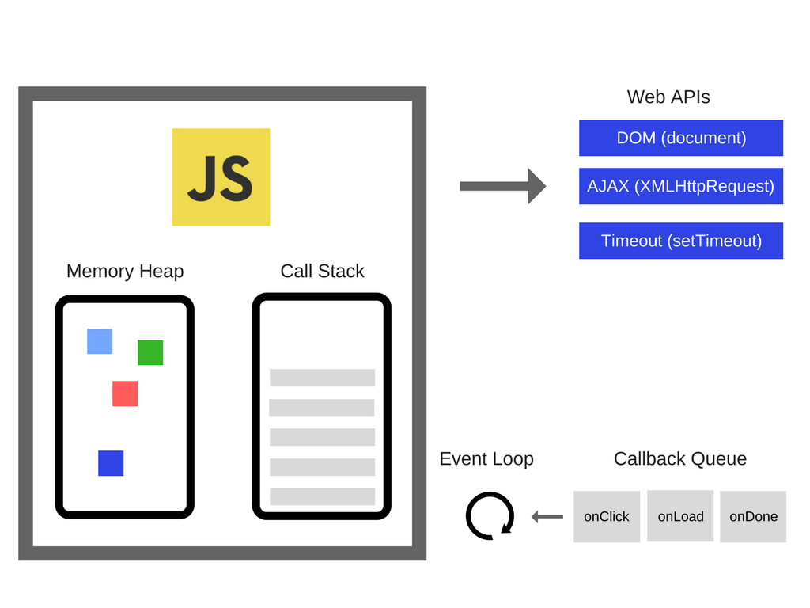

# JS Engine
- JavaScript 코드를 해석하고 실행하는 인터프리터
- 메모리 힙과 콜 스택으로 구성

## 1. JS 런타임


- JavaScript 자체는 싱글 스레드(Single Thread)이나, 브라우저나 Node.js에서는 여러 개의 스레드가 사용됨
- Web APIs
  - DOM, AJAX, Timer, 이벤트리스너 등 브라우저에서 제공하는 API
- Callback Queue(Event Queue, Task Queue)
  - Web API의 콜백 함수들이 대기하는 곳
    - 실제로 Queue가 아닌 Set으로 구현되어 있고, 대기하는 테스크 중 실행 가능한 테스크를 뽑아내기 위한 구조로 되어있음
  - 마이크로테스크 큐(Microtask Queue, Event Queue)
    - 마이크로테스크 큐가 메크로테스크 큐 보다 **우선순위가 높음**
    - `process`, `Promise`, `Object.observer`, `MutationObserver`
    - `Promise`와 관련된 콜백함수나 마이크로태스크로 예약된 작업들이 여기에 속함
    - 이벤트 루프의 다른 큐보다 높은 우선순위를 갖고 있어, 이벤트 루프의 현재 태스크가 완료된 후 실행
  - 메크로테스크 큐(Macrotask Queue, Job Queue)
    - `setTimeout`, `setImterval`, `setImmediate`, `requestAnimationFrame`, I/O, UI 렌더링
    - 마이크로테스크 큐의 작업들보다 우선순위가 낮음

  ```javascript
  console.log('start');

  setTimeout(() => {
    console.log('setTimeout - macrotask')
  }, 0);

  Promise.resolve()
    .then(() => console.log('promise 1 - microtask'))
    .then(() => console.log('promise 2 - microtask'));

  console.log('end');

  /*
  start
  end
  promise 1 - microtask
  promise 2 - microtask
  setTimeout - macrotask
  */
  ```
- Event Loop
  - 콜 스택이 비워질떄마다 콜백 큐에 대기 중인 콜백 함수가 있다면, 콜백 함수를 콜 스택에 넘겨줌
  - 런타임에서 JavaScript 엔진과 상호 연동하기 위해 사용하는 장치가 Event Loop

## 1. 메모리 힙(Memory Heap)
- 변수와 객체의 메모리 할당이 발생하는 곳

## 2. 콜 스택(Call Stack)
- JavaScript는 싱글 스레드(Single Thread) 언어인데 이는 콜 스택이 하나라는 의미
  - 즉, 동시에 하나의 일만 처리 가능
- 여러 함수들을 호출하는 스크립트에서 해당 위치를 추적하는 인터프리터를 위한 메커니즘
- 현재 어떤 함수가 동작하고 있는지, 그 함수 내에서 어떤 함수가 동작하는지, 다음에 어떤 함수가 호출되어야 하는지 등을 제어
  - 스크립트가 함수를 호출하면 인터프리터는 이를 콜 스택에 추가한 다음 함수를 수행하기 시작
  - 해당 함수에 의해 호출되는 모든 함수는 콜 스택에 추가되고 호출이 도달하는 위치에서 실행
  - 메인 함수가 끝나면 인터프리터는 스택을 제거하고 메인 코드 목록에서 중단된 실행을 다시 시작
  - 스택이 할당된 공간보다 많은 공간을 차지하면 **Stack Overflow** 에러가 발생

## 3. 이벤트 루프(Event Loop)
- JavaScript 엔진의 **동시성 제어**를 위한 요소
- JavaScript 엔진에서 제공되는 것이 아닌 브라우저나 Node.js 런타임에서 지원
- 싱글 스레드의 한계를 보완하기 위해 비동기 콜백(Asynchronous Callback)을 이용
- 비동기 콜백에는 Web APIs, Promise, setTimeout, 이벤트리스너 등이 있음
- JavaScript 코드 실행 중에 이벤트를 만나면 이벤트가 콜백 큐(Callback Queue)에 차례로 쌓임
- 이벤트 루프는 **콜 스택이 비어있는지 확인 후, 이 콜백 큐에 있는 이벤트를 콜 스택에 넘기**는데 이 한 번의 작업을 틱(tick)이라 함
  - 큐의 첫 번째 테스크를 가져오는 것이 아닌, 테스크 큐에서 실행 가능한(runnable) 첫 번째 테스크를 가져옴
- 이벤트 루프는 이 작업을 반복