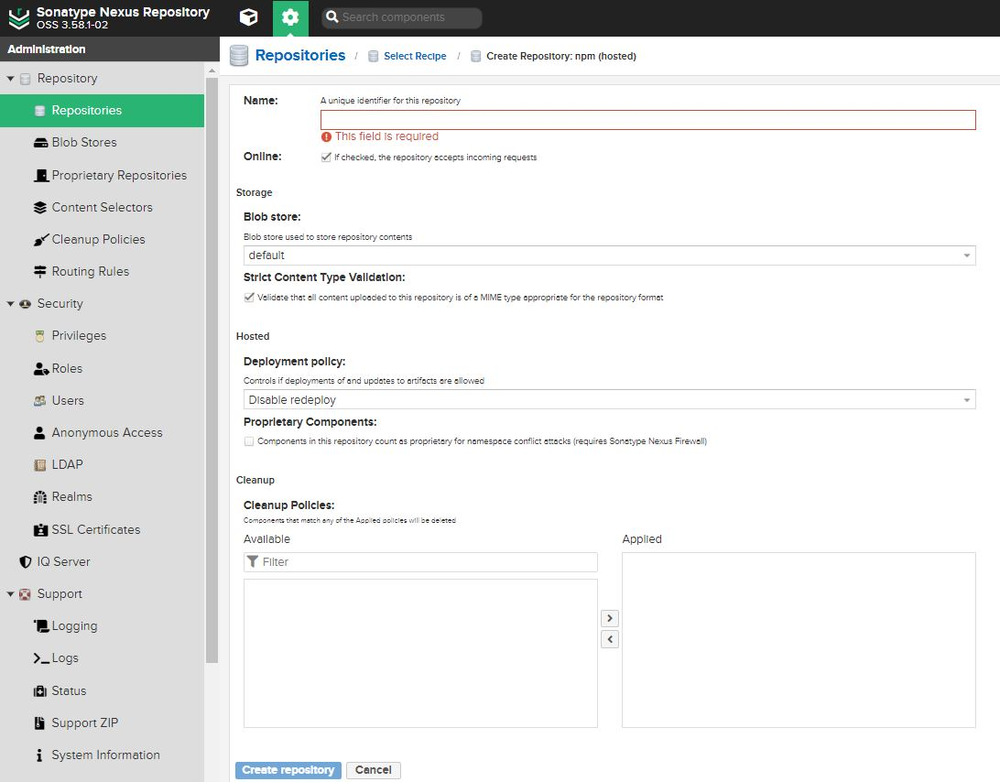

# Nexus NPM Deploy

## 1. 웹팩 빌드

### 1.1 node.js 9 + react@15.6.2

- `src/index.js` react 컴포넌트 생성

  ```javascript
  import React, { Component } from 'react';

  class HsComponent extends Component {
    constructor() {
      super();
    }

    render() {
      return (
        <div>
          Hello! HsComponent.
        </div>
      );
    }
  }

  export default HsComponent;
  ```

- `package.json`

  ```json
  {
    "name": "hs-component",
    "version": "1.0.0",
    "description": "",
    "main": "index.js",
    "scripts": {
      "test": "echo \"Error: no test specified\" && exit 1",
      "build": "npx webpack"
    },
    "author": "",
    "license": "ISC",
    "dependencies": {
      "react": "^15.6.2",
      "react-dom": "^15.6.2"
    },
    "devDependencies": {
      "@babel/core": "7.15.0",
      "@babel/preset-env": "7.15.0",
      "@babel/preset-react": "^7.14.5",
      "babel-loader": "^8.3.0",
      "webpack": "^4.46.0",
      "webpack-cli": "^4.7.2"
    },
    "peerDependencies": {
      "react": "^15.6.2",
      "react-dom": "^15.6.2"
    },
  }
  ```

- `.babelrc`
  
  ```json
  {
    "presets": ["@babel/preset-env", "@babel/preset-react"]
  }
  ```

- `webpack.config.js`
  
  ```javascript
  const path = require('path');

  module.exports = {
    mode: 'production',
    entry: './src/index.js',
    output: {
      filename: 'bundle.js',
      path: path.resolve(__dirname, 'dist'),
      library: 'hs-component',
      libraryTarget: 'umd',
      umdNamedDefine: true
    },
    module: {
      rules: [
        {
          test: /\.js$/,
          exclude: /node_modules/,
          use: {
            loader: 'babel-loader'
          }
        }
      ]
    }
  }
  ```

- `root`에 빌드된 파일을 연결하는 `index.js` 파일 추가
  
  ```javascript
  module.exports = require('./dist/bundle');
  ```

- `webpack` 빌드

  ```bash
  $ npm run build
  ```

### 1.1 + typescript

- `src/indes.tsx` react 컴포넌트 생성

  ```typescript
  import React, { Component } from 'react';

  interface TestProps {}

  class MyComponentTS extends Component<TestProps> {
    constructor(props: TestProps) {
      super(props);
    }

    render() {
      return (
        <div>
          test ts
        </div>
      );
    }
  }

  export default MyComponentTS;
  ```

- `package.json`

  ```json
  {
    "name": "hs-component-ts",
    "version": "1.0.0",
    "description": "",
    "main": "index.js",
    "scripts": {
      "test": "echo \"Error: no test specified\" && exit 1",
      "build": "npx webpack"
    },
    "keywords": [],
    "author": "",
    "license": "ISC",
    "dependencies": {
      "react": "^15.6.2",
      "react-dom": "^15.6.2"
    },
    "devDependencies": {
      "@babel/core": "^7.15.0",
      "@babel/preset-env": "^7.15.0",
      "@babel/preset-react": "^7.14.5",
      "@types/react": "^15.6.2",
      "@types/react-dom": "^15.5.17",
      "babel-loader": "^8.3.0",
      "ts-loader": "^4.0.1",
      "typescript": "^2.9.2",
      "webpack": "^4.46.0",
      "webpack-cli": "^4.7.2"
    },
    "peerDependencies": {
      "react": "^15.6.2",
      "react-dom": "^15.6.2"
    }
  }
  ```

- `.babelrc`

  ```json
  {
    "presets": ["@babel/preset-env", "@babel/preset-react"]
  }
  ```

- `tsconfig.json`

  ```json
  {
    "compilerOptions": {
      "target": "ES6",
      "module": "CommonJS",
      "jsx": "react",
      "strict": true,
      "allowSyntheticDefaultImports": true,
      "esModuleInterop": true
    }
  }
  ```

- `webpack.config.js`

  ```javascript
  const path = require('path');

  module.exports = {
    mode: 'production',
    entry: './src/index.tsx',
    output: {
      filename: 'bundle.js',
      path: path.resolve(__dirname, 'dist'),
      library: 'hs-component-ts',
      libraryTarget: 'umd',
      umdNamedDefine: true
    },
    module: {
      rules: [
        {
          test: /\.ts(x?)$/,
          exclude: /node_modules/,
          use: [
            {
              loader: 'babel-loader',
            },
            {
              loader: 'ts-loader'
            }
          ]
        },
        {
          test: /\.js$/,
          exclude: /node_modules/,
          use: [
            {
              loader: 'babel-loader',
            }
          ]
        }
      ]
    },
    resolve: {
      extensions: ['.ts', '.tsx', '.js']
    }
  }
  ```

- `root`에 빌드된 파일을 연결하는 `index.js` 파일 추가
  
  ```javascript
  module.exports = require('./dist/bundle');
  ```

- `webpack` 빌드

  ```bash
  $ npm run build
  ```

## 2. Nexus 배포

### 2.1 설치

- [다운로드](https://help.sonatype.com/repomanager3/product-information/download)

#### 2.1.1 Windows

- 위에서 받은 압축 파일을 원하는 위치에 **압축해제**
- `cmd` 관리자 모드 실행

  ```bash
  $ cd {압축파일 해제 위치}/nexus-3.58.1-02/bin

  # 설치
  $ nexus.exe/install

  # 실행
  $ nexus.exe/run
  ```


#### 2.1.2 Mac

```bash
$ brew isntall nexus

# 중지
$ brew services stop nexus

# 시작
$ brew services start nexus
```

### 2.2 Nexus 설정

#### 2.2.1 로그인

- 위에서 설치된 Nexus의 **기본 포트는 8081**
  - `localhost:8081` 로 접속해서 확인

- 접속이 됐다면 우측 상단 `Sign in` 클릭
  - 로그인 창에 `username`, `password`를 입력
    - `username`은 `admin`
    - 입력 초기 `password`는 `{압축파일 해제 위치}/sonatype-work/nexus3/admin.password` 안의 값
    - 초기에는 비밀번호 재설정 창이 팝업

#### 2.2.2 npm repository 생성

- `Repositories` 탭의 `Create repository` 클릭
- `npm (hosted)` 클릭
  - `name`을 입력하고 `Create repository`를 클릭
  
- 생성 후 입력한 `name`을 클릭해서 찾아 **`URL`** 메모

#### 2.2.3 Roles 추가

- `Security` 탭의 `Roles` 클릭
- `Create Role` 클릭
  - `Role ID`, `Role name`, `Role Description`을 각각 입력
  - `Privileges`에서 
    - `nx-repository-view-npm-{위에서 생성한 repository name}-browse`, `nx-repository-view-npm-{위에서 생성한 repository name}-read`를 `read` 이름으로 생성
    - `nx-repository-view-npm-{위에서 생성한 repository name}-add`, `nx-repository-view-npm-{위에서 생성한 repository name}-edit`를 `write` 이름으로 생성
  

#### 2.2.4 Role 부여

- `Security` 탭의 `Users`
  - 생성한 Role 부여
  

#### 2.2.5 Realms

- `Security` 탭의 `Realms` 클릭
  - `npm Bearer Token Realm`을 `Active`로 이동
  

### 2.3 배포

- 1 에서 만든 라이브러리로 돌아옴
- `npm login`

  ```bash
  $ npm login --registry={위에서 메모해 놓은 nexus repository URL}

  $ Username: Nexus ID

  $ Password: Nexus password

  $ Email: email
  ```

- `package.json` 수정

  ```json
  {
    ...,
    "publishConfig": {
      "registry": {위에서 메모해 놓은 nexus repository URL}
    }
  }
  ```

- 배포

  ```bash
  $ npm publish
  ```

## 3. 패키지 사용

- 사용할 프로젝트에서
  ```bash
  $ npm --registry {위에서 메모해 놓은 nexus repository URL} install {package name}
  ```