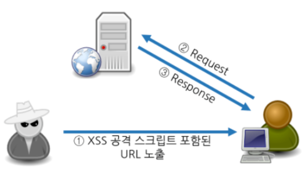
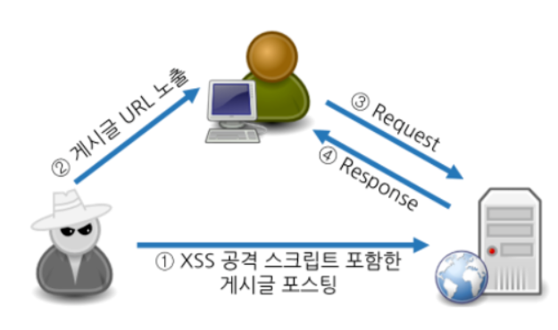
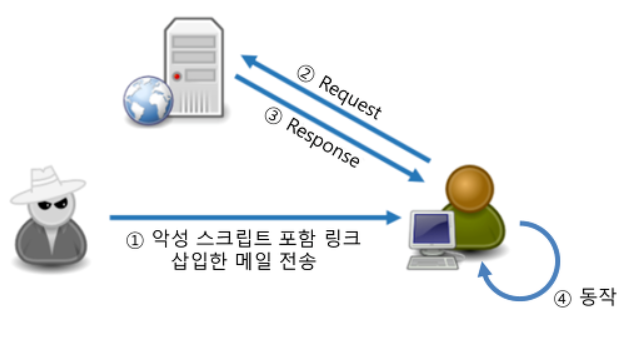
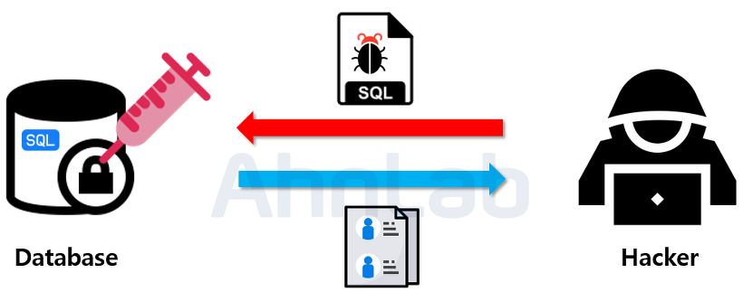
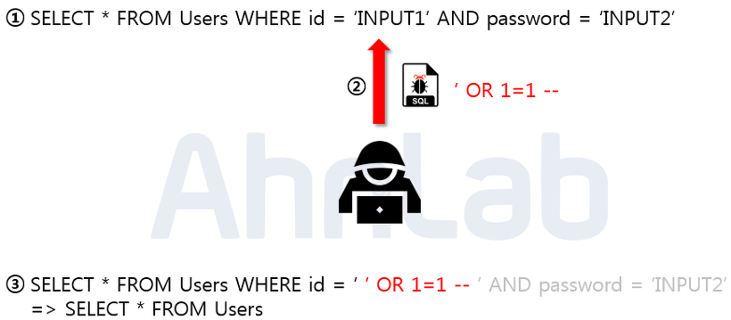
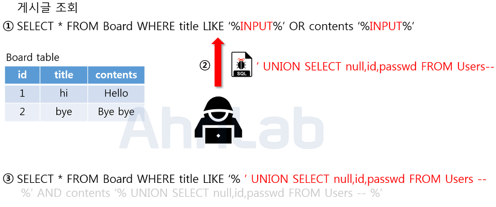
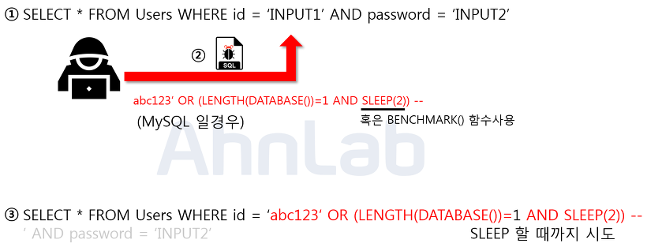

# 보안

## 1. XSS(Cross Site Scripting)

### 1.1 XSS ?

- 게시판이나 웹 메일 등에 자바 스크립트와 같은 스크립트 코드를 삽입해 개발자가 고려하지 않은 기능이 작동하게 하는 치명적인 공격
- 클라이언트(사용자)를 대상으로 한 공격이다.

### 1.2 종류

#### 1.2.1 Reflected XSS

- 웹 애플리케이션의 **지정된 변수를 이용할 때 발생하는 취약점을 이용**
  - 서버가 브라우저에게 응답할 때 전송 과정에서 입력된 변수의 위험한 문자를 사용자에게 그대로 돌려주면서 발생
- 공격자가 미리 XSS 공격에 취약한 웹 사이트를 탐색하고, XSS 공격을 위한 스크립트를 포함한 URL을 사용자에게 노출시킴
- 사용자가 해당 URL을 클릭할 경우, 취약한 웹 사이트의 서버에 스크립트가 포함된 URL을 통해 Request를 전송하고, 웹 서버에서는 해당 스크립트를 포함한 Response를 전송하게 된다.

#### 1.2.2 Stored XSS

- 웹 애플리케이션 취약점이 존재하는 **웹 서버에 악성 스크립트를 영구적으로 저장**해 놓는 방법
- 웹 사이트의 게시판에 스크립트를 삽입하는 공격 방식
- 공격자는 게시판에 스크립트를 삽입한 후 공격 대상자가 해당 게시글을 클릭하도록 유도
- 공격자가 미리 XSS 공격에 취약한 웹 사이트를 탐색하고 XSS 공격을 위한 스크립트를 포함한 게시글을 웹 사이트에 업로드
- 게시글의 URL을 사용자에게 노출하고 사용자가 게시글을 확인함으로써 URL에 대한 요청을 서버에 전송
- 웹 서버에서 스크립트를 포함한 Response를 전송하며 공격이 수행

#### 1.2.3 DOM Based XSS

- 사용자의 브라우저가 **HTML 페이지를 구문 분석할때마다 공격 스크립트가 DOM 생성의 일부로 실행**되면서 공격
- 페이지 자체는 변하지 않으나, 페이지에 포함되어 있는 브라우저측 코드가 DOM 환경에서 악성코드로 실행
- 서버와 관계없이 브라우저에서 발생

### 1.3 위험성

#### 1.3.1 쿠키 정보 및 세션 ID 획득

- 공격자는 페이지 및 게시판에 공격을 수행함으로써 해당 페이지를 이용하는 사용자의 쿠키 정보나 세션 ID를 획득 가능
- 만약 세션 ID 등을 쿠키에 포함하는 경우, XSS 공격을 통해서 사용자의 세션 ID를 획득해 공격자가 불법적으로 정상 사용자인 척 가장 가능

#### 1.3.2 시스템 관리자 권한 획득

- 웹 서버에 다양한 악성 데이터를 포함시킨 후, 사용자의 브라우저가 악성 데이터를 실행 가능
- 공격자는 아직 패치되지 않은 취약점에 대한 공격 코드가 실행되도록 해 사용자의 시스템을 통제 가능

#### 1.3.3 악성코드 다운로드

- XSS 공격은 악성 스크립트 자체로 악성 프로그램을 다운로드는 불가능
- 하지만, 사용자가 악성 스크립트가 있는 URL을 클릭하도록 유도해 악성 프로그램을  받을  수 있는 사이트로 Redirect하거나 트로이 목마 프로그램을 다운로드 유도 가능

#### 1.3.4 거짓 페이지 노출

- 공격에 취약한페이지일 경우, `<script>`태그 뿐 아니라 ``와 같은 그림을 표시하는 태그를 사용해 원래 페이지와는 전혀 관련이 없는 페이지 표시 가능
- 기타 다른 태그도 사용이 가능할 경우, 원래 페이지의 일부를 변조해 거짓 페이지가 노출 가능해 이를 통해 개인정보 유출 등의 위험이 존재

### 1.4 XSS 방지법

- XSS 공격은 IPS, IDS, 방화벽 등으로도 방지가 불가능
- 때문에 단순히 문자를 필터링하는 등의 방법만이 존재
- **코딩에 사용되는 입력 및 출력 값에 대해서 검증하고 무효화**

#### 1.4.1 Script 문자 필터링

- XSS 공격은 입력값에 대한 검증이 제대로 이루어지지 않아 발생하는 취약점이기 때문에 사용자의 모든 입력값에 대하여 서버측에서 필터링을 해주어야 함
- PHP에서는 eregi함수를 이용하면 XSS 공격에 주로 사용되는 문자들을 필터링 가능
- **입력값 제한**
  - 사용자의 입력값을 제한하여 스크립트를 사용하지 못하도록 해야함, 요청의 값의 타입을 지정하는 방법
- **입력값 치환**
  - XSS 공격은 기본적으로 `<script>` 태그를 사용하기에 태그(`<`, `>`) 등 위험한 문자 입력시 문자 참조로 필터링 후 서버에 전송시 문자 인코딩
- **스크립트 영역 출력 자제**

#### 1.4.2 htmlentities 사용

- PHP에서는 htmlentities라는 함수가 있음
- htmlentities는 모든 특수문자를 HTML 엔티티로 변환함

## 2. SQL Injection

### 2.1 SQL Injection ?

- 악의적인 사용자가 보안상의 취약점을 이용하여, 임의의 SQL문을 주입하고 실행되게 하여 데이터베이스가 비정상적인 동작을 하도록 조작하는 행위
- 공격이 비교적 쉬운 편이고 공격에 성공할 경우 큰 피해를 입힐 수 있는 공격

### 2.2 종류

#### 2.2.1 Error based SQL Injection

- 논리적 에러를 이용한 SQL Injection은 가장 많이 쓰이고, 대중적인 공격 기법

- 위의 사진에서 보이는 쿼리문은 일반적으로 로그인 시 많이 사용되는 SQL 구문이다.
- 해당 구문에서 입력값에 대한 검증이 없음을 확인하고, 악의적인 사용자가 임의의 SQL 구문을 주입
- 주입된 내용은 ‘ OR 1=1 -- 로  WHERE 절에 있는 싱글쿼터를 닫아주기 위한 싱글쿼터와 OR 1=1 라는 구문을 이용해 WHERE 절을 모두 참으로 만들고, -- 를 넣어줌으로 뒤의 구문을 모두 주석 처리 해준다.
- 매우 간단한 구문이지만, Users 테이블에 있는 모든 정보를 조회 가능하게 되면서, 가장 먼저 만들어진 계정(일반적으론 관리자 계정)으로 로그인에 성공하게 된다.

#### 2.2.2 Union based SQL Injection

- 정상적인 쿼리문에 Union 키워드를 사용하여 인젝션에 성공하면, 원하는 쿼리문을 실행할 수 있게 된다.

- 위의 사진에서 보이는 쿼리문은 Board라는 테이블에서 게시글을 검색하는 쿼리문이다.
- 입력값을 title과 contents 컬럼의 데이터랑 비교한 뒤 비슷한 글자가 있는 게시글을 출력한다.
- 여기서 입력값으로 Union과 함께 컬럼 수를 맞춰서 SELECT를 넣어주게되면 두 쿼리문이 합쳐져서 하나의 테이블로 보여지게 된다.

#### 2.2.3 Blind SQL Injection

- 데이터베이스로부터 특정한 값이나 데이터를 전달받지 않고, 단순히 참과 거짓의 정보만 알 수 있을때 사용
- 로그인 폼에 SQL Injection이 가능핟고 가정했을 때, 서버가 응답하는 로그인 성공과 로그인 실패 메시지를 이용하여, DB의 테이블 정보 등을 추출할 수 있다.

- 위의 그림은 Blind Injection을 이용하여 DB의 테이블 명을 알아내는 방법이다.
- 로그인 폼을 통하여 악의적인 사용자는 임의로 가입한 abc123이라는 아이디와 함께 구문을 주입한다.
- 해당구문은 MySQL 에서 테이블 명을 조회하는 구문으로 limit 키워드를 통해 하나의 테이블만 조회하고, SUBSTR 함수로 첫 글자만, 그리고 마지막으로 ASCII 를 통해서 ascii 값으로 변환해준다. 
- 만약에 조회되는 테이블 명이 Users 라면 ‘U’ 자가 ascii 값으로 조회가 될 것이고, 뒤의 100 이라는 숫자 값과 비교를 하게 된다. 
- 거짓이면 로그인 실패가 될 것이고, 참이 될 때까지 뒤의 100이라는 숫자를 변경해 가면서 비교를 하면 된다. 
- 공격자는 이 프로세스를 자동화 스크립트를 통하여 단기간 내에 테이블 명을 알아 낼 수 있다. 

#### 2.2.4 Time based SQL Injection

- 서버로부터 특정한 응답 대신에 참 혹은 거짓의 응답을 통해서 데이터베이스의 정보를 유추하는 기법

- 위의 그림은 Time based SQL Injection을 사용하여 현재 사용하고 있는 데이터베이스의 길이를 알아내는 방법이다.
- 로그인 폼에 주입이 되었으며 임의로 abc123 이라는 계정을 생성해 두었다.
- 악의적인 사용자가 abc123’ OR (LENGTH(DATABASE())=1 AND SLEEP(2)) – 이라는 구문을 주입한다.
- 여기서 LENGTH 함수는 문자열의 길이를 반환하고, DATABASE 함수는 데이터베이스의 이름을 반환한다.
- 주입된 구문에서, LENGTH(DATABASE()) = 1 가 참이면 SLEEP(2) 가 동작하고, 거짓이면 동작하지 않는다.
- 이를 통해서 숫자 1 부분을 조작하여 데이터베이스의 길이를 알아 낼 수 있다.

#### 2.2.5 Stored Procedure SQL Injection

- 저장 프로시저(Stored Procedure)는 일련의 쿼리들을 모아 하나의 함수처럼 사용하기 위한 것이다.
- 공격에 사용되는 대표적인 저장 프로시저는 MS-SQL에 있는 xp_cmdshell로 윈도우 명령어를 사용할 수 있게 된다.
- 공격자가 시스템 권한을 획득해야하므로 공격 나이도가 높으나 공격에 성공한다면, 서버에 직접적인 피해를 줄 수 있다.

#### 2.2.6 Mass SQL Injection

- 한번에 다량의 DB가 조작되어 큰 피해를 입힌다.
- 보통 MS-SQL을 사용하는 ASP 기반 웹 애플리케이션에서 많이 사용되며, 쿼리문은 HEX 인코딩 방식으로 인코딩 하여 공격한다.
- 보통 데이터베이스 값을 변조하여 데이터베이스에 악성스크립트를 삽입하고, 사용자들이 변조된 사이트에 접속 시 좀비PC로 감염되게 한다. 이렇게 감염된 좀비 PC들은 DDoS 공격에 사용된다.

### 2.3 대응 방안

#### 2.3.1 입력 값에 대한 검증

- SQL Injection에서 사용되는 기법과 키워드는 많이 존재하므로 사용자의 입력값에 대한 검증이 필요하다.
- 서버에서 화이트리스트 기반으로 검증해야한다.
- 블랙리스트 기반으로 검증하게 되면 수많은 차단 리스트를 등록해야 하고, 하나라도 빠지면 공격에 성공한다.

#### 2.3.2 Prepared Statement 구문 사용

- Prepared Statement를 사용하게 되면, 사용자의 입력값이 DB의 파라미터로 들어가기 전에 DBMS가 미리 컴파일하여 실행하지 않고 대기한다.
- 그 후 사용자의 입력값을 문자열로 인식하게 하여 공격쿼리가 들어간다고 하더라도, 사용자의 입력은 이미 의미없는 단순 문자열이기 때문에 전체 쿼리문도 공격자의 의도대로 작동하지 않는다.

#### 2.3.3 Error Message 노출 금지

- 공격자가 SQL Injection을 수행하기 위해서는 데이터베이스의 정보(테이블명, 컬럼명 등)가 필요하다.
- DB 에러 발생 시 따로 처리를 해주지 않는다면, 에러가 발생한 쿼리문과 함께 에러에 관한 내용을 반환한다.
- 여기서 테이블명과 컬럼명 그리고 쿼리문이 노출 가능하므로, 오류 발생시 사용자에게 보여줄 수 있는 페이지나 메시지 박스를 따로 띄워야한다.

#### 2.3.4 웹 방화벽 사용

- 웹 방화벽은 소프트웨어 형, 하드웨어 형, 프록시 형 이렇게 세가지 종류로 나눌 수 있다.
- 소프트웨어 형은 서버 내에 직접 설치하는 방법
- 하드웨어 형은 네트워크 상에서 서버 앞 단에 직접 하드웨어 장비로 구성
- 프록시 형은 DNS 서버 주소를 웹 방화벽으로 바꾸고 서버로 가는 트래픽이 웹 방화벽을 먼저 거치도록 하는 방법

## 3. MyBatis에서 #{}와 ${}의 차이

### 3.1 #{}

- 파라미터가 String 형태로 들어와 자동적으로 파라미터 형태가 된다.
- 예를 들어, #{user_id}의 user_id의 값이 abc라면 쿼리문에는 USER_ID='abc'의 형태가 된다.
- 쿼리 주입을 예방할 수 있어 보안측면에 유리

### 3.2 ${}

- 파라미터가 바로 출력된다.
- 해당 컬럼의 자료형에 맞추어 파라미터의 자료형이 변경된다.
- 쿼리 주입을 예방할 수 없어 보안측면에서 불리하므로, 사용자의 입력을 전달할 때는 사용하지 않는 편이 좋다.
- 테이블이나 컬럼명을 파라미터로 전달하고 싶을때 사용한다.

## 4. CSRF(Cross-site Request Forgery)

- 사용자가 자신의 의지와는 무관하게 공격자가 의도한 행위(수정, 삭제, 등록 등)를 특정 웹사이트에 요청하게 하는 공격을 말한다.
- XSS를 이용한 공격이 사용자가 특정 웹사이트를 신용하는 점을 노린 것이라면, CSRF는 특정 웹사이트가 사용자의 웹 브라우저를 신용하는 상태를 노린것이다.
- 일단 사용자가 웹사이트에 로그인한 상태에서 사이트간 요청 위조 공격 코드가 삽입된 페이지를 열면, 공격 대상이 되는 웹사이트는 위조된 공격 명령이 믿을 수 있는 사용자로부터 발송된 것으로 판단하게 되어 공격에 노출된다.

## 5. OWASP Top 10

- 3년 주기로 발표되는 웹 애플리케이션 보안 위협 동향
- 웹 공격은 날이 갈수록 더욱 다양해지고 복잡해지므로, 최신 공격 경향을 파악하는 것이 중요하다.
- 새롭게 발견된 공격이 무엇인지 그 트랜드를 안다면 해커의 공격으로부터 전략적으로 대응이 가능하다.
- 국제 웹 보안 표준기구(The Open Web Application Security Project, OWASP)에서는 3년 주기로 웹에 대한 정보노출, 악성 파일 및 스크립트, 보안 취약점 등을 연구하며, 웹 보안에서 빈도가 많이 발생하고 보안상 크게 위협이 되는 10가지 이슈를 발표한다.

